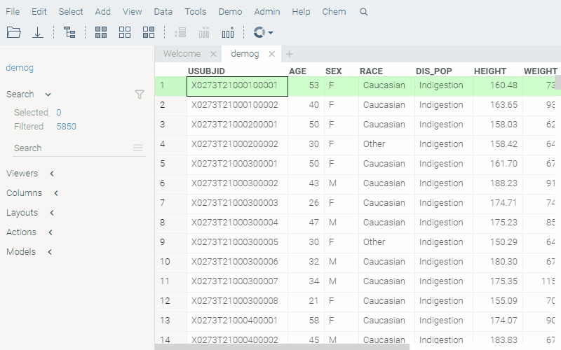
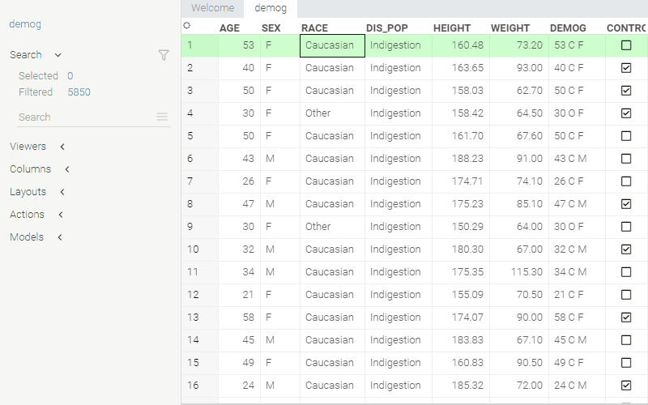

<!-- TITLE: Smart bar -->
<!-- SUBTITLE: -->

# Smart bar

Search for available commands and help pages. Start typing, and suggestions will appear. Search in data by preceding a
query with '?'.

## Shortcuts

|       |                                   |
|-------|-----------------------------------|
| Alt+Q | Activate search                   |
| Esc   | Close search                      |
| Enter | Run command (command search mode) |
| Enter | Select rows (data search mode)    |

## Search in data

Start the query with '?' to query data.

|          |                   |
|----------|-------------------|
| ? > 5    | Any values > 5    |
| age > 30 | 'Age' values > 30 |

