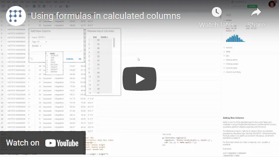

<!-- TITLE: Add new column -->
<!-- SUBTITLE: -->

# Adding new columns

Adds a column of the specified type to the current table, and initializes it using the specified expression (
mathematical function, constants, platform objects properties and functions).

To add new columns, you can use data from existing columns as follows:

- To reference each row of a column, specify its name in the curly brackets, preceded by the dollar sign: `${Width}`.
  For example you can use this expression in function like that: `Round(${Width})`
  .

- To reference a whole column, specify its name in the square brackets, preceded by the dollar sign: `$[Width]`. For
  example you can use this expression in function like that: `Avg($[Width])`.

While editing the formula, press '$' to opens up a column list popup; use arrows and Enter to select it. You can also
use the Drag-n-Drop mechanism to drag and drop the desired column directly into the text of the formula. To do this,
grab the column heading and drag it to the formula window.

For formulas where row index is required, `row` variable is available.

Example:

```javascript
1.57 * Round10(${Weight}, 2) / Avg($[Weight]) - log(${IC50} * PI)
```

To treat data as strings use quotes, for example:

```javascript
"Police" + "man"    // "Policeman"
```

The platform supports a large number of functions, constants and operators. You can find out about them in the
corresponding sections of the help system:

- [Binning functions](functions/binning-functions.md)
- [Constants](functions/constants.md)
- [Conversion functions](functions/conversion-functions.md)
- [DateTime functions](functions/datetime-functions.md)
- [Math functions](functions/math-functions.md)
- [Operators](functions/operators.md)
- [Stats functions](functions/stats-functions.md)
- [Text functions](functions/text-functions.md)
- [TimeSpan functions](functions/timespan-functions.md)

## Videos

[](https://www.youtube.com/watch?v=-yTTaS_WOU4)

See also:

- [Scripting](../datagrok/grok-script.md)
- [Function](../datagrok/functions/function.md)
- [Column selectors](../visualize/viewers/column-selectors.md)
