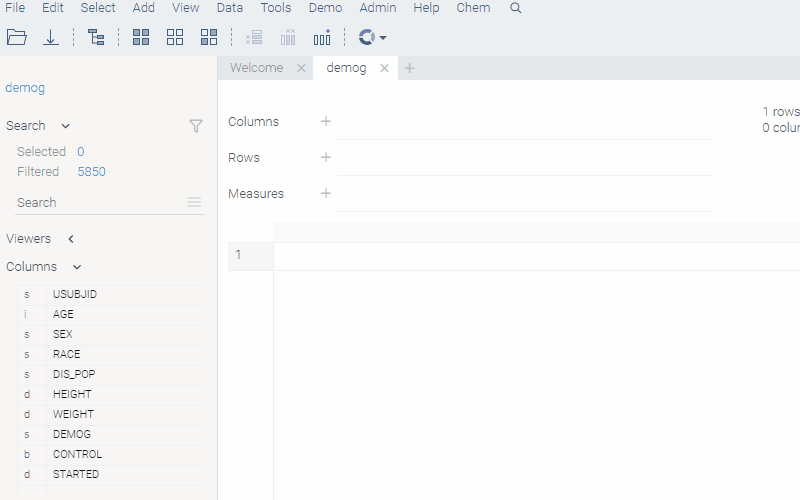
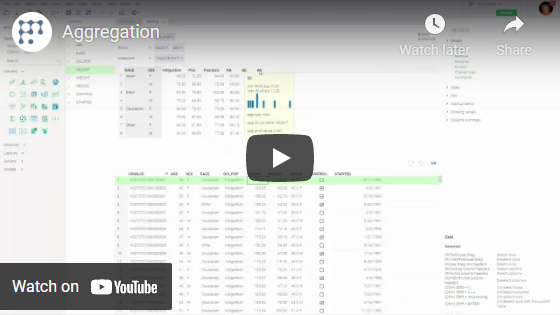

This tool lets you interactively define aggregation logic and immediately see results in the preview window.

To define a column to use as a key, add it to the "Rows" section (unique values become row identifiers). To do
so, either use the "+" sign or drop a column into the corresponding field (you can drag it out of the grid). You can use more than one
column as a key.

To calculate an aggregate value for a column, add it to the "Measures" section. Either use the
"+" sign or drop a column into the corresponding field. To specify the aggregation function, right-click the
column and select it from the list. If you are adding multiple columns using the same aggregation function, you can
set it as the default by pressing the "+" sign and choosing it under the "Aggregation" submenu.

To pivot the dataset (group values in columns), use the "Columns" section.

When you are done, click OK to add the aggregated table to the workspace. As with many dialogs, use the history option (
watch icon in the left bottom corner) to access previously used aggregation options.

## Videos

See also:

* [Aggregation functions](functions/aggregation-functions.md)
* [JS API: Aggregations](https://public.datagrok.ai/js/samples/data-frame/aggregation)
