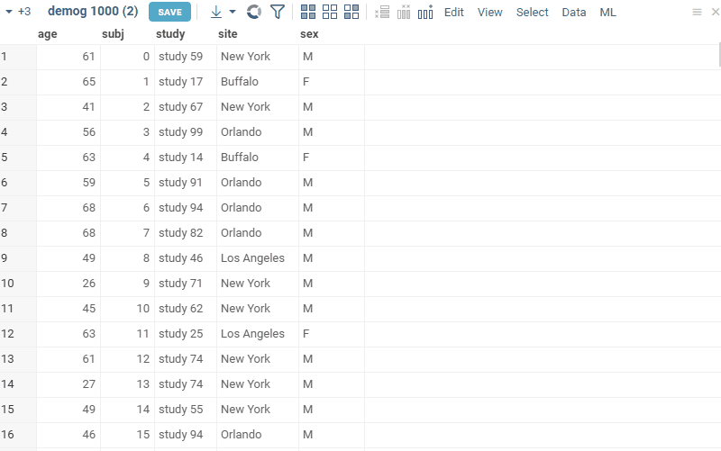

Evaluate multiple patterns against the dataset, and assign categories to the rows, based on the conditions (patterns).

Rows that match the specified **Pattern** get marked with the corresponding **Category**. Multiple patterns can be
associated with the same category (for instance, when classifying animals patterns
"dog", "cat" and "dolphin" might be associated with the "Mammals" category).

For text columns, patterns are regular expressions. For numerical columns, use conditions like ">
70", "\<=30", "30-40" "40", etc.

**Bin...** option allows you to automatically bin numerical columns into ranges, given the desired ammount of bins.

**APPLY COLOR CODING** option allows you to color code the rows of source column based on the category they belong to.

**SAVE COLUMN** Creates a column 'category', and for all rows assigns the value of that column to the category of the
first matching pattern. If the color coding checkbox is enabled, added column will contain specified color coding. This option is mostly useful when categories do not overlap; if they do, it might make sense
to **SAVE MATRIX**.

**SAVE MATRIX** For each category, adds a column that indicates whether the row matches any of the patterns of that
category. This is useful when categories overlap. Saving matrix also adds combined boolean filter, which allows you to filter categorized rows in a convenient way.

