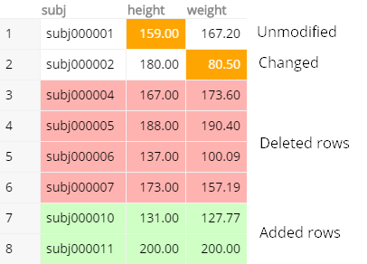
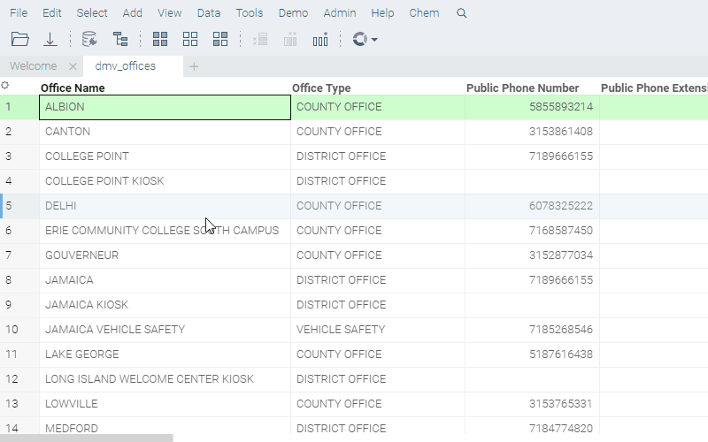
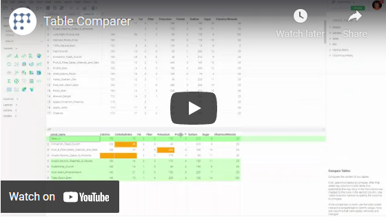

Compares the content of two tables.

First, select two tables to compare. Then, select key columns in both tables to establish how rows in the
first table are mapped to rows in the second table. Use the "Value Columns" section to specify the columns to compare.

Once the comparison is done, use the color-coded interactive spreadsheet to identify values, rows, and columns that were
added, removed, or changed.

## Videos

See also:

* [JS API: Compare Tables](https://public.datagrok.ai/js/samples/data-frame/compare-tables)
