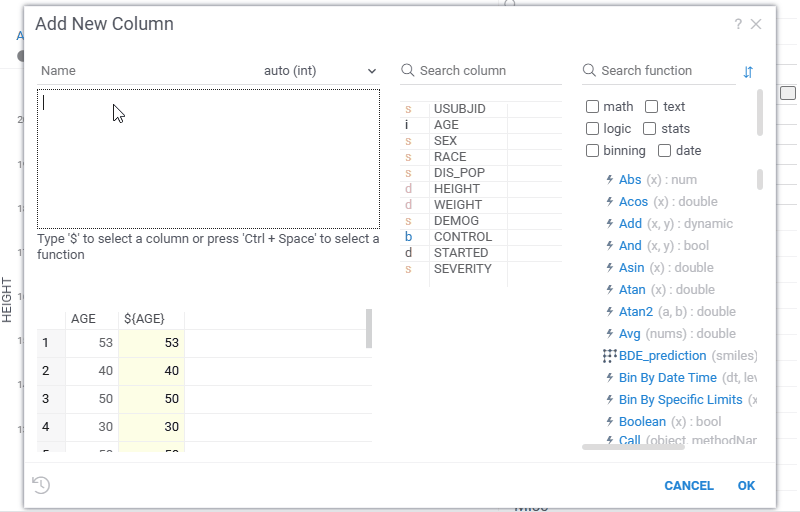

Datagrok provides a unified formula syntax used across the platform. The syntax supports column references, operators, built-in and custom functions, multi-language support and more.

### Syntax elements

#### Column references

- Current row value: `${ColumnName}`. Used in scalar functions and row-wise expressions.
- Entire column as a vector: `$[ColumnName]`. Used with aggregation or vector-aware functions.
- Vector functions atribute: `${ColumnName}` when passed to a function marked as vector (for example, `Chem:getInchis(${ColumnName})`).
- Row index: `row`. Used when a row index is required.
- Escaping column names: `grok.functions.handleOuterBracketsInColName`. Used for column names containing special characters.

#### Operators and functions

- [Operators](functions/operators.md): standard arithmetic, logical, and comparison operators.
- [Constants](functions/constants.md): common, other mathematical, chemical and physical constants.
- String literals: use quotes, for example `"Police" + 'man'`.
- Built-in functions: [math](functions/math-functions.md), [statistical](functions/stats-functions.md), [text](functions/text-functions.md), [datetime](functions/datetime-functions.md), [conversion](functions/conversion-functions.md), [binning](functions/binning-functions.md), [timespan](functions/timespan-functions.md).
- Custom functions: called as `PackageName:FunctionName` (e.g. `Chem:getInchis(${ColumnName})`) or `UserLogin:FunctionName`.
- Multi-language support: Python, R, Julia, JavaScript, C++, etc., if functions are annotated correctly. See [Function annotations](../datagrok/concepts/functions/func-params-annotation.md) for details.

##### Complex calculated columns

Formulas can use complex calculated columns, which are a special case of vector functions. Functions annotated with `//meta.vectorFunc: true` operate on entire columns and can return a `DataFrame`, allowing multiple output columns to be created in a single step. An optional `list<string>` parameter lets users choose which output columns to add. When used from **Add New Column**, all resulting columns are created automatically and remain synchronized with the source data.   
For details, see [Сomplex calculated columns](../datagrok/concepts/functions/func-params-annotation.md#complex-calculated-columns).

### Context-specific usage

#### Calculated columns

Calculated columns use **scalar or vector expressions** and may depend on one another. Updates propagate automatically when dependencies change. The **Add New Column** dialog provides real-time preview, autocomplete, and formula validation, checking for syntax errors, missing columns, and type mismatches.   
For details, see [Add new column](add-new-column.md). 

Examples: 

* `RoundFloat(${IC50} / Median($[IC50]) * E, 3)`
* `Chem:getInchis(${Structure})`

#### Filter expressions

The [in-viewer filter](../visualize/table-view-1.md#common-viewer-properties) subsets rows in a viewer using **conditions** such as equality, range, or logical expressions. You can create filter expressions directly in the **Filter** field on the **Context Panel**, or use the **Add New Column** dialog.  

Examples:  

* `${AGE} > 18 && ${SEVERITY} == 'Medium'`  
* `Contains(${RACE},'sian')` or `In(${RACE}, ['Black', 'Asian', 'Other'])`  
* `${Chemical Space X} >Avg($[Chemical Space X])`

See visual

#### Formula lines, bands, and annotation regions

Scatter plot and line chart viewers use **boundary formulas** (equalities or ranges) to define reference lines, filled areas, or annotation regions. Formulas can be created in the **Formula lines** dialog with real-time preview and validation.  
For details, see [Formula lines](../visualize/viewers/scatter-plot.md#formula-lines) and [Annotation regions](../visualize/viewers/scatter-plot.md#annotation-regions).

Examples: 

* Formula line: `${height} = 2.2 * ${weight}`
* Band: `${age} in(20, 60)`

* Annotation region:   

   Formula 1: `${Chemical Space Y} = ln(${Chemical Space X})+5`
   Formula 2: `${Chemical Space Y} = -ln(${Chemical Space X})+2`
   
## See also

* [Functions](../datagrok/concepts/functions/functions.md)
* [Data wrangling](../transform/transform.md)
* [Macros](../datagrok/navigation/panels/panels.md#console)