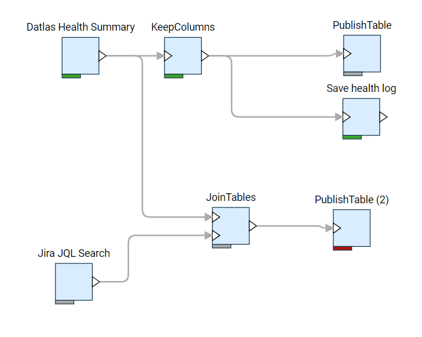

Use job editor to define data flows and transformation by drag-and-dropping
[functions](../datagrok/concepts/functions/functions.md), connecting outputs to inputs, and editing function parameters.

See also:

* [Functions](../datagrok/concepts/functions/functions.md)
* [Console](../datagrok/navigation/panels/panels.md#console)
