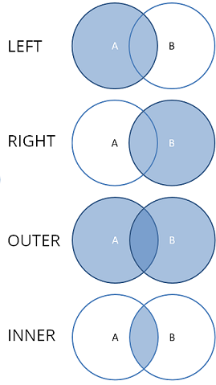

<!-- TITLE: Join Tables -->
<!-- SUBTITLE: -->

# Join Tables

Joins two tables, using the specified key columns.

First, select two tables to join. After that, select key columns in both table; this establishes the
way rows in the first column are mapped to the rows in the second column. Use 'Value Columns'
section to specify the columns to join to result table.

Use 'Preview' to check join result.

A join is used to compare and combine - literally join - and return specific rows of data from two
or more tables in a database. An inner join finds and returns matching data from tables, while an
outer join finds and returns matching data and some dissimilar data from tables.

'left' and 'right' join types can be performed in-place. Result will be stored in left selected table for 
'left' join type and in right for 'right' type.

'Key Columns' section contains not matched statistics (Number of not matched key rows / Total number of rows) 
for each table and values selection buttons:
  - Filter not matching rows in both tables
  - Select all not matching rows in both tables
  - Clear selection.

If no keys specified in 'Keys Columns' joining in performed by row indexes.

### Videos

<iframe width="560" height="315" src="https://www.youtube.com/embed/dlbK2Zo-eng" frameborder="0" allow="accelerometer; autoplay; encrypted-media; gyroscope; picture-in-picture" allowfullscreen></iframe>

Samples:
  * [Join Tables](https://public.datagrok.ai/js/samples/data-frame/join-tables) 

See also:

* [Link Tables](../explore/link-tables.md) 