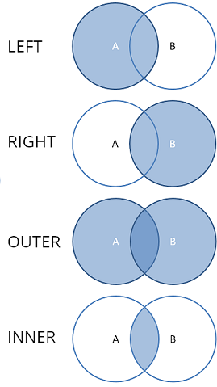
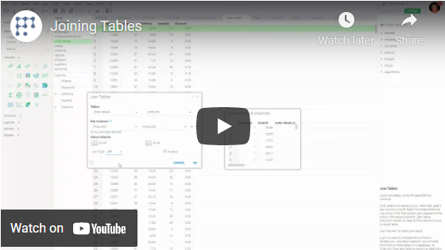

Joins two tables, using the specified key columns.

First, select two tables to join. Then, select key columns in both tables. This
establishes how rows in the first table map to rows in the second table.
Use the **Value Columns** section to specify which columns to include in the
result table.

Use 'Preview' to check join result.

A join is used to compare and combine - literally join - and return specific rows of data from two or more tables in a
database. An inner join finds and returns matching data from tables, while an outer join finds and returns matching data
and some dissimilar data from tables.

You can perform **left** and **right** joins in-place. A **left** join stores
the result in the left table, and a **right** join stores it in the right table.

'Key Columns' section contains not matched statistics (Number of not matched key rows / Total number of rows)
for each table and values selection buttons:

* Filter not matching rows in both tables
* Select all not matching rows in both tables
* Clear selection.

If you don't specify key columns, the join is performed by row index.

## Videos

Samples:

* [Join Tables](https://public.datagrok.ai/js/samples/data-frame/join-link/join-tables)

See also:

* [Link Tables](link-tables.md)
