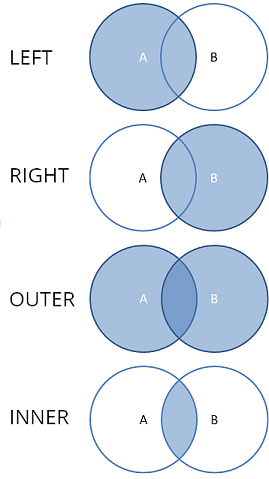
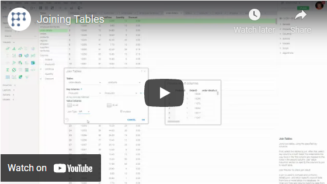

Joining combines two tables into one on key columns. The result is a new, wider table (or, for left and right joins, an
extended copy of one of the source tables). To keep two tables separate and
only synchronize their rows, use Link tables instead. For
when to prefer which, see
[Joining or linking](link-tables.md#joining-or-linking).

## Joining two tables

To join two open tables, follow these steps:

1. On the **Top Menu**, select **Data** > **Join Tables...**
1. In the dialog:
   * Under **Tables**, choose the left and the right table.
   * Under **Key Columns**, pick one or more pairs of key columns. Rows match
     when all key values are equal. Click **+** to add another pair for
     composite keys.
   * Under **Values**, choose which columns of each table go into the result.
     By default, all columns are selected, including the key columns of both
     tables.
   * In **Join Type**, choose `inner`, `outer`, `left`, or `right`. See
     [Join types](#join-types).
   * For a `left` or `right` join, select **In-place** to write the result
     into one of the source tables instead of creating a new one. See
     [In-place joins](#in-place-joins).
1. Check the result in the **Preview result columns** pane, which shows the
   first rows of the join as you change the settings.
1. Click **OK**.

The dialog reports how the keys matched. When every key row of both tables
has a match, it says so. Otherwise, it shows, per table, the number of key
rows without a match out of the total. The menu next to the number lets you
**Filter Not Matching**, **Select All Not Matching**, or **Clear Selection**
in that table, so you can inspect the rows before joining. When no key rows
match at all, **OK** is disabled.

## Join types

| Join type | Rows in the result |
|---|---|
| `inner` | Only rows whose keys match in both tables |
| `outer` | All rows of both tables. Missing values where a side has no match |
| `left` | All rows of the left table, with the right table's values where they match |
| `right` | All rows of the right table, with the left table's values where they match |

## One-to-many joins

Key columns don't have to be unique. When a key value occurs in several rows
of the right table, each matching row of the left table is repeated once per
right row. A table of orders joined to a table of order lines thus produces
one row per order line. The same applies the other way around.

Keys need to be unique only for in-place joins, and only
on the side that doesn't receive the result.

## In-place joins

A `left` or `right` join can be performed in place: the result replaces the
content of the left table (for a `left` join) or the right table (for a
`right` join), and no new table is created. This is useful for enrichment,
for example to add a few columns from a lookup table to a large table
without duplicating it.

Because the receiving table keeps its rows, the other table's keys must be
unique. If they aren't, the dialog reports it and won't run the join.

## Joining in the database

When both tables come from the same database, consider joining them in the
database instead. The
[Visual Query Editor](../access/databases/databases.md#visual-query-editor)
builds joins from foreign keys, letting the database perform the join before
the data reaches Datagrok.

If the detail data is stored in a database, you may not need to load it at
all. [Database Explorer](../access/databases/databases.md#database-explorer)
and [data enrichment](../access/databases/databases.md#data-enrichment) can
fetch related records for the row you are viewing.

## Joins and dashboards

An in-place join on a table that has a creation script is recorded as a
step in that script and replays every time the dashboard opens with Data
sync on. A join that creates a new table is done once.

## Videos

Samples:

* [Join Tables](https://public.datagrok.ai/js/samples/data-frame/join-link/join-tables)

See also:

* [Link tables](link-tables.md)
