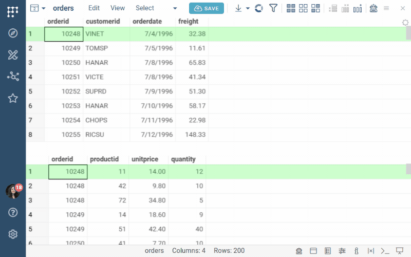
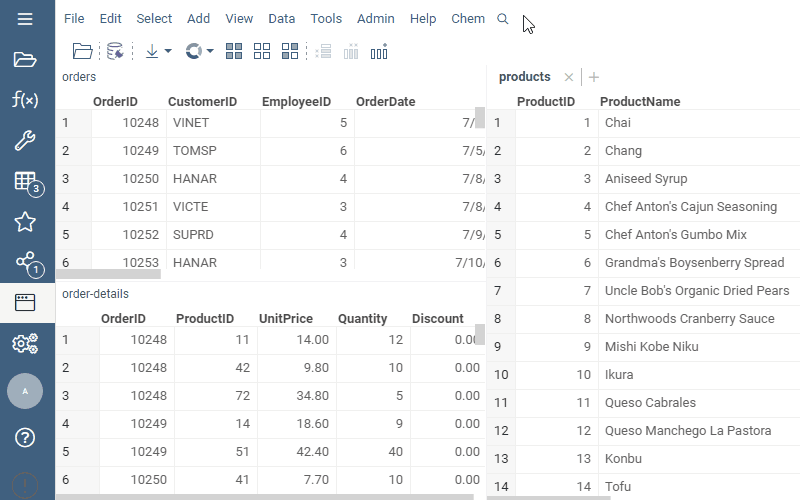
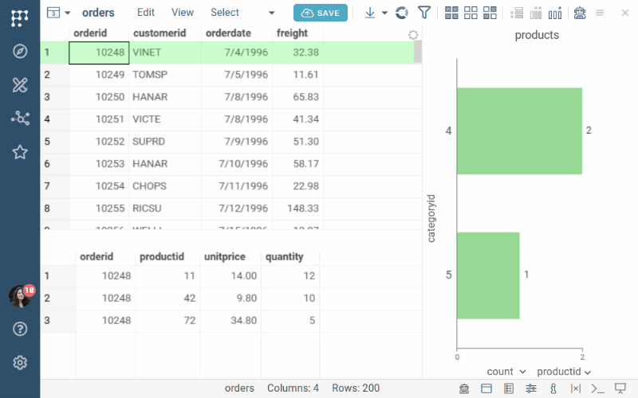

Linking connects two open tables through key columns without copying data.
An action in one table (changing the current row, hovering, filtering, or
selecting) updates the row state in the other table. Both tables remain
separate.

Linking is useful for one-to-many relationships and master-detail browsing,
where you want to explore related rows without combining the tables.

## Joining or linking

Datagrok provides two ways to relate tables:

* [Join](join-tables.md) combines matching rows into one wider table. A
  master row is repeated for each matching detail row. Use a join when you
  need one flat table for analysis or visualization.
* Link keeps the tables separate. The current row, selection, or filter in
  one table drives the other. Use a link when you want to browse related
  detail rows.

## Creating a link

To link two tables, follow these steps:

1. Open both tables.
1. On the **Top Menu**, select **Data** > **Link Tables...**
1. In the dialog:
   * Under **Tables**, choose the source table (the one you act on) and the
     target table (the one that responds).
   * Under **Key Columns**, pick one or more pairs of key columns. Rows match
     when all key values are equal. Click **+** to add another pair for
     composite keys.
   * In **Link Type**, choose what gets synchronized. See [Link types](#link-types).
1. Click **LINK**. The new link gets its own tab in the dialog, next to
   **New Link**.
1. On the link's tab, adjust the link if needed:
   * Select **Filter All On No Rows Selected** for links that end in
     `filter` if the target should show no rows while nothing is current,
     selected, or filtered in the source. This is useful for detail tables
     that should stay empty until a master row is chosen.
   * Clear **Enabled** to turn the link off temporarily and look at the whole
     target table without deleting it.
   * Click **UNLINK** to remove the link.
1. Click **CLOSE**.

The same dialog lists the existing links, so you can come back to edit,
disable, or remove them later.

:::note

Key columns are compared by value. Both columns should have the same data
type and consistent formatting. A trailing space or a different case in one
of them means no match.

:::

## Link types

A link type reads as `<what changes in the source> to <what changes in the
target>`, where the source is the first table in the dialog.

| Link type | When you... in the source | The target... |
|---|---|---|
| `row to row` | Change the current row | Moves its current row to the matching row |
| `row to selection` | Change the current row | Selects all matching rows |
| `row to filter` | Change the current row | Shows only the matching rows |
| `mouse-over to selection` | Hover over a row | Selects all matching rows |
| `mouse-over to filter` | Hover over a row | Shows only the matching rows |
| `filter to filter` | Filter rows | Shows only the rows matching the filtered rows |
| `filter to selection` | Filter rows | Selects the rows matching the filtered rows |
| `selection to filter` | Select rows | Shows only the rows matching the selected rows |
| `selection to selection` | Select rows | Selects the rows matching the selected rows |

The most common choices are:

* `row to filter` for master-detail browsing, for example to click an order
  and see its line items.
* `selection to filter` to compare several masters at once, for example to
  select five compounds and see all their measurements together.
* `filter to filter` to propagate the filter panel, for example to filter
  subjects by site and have their visits follow.
* `row to selection` or `mouse-over to selection` to highlight without
  hiding. The target keeps all rows and highlights the matches.

## Master-detail

A master-detail setup is a `row to filter` link, where the current row in the
master table filters the detail table. To set it up:

1. Open both tables.
1. On the **Top Menu**, select **Data** > **Link Tables...**
1. Pick the master table as the source, the detail table as the target, the
   key columns, and the link type `row to filter`, and click **LINK**.
1. Optionally, on the new link's tab, select **Filter All On No Rows
   Selected** so that the detail table shows nothing until a master row is
   chosen. Then click **CLOSE**.

Now clicking a row in the master grid filters the detail grid to the matching
rows. You can put both grids side by side, or add a viewer on the detail
table to the master view with **Row Source** set to **Filtered**. To learn
more about the **Row Source** and **On Click** settings, see
[Viewers as filters](../visualize/table-view-1.md#viewers-as-filters).

## Drilling down

Linking is also how you drill down from a summary to the rows behind it:

* **From an aggregate to its rows.** Summarize the table with
  [Aggregate rows](aggregate-rows.md) (for example, count and average per
  compound), and then link the aggregated table to the original one on the
  grouping columns with `row to filter`. Clicking a summary row now shows the
  measurements it was computed from. A pivoted table works the same way.
* **From a chart segment to its rows.** Any bar chart or pie chart can act as
  the drill-down control: set **On Click** to **Filter** on the viewer, and
  clicking a bar filters the table to that category. See
  Viewers as filters.
* **From an identifier to related records.** When the
  [Database Explorer](../access/databases/databases.md#database-explorer) is
  configured for your database, clicking an identifier such as a compound or
  batch ID anywhere in Datagrok shows the record in the **Context Panel**,
  together with everything related to it through foreign keys. No detail
  table is loaded and no query is written.
* **From a row into a parameterized query.** A query with an input such as
  `compoundId`, run from the **Context Panel** for the current row, returns
  that row's details from the database. See
  [Parameterized queries](../access/databases/databases.md#parameterized-queries).

## Cascading links

Links can be chained. When the target of one link is the source of another,
a change in the first table propagates through all of them. For example,
with three Northwind tables:

* `orders` to `order_details` on `orderid`, using `row to filter`
* `order_details` to `products` on `productid`, using `filter to filter`

Clicking an order filters its details, and the filtered details in turn
filter the products table to the products in that order.

Worked example: a master-detail dashboard on the Northwind demo database

This example builds a master-detail dashboard on the Northwind demo
database: you pick an order and see its line items and the products in it.
Northwind ships as a demo connection named **Northwind** under its database
type in **Browse** > **Databases**.

1. Open three tables. Expand the Northwind connection, right-click
   `orders`, `order_details`, and `products` in turn, and select **Get All**.
   Each table opens in its own Table View.
1. Link `orders` to `order_details`. On the **Top Menu**, select **Data** >
   **Link Tables...**, choose `orders` and `order_details`, set the key
   columns to `orderid` on both sides and the link type to `row to filter`,
   and click **LINK**. On the new link's tab, select **Filter All On No Rows
   Selected**.
1. Link `order_details` to `products` in the same way, with `productid` as
   the key and `filter to filter` as the link type. Click **CLOSE**.
1. Show the details next to the orders. Go to the `orders` view, add a
   [grid](../visualize/viewers/grid.md), click its **Gear** icon, and under
   **Data** set **Table** to `order_details` and **Row Source** to
   **Filtered**. Dock it below the orders grid.
1. Add a chart on products. In the same view, add a
   [bar chart](../visualize/viewers/bar-chart.md), set its **Table** to
   `products` and **Row Source** to **Filtered**, and split it by `categoryid`.
1. Click an order. The details grid shows its line items, and the bar chart
   shows the categories of the products in it.
1. Click **SAVE**. Keep **Data sync** on for all three tables, so that the
   dashboard re-runs the three queries on every open, and share the
   dashboard and the Northwind connection with your team. See
   [What recipients get](../datagrok/concepts/project/dashboard.md#what-recipients-get).

For a smaller live example that needs no database, open the **Table Linking**
demo under **Data Access** in the
[demo app](https://public.datagrok.ai/apps/Tutorials/Demo/Data-Access/Table-Linking).

## Links and viewers

Linking changes the row state (current, selected, or filtered) of the target
table, and every viewer on the target table reacts the same way it reacts to
a manual filter or selection. Set a viewer's **Row Source** to **Filtered**
or **Selected** so that it shows only the linked rows.

A viewer can also show a table other than the one its view belongs to. Click
the viewer's **Gear** icon and change **Table** under **Data** in the
**Context Panel**. This is how one view shows a master table next to a chart
of its linked details.

To show the matching target rows inside the source grid instead of in a
separate view, right-click a cell, select **Add** > **Linked Tables**, and
choose the target table. See
[Data from linked tables](../visualize/viewers/grid.md#data-from-linked-tables).

## Links in projects

Links are saved with the dashboard
and re-established when it opens. If a linked table is dynamic (Data sync on)
and its key column is renamed in the source query, the link stops matching,
so keep key column names stable. For what else to check when saving a
dashboard with several tables, see
[Multiple tables](../datagrok/concepts/project/dashboard.md#multiple-tables).

:::note developers

To link tables from a script or a plugin, see the
[Linking tables](https://public.datagrok.ai/js/samples/data-frame/join-link/link-tables) sample.

:::

See also:

* [Join tables](join-tables.md)
* [Dashboards](../datagrok/concepts/project/dashboard.md)
