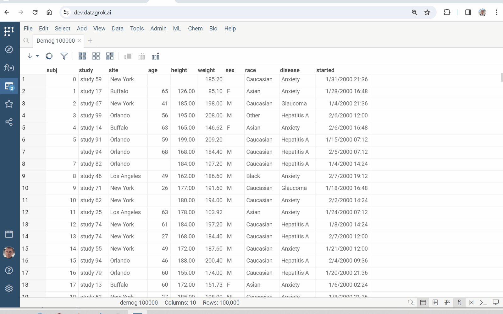

[Imputation](https://en.wikipedia.org/wiki/Imputation_\(statistics\)) is the process of replacing missing data with substituted values.

Datagrok imputes missing values using the k-nearest neighbors method ([k-NN](https://public.datagrok.ai/js/samples/domains/data-science/missing-values-imputation)).

## Run

* Open a table
* Run **Top Menu > ML > Missing Values Imputation...**
* Select `Impute` and `Using` columns
* Set `Distance` and `Neighbors`
* Specify whether to use in-place imputation
* Press **RUN**

See also:

* [Imputation](https://en.wikipedia.org/wiki/Imputation_\(statistics\))
* [k-nearest neighbors algorithm](https://en.wikipedia.org/wiki/K-nearest_neighbors_algorithm)
