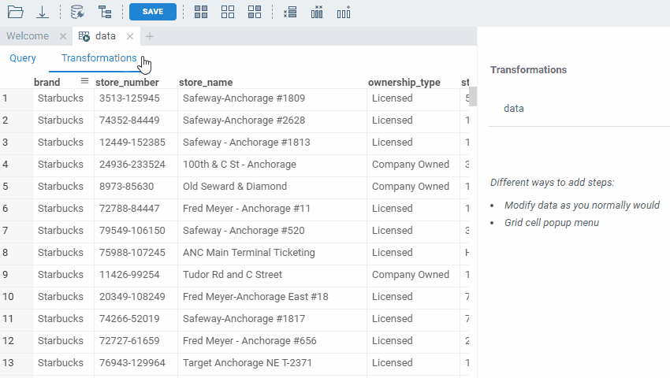

<!-- TITLE: Query View -->
<!-- SUBTITLE: -->

# Transformations

After the data is retrieved from the data provider, it can be transformed using functions.

There are several ways to add transformations: 
 * Edit table as you normally would.
 * Add steps manually from toolbox.
 * Use table context menu
 
All data transformations done via the UI are recorded as macros, and can be replayed.

 

You can manually edit steps parameters.

 

You can add steps manually and switch between steps to view results of each step.

 

See also:

  * [Data Pipeline](../access/data-pipeline.md)
  * [Data Source](../access/data-source.md)
  * [Data Connection](../access/data-connection.md)
  * [Data Query](../access/data-query.md)
  * [Data Job](../access/data-job.md)
  * [Function Call](../overview/functions/function-call.md)
  * [Aggregate Rows](aggregate-rows.md)
  * [Recipe Editor](recipe-editor.md)
