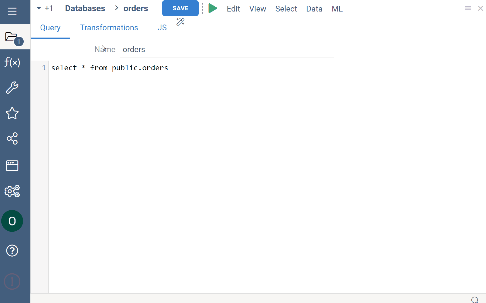
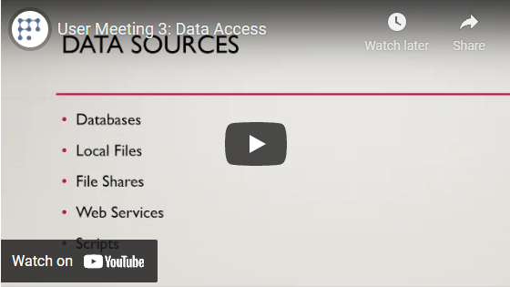

After a query returns data, you can keep transforming it in Datagrok: rename
or remove columns, add calculated columns, aggregate, unpivot, or join the
result with another table. Each such step is recorded as part of the query,
so it replays every time the query runs, including when a
[dynamic dashboard](../datagrok/concepts/project/dashboard.md#data-sync) opens.

## Where steps come from

There are three ways to add a transformation step, and all of them end up in
the same list:

* **Edit the result as you normally would.** Run the query, and then use the
  grid, dialogs, and menus on the result. Every action that changes the data
  is recorded. This suits exploratory work, where you discover the steps as
  you go.
* **Add steps in the Query Editor.** Open the query, go to the
  **Transformations** tab, pick a function, and set its parameters. This
  suits deliberate pipelines that others will review.
* **Write code.** On the **Post-Process** tab of the Query Editor, edit the
  pipeline as a script in Python, R, JavaScript, or another language. This
  suits logic that has no dialog, or that should live in one file.

## Editing steps

In the **Query Editor**, the **Transformations** tab lists the recorded steps
on the left. Click a step to see the data as it was after that step in the
**Preview** section. To edit a step's parameters, use the dropdown next to
it. To remove a step, click the **Delete** (**x**) icon. Steps run in order,
so removing one can invalidate the steps after it. Check the preview of the
last step before saving.

:::note developers

You can create custom transformation functions in R, Python, or any other
language. See [Scripting](../compute/scripting/scripting.mdx).

:::

## Where to put the logic

The same result can often be produced in three ways, and they differ in
what happens when the source data changes:

| Where the logic lives | Where it runs | When the source loses a column it uses |
|---|---|---|
| SQL, in the query itself | On the database | The query fails with a clear database error |
| A transformation step, or a [calculated column](add-new-column.md) that calls a vector function on a whole column | In Datagrok, after the query, on every run | The step fails and stops a dynamic dashboard from opening |
| A [calculated column](add-new-column.md) with a scalar formula, such as `${a} / ${b}` | In Datagrok, after the query, on every run | The column shows a warning, and the dashboard opens |

A calculated column is recorded in the generation script like any other
step. The difference is in how it fails: a scalar formula that can't find
its input produces a warning, whereas a transformation step or a vector
function that can't find its input stops the replay.

As a guideline, filtering, joining, and aggregating large data belong in SQL,
because less data crosses the network and the database does the work.
Reshaping that SQL does badly, such as [unpivoting](unpivot.md), and
Datagrok-specific functions belong in a transformation step. Derived metrics
for viewers, such as ratios and normalized values, belong in scalar-formula
calculated columns, because they survive source changes gracefully.

## Transformations and dashboards

A transformation step is part of the table's generation script. When a
dashboard is saved with Data sync on, the query runs and the steps replay on
every open. When it is saved with Data sync off, the transformed data is
stored as a snapshot and the steps are kept for lineage.

Because steps reference columns by name, a column that is renamed or removed
in the query output breaks the steps that use it. To learn what breaks and
how to recover, see
[Changing the source](../datagrok/concepts/project/dashboard.md#changing-the-source).

## Videos

See also:

* [Query Editor](../access/databases/databases.md#query-editor)
* [Function call](../datagrok/concepts/functions/function-call.md)
* [Aggregate rows](aggregate-rows.md)
* [Add new column](add-new-column.md)
* [Retrieve and filter data](../datagrok/solutions/workflows/retrieve-and-filter.md)
