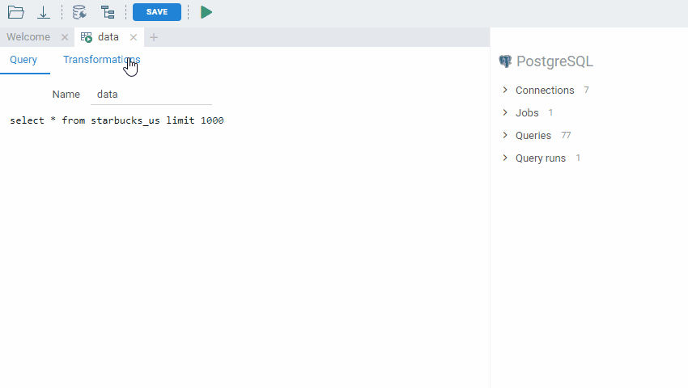
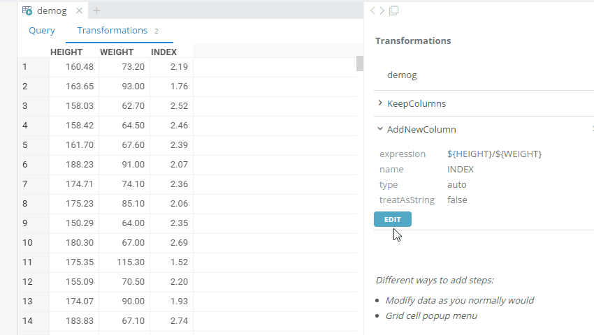
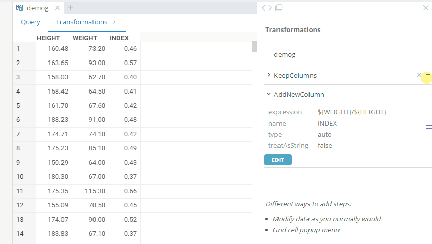

<!-- TITLE: Recipe Editor -->
<!-- SUBTITLE: -->

# Recipe Editor

Recipe editor lets you define data transformations. A Recipe can be used as a post-run steps for data
queries.

## Recipe structure

A recipe consists of a number of parameterized steps. There are different ways to add steps:

### Modify data as you normally would

Use the regular tools for modifying the data, mostly located under Edit, Select, and Data top menus.

 

### From the console

Execute commands from the [console](../overview/navigation.md#console)

### Grid cell popup menu

Right-click on a cell and choose a context-dependent command from one of the following menus:

* Rows with the same value 
* Column 
* Selected columns 

### Function library

Choose a step from the list of all available transformations. 

## Parameters

You can manually edit steps parameters.

 

## Navigation

Click to step to view recipe step results

 

See also: 

* [Job Editor](job-editor.md)
* [Console](../overview/navigation.md#console)
