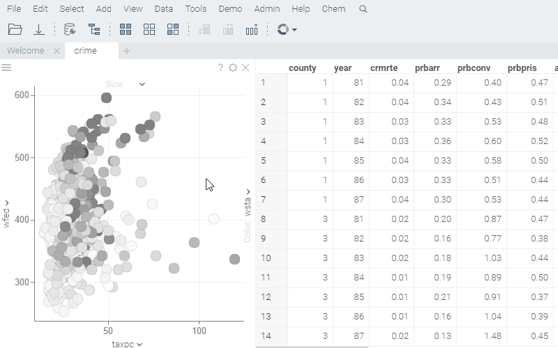

Selects the specified number of rows randomly.

Either type the desired number of rows to select, use the slider, or click on a link indicating the proportion of rows
to select.

This feature is commonly used for sampling. Click the dropdown arrow to access
additional commands:

* `#{x.CmdExtractSelectedRows}`
