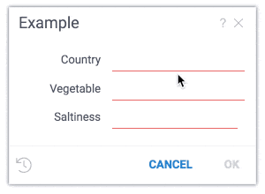
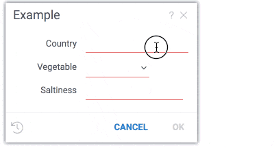

<!-- TITLE: Function Parameters Enhancement -->
<!-- SUBTITLE: -->

# Function Parameters Enhancement

When a [function](../entities/function.md) is invoked with no explicitly specified parameters, a dialog is shown. 
The UI is automatically generated by creating editors for each parameter. Depending on the metadata associated
with the parameters, the editor can be enriched by [validators](../features/scripting.md#parameter-validators), 
[choices](../features/scripting.md#parameter-choices),
and [suggestions](../features/scripting.md#parameter-suggestions). Validators, choices, and suggestions are [functions](../entities/function.md),
that means they can be implemented in different ways (db query, script, etc), and reused. 

In this tutorial, we will create a Python script that that has three parameters - country, vegetable, and saltiness.
For the dialog to be easy to use, we want the country name to be automatically suggested as user types it, 
vegetable should be selected from list of choices, and saltiness should fall into the specified range.

To achieve the desired outcome, we will use the following features: 
  * [validators](../features/scripting.md#parameter-validators) 
  * [choices](../features/scripting.md#parameter-choices)
  * [suggestions](../features/scripting.md#parameter-suggestions)

## 1. Creating a vanilla Python script
  
Let's start with Python script and it's parameters:
  * open script editor: Tools | Scripting | New | Python
  * paste code
  * save script using "Save" button on toolbar
  * now you can run script using "Run" button on toolbar

```python
#name: Example
#language: python
#input: string country
#input: string vegetable
#input: double saltiness
```

This is how parameters dialog looks like:

 

## 2. Annotating the Python script

Every function parameter in Datagrok has [options](../features/scripting.md#options) where  
validators, choices and suggestions functions can be specified. For "country", we want to call a function 
that suggests country based on the already entered text (jsSuggestCountryName).  For "vegetable", we will register 
function that returns list of vegetables (jsVeggies). For "saltiness", we need a validator to check if
the parameter value falls in the specified range. Also, we want to add the default values to each parameter.

Here is the modified script:

```python
#name: Example
#language: python
#input: string country {suggestions: jsSuggestCountryName}
#input: string vegetable {choices: jsVeggies}
#input: double saltiness {validators: ["jsSaltinessRange"]}
```

Next step is registering functions. To do that, we are going to use [JS integration](../features/js-integration.md).  

Let's open JS editor: 
  * Tools | Scripting | JavaScript
  * paste code of corresponding JS functions
  * run using "Run" button on toolbar 

## 3. Writing a parameter value suggestion function

Suggests country by name: 
```javascript
gr.functions.register({
  signature: 'List<String> jsSuggestCountryName(String text)',
  isAsync: true,
  run: async function(text) {
    let response = await fetch('https://restcountries.eu/rest/v2/name/' + text);
    return response.status === 200 ? (await response.json()).map(country => country['name']) : [];
  }
});
```

## 4. Writing a choice list function

Returns veggies list: 
```javascript
gr.functions.register({
    signature: 'List<String> jsVeggies()',
    run: () => ["Artichoke", "Cucumber", "Cauliflower", "Onion"]});
```

## 5. Writing a validation function

Checks saltiness range:
```javascript
gr.functions.register({
    signature: 'List<String> jsSaltinessRange(double input)',
    run: (input) => input >= 0 && input <= 100 ? null : "Saltiness is out of range"});
```

Now you can re-run Python script and see following parameters dialog:

 

See also: 
  * [Scripting](../features/scripting.md)
