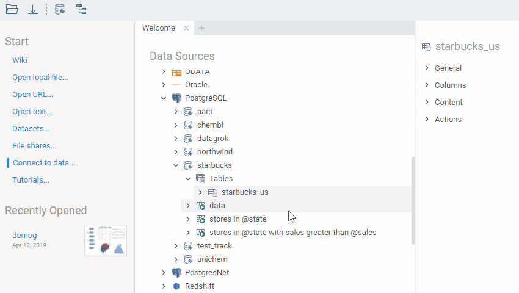

<!-- TITLE: Query View -->
<!-- SUBTITLE: -->

# Db Query

To define a column to be used as a key, add it to the "Rows" section (unique values will become
row identifiers). To do so, either use "+" sign. More than one column can be used as a key.

To calculate an aggregate value of the column, add it to the "Measures" section. To specify aggregation function to use,
right-click on the column and select it from the list. In case you are adding multiple columns using
the same aggregation function, you can set it as default by pressing the "+" sign and choosing it
under the "Aggregation" submenu. 

Save and use this query as a regular data query.

 

See also:

  * [Data Pipeline](../entities/data-pipeline.md)
  * [Data Source](../entities/data-source.md)
  * [Data Connection](../entities/data-connection.md)
  * [Data Query](../entities/data-query.md)
  * [Query View](../views/query-view.md)
  * [Data Job](../entities/data-job.md)
  * [Function Call](../entities/function-call.md)
  * [Aggregate Rows](../dialogs/aggregate-rows.md)
  * [Recipe Editor](../features/recipe-editor.md)
