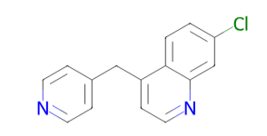

You can visualize data within a [grid](viewers/grid.md) cell using a [cell renderer](viewers/grid.md#cell-renderers). Supported cell renderers:

| Cell render | Image | Description | Additional parameters | Application |
|:--|--|--|--|--|
| Molecule ||Molecule in 2D| `sem.type`: Molecule|Auto|
| Tags |[img]|---| `cell.renderer`: Tags| Manual| 
| Choices |[img]|---| `cell.renderer`: MultiChoice  `.choices`: Comma separated values, e.g., ["1","2","3"] | Manual|
| `Fit`|||`quality`: fit `.fit`{"chartOptions":{"logX":false,"logY":false,"allowXZeroes":true},"seriesOptions":{"fitFunction":"sigmoid","errorModel":"constant","clickToToggle":false,"showFitLine":true,"showPoints":"points","showCurveConfidenceInterval":false,"markerType":"circle","lineStyle":"solid","pointColor":"#1f77b4","outlierColor":"#ff0000","fitLineColor":"#1f77b4"}}: |Auto|
| ImageURL|||||

