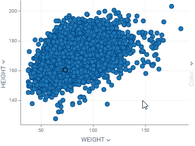
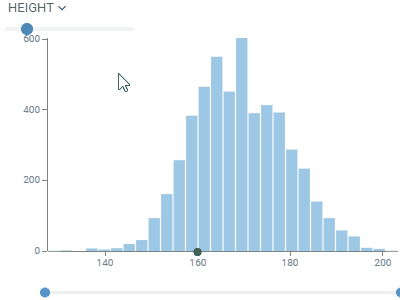

This is a list of all available viewers. Check [this document](viewers/viewers.md) to learn how to 
work with them, such as [creating](viewers/viewers.md#creating), [docking](viewers/viewers.md#docking), [interacting](viewers/viewers.md#interaction),
working with [properties](viewers/viewers.md#properties), 
[selecting](viewers/viewers.md#selection) and [filtering](viewers/viewers.md#filter) rows, using [tooltips](viewers/viewers.md#row-tooltips),
reusing [layouts](viewers/viewers.md#layouts), and a lot more!

| _______________________________________________________ |                                                                                                                                                                                                                                                                                                                                                                   |
|---------------------------------------------------------|-------------------------------------------------------------------------------------------------------------------------------------------------------------------------------------------------------------------------------------------------------------------------------------------------------------------------------------------------------------------|
|                      | [Scatter plot](viewers/scatter-plot.mdx) displays data points on the horizontal (X) and vertical (Y) axes to show the relationship between two variables. By using marker color, shape, and size, you can show up to three additional data dimensions.                                                                                                            | 
|                         | [Histogram](viewers/histogram.md) shows the distribution of the numerical data. Supports multiple distribution, with a few normalization options. Use the slider below to filter the dataset.                                                                                                                                                                     | 
|                        | [Line chart](viewers/line-chart.md) shows points connected by lines. Points are ordered by the X component, with multiple values for the same X aggregated.     Supports multiple charts, multiple axis, different normalization and aggregation options. Multiple chart types: lines, area, stacked bar chart, stacked area chart.                       | 
|                         | [Bar chart](viewers/bar-chart.md) presents grouped data with rectangular bars with lengths proportional to the values that they represent. Select the "split" column to create a stacked bar chart.     Supports multiple data type-dependent aggregation functions for values. Works with dates as a category, converting them to year, Q1-Q4, or month. |
|                         | [Pie chart](viewers/pie-chart.md) shows proportions by dividing data into slices.                                                                                                                                                                                                                                                                         |
|                           | [Parallel coordinates plot](viewers/pc-plot.md) shows each row as a trajectory, where each column value gets mapped to the correponding axis. This is useful for analyzing in the multidimensional data.                                                                                                                                                          |
|                   | [3D scatter plot](viewers/3d-scatter-plot.md) shows the relationship between three variables in 3d space.      You can also color-code points, size-code points, and display labels next to markers.                                                                                                                                                      |
|                                                         |                                                                                                                                                                                                                                                                                                                                                                   |
|                                                         |                                                                                                                                                                                                                                                                                                                                                                   |

