This is a list of all available viewers. Check [this document](viewers/viewers.md) to learn how to 
work with them, such as [creating](viewers/viewers.md#creating), [docking](viewers/viewers.md#docking), [interacting](viewers/viewers.md#interaction),
working with [properties](viewers/viewers.md#properties), 
[selecting](viewers/viewers.md#selection) and [filtering](viewers/viewers.md#filter) rows, using [tooltips](viewers/viewers.md#row-tooltips),
reusing [layouts](viewers/viewers.md#layouts), and a lot more!

| 

        |                                                                                                                                                                                                                                                                                                                                                                                                                       |
|----------------------------------------|-----------------------------------------------------------------------------------------------------------------------------------------------------------------------------------------------------------------------------------------------------------------------------------------------------------------------------------------------------------------------------------------------------------------------|
| 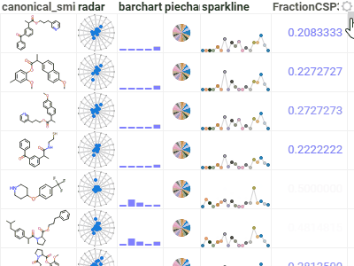            | [Grid](viewers/grid.md) is a high-performance, customizable spreadsheet optimized for interactive exploration of data.     Provides color-coding, filtering, sorting, custom cell types, and hundreds of other features.                                                                                                                                                                                      |
|     | [Scatter plot](viewers/scatter-plot.mdx) displays data points on the X and Y axes to show the relationship between two variables. By using marker color, shape, and size, you can show up to three additional data dimensions.     Supports regression lines, and data annotations.                                                                                                                           | 
|        | [Histogram](viewers/histogram.md) shows the distribution of the numerical data. Supports multiple distribution, with a few normalization options. Use the slider below to filter the dataset.                                                                                                                                                                                                                         | 
| 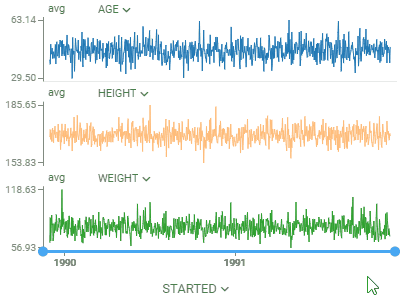      | [Line chart](viewers/line-chart.md) shows points connected by lines. Points are ordered by the X component, with multiple values for the same X aggregated.     Supports multiple charts, multiple axis, different normalization and aggregation options. Multiple chart types: lines, area, stacked bar chart, stacked area chart.                                                                           | 
| 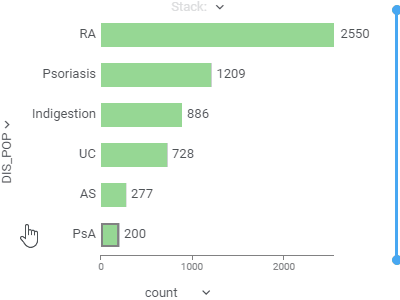       | [Bar chart](viewers/bar-chart.md) presents grouped data with rectangular bars with lengths proportional to the values that they represent. Select the "split" column to create a stacked bar chart.     Supports multiple data type-dependent aggregation functions for values. Works with dates as a category, converting them to year, Q1-Q4, or month.                                                     |
| 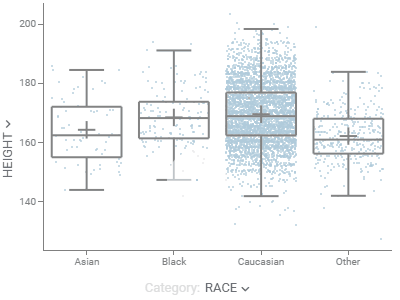        | [Box plot](viewers/box-plot.md) summarizes distributions of values by showing minimum, first quartile, median, third quartile, and maximum.     Shows each point and lets you color-code them.     When comparing multiple sets, automatically tests for statistical significance and calculates p-values.                                                                                            |
| 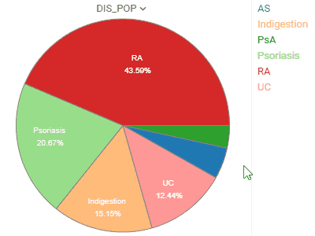       | [Pie chart](viewers/pie-chart.md) shows proportions by dividing data into slices.                                                                                                                                                                                                                                                                                                                             |
| 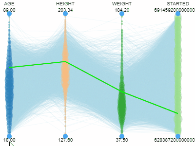         | [Parallel coordinates plot](viewers/pc-plot.md) shows each row as a trajectory, where each column value gets mapped to the correponding axis. This is useful for analyzing in the multidimensional data.                                                                                                                                                                                                              |
| 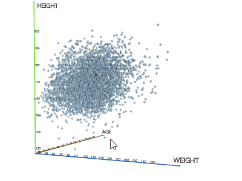 | [3D scatter plot](viewers/3d-scatter-plot.md) shows the relationship between three variables in 3d space.      You can also color-code points, size-code points, and display labels next to markers.                                                                                                                                                                                                          |
| 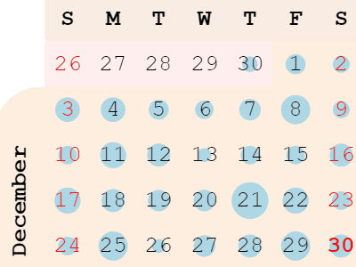        | [Calendar](viewers/calendar.md) Calendar lets you analyze longitudinal data. It needs at least one column of type DateTime.                                                                                                                                                                                                                                                                                           |
| 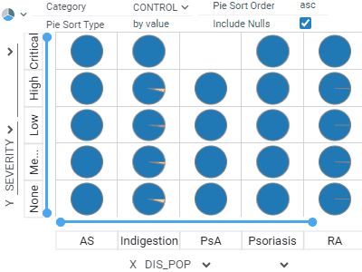    | [Trellis plot](viewers/calendar.md) lets you select two categories on X an Y, and puts smaller charts in a grid, where each smaller chart represents rows that belong to a corresponding category.     You can select more than one category per axis.                                                                                                                                                        |
| 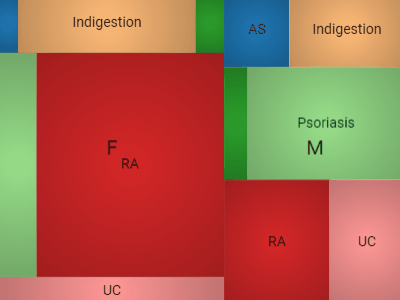        | [Tree map](viewers/tree-map.md) displays hierarchical data as a set of nested rectangles. A leaf node's rectangle has an area proportional to a specified dimension of the data.                                                                                                                                                                                                                                      |
|             | [Form](viewers/form.md) allows you to customize the appearance of the row by manually positioning the fields, and adding other visual elements, such as pictures or panels. A form can be used either as a stand-alone viewer, or as a row template of the [Tile Viewer](viewers/tile-viewer).                                                                                                                        |
| 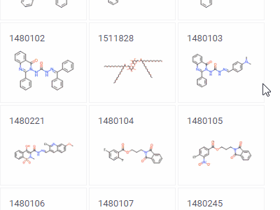     | [Tile viewer](viewers/form.md) visualizes rows as [forms](viewers/form.md) positioned as tiles.     Useful for reviewing the contents of each row.                                                                                                                                                                                                                                                            |
| 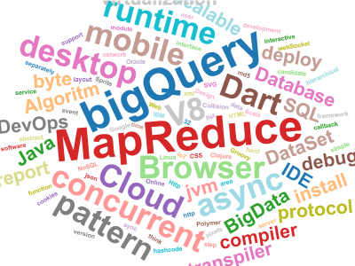      | [Word cloud](viewers/word-cloud.md) is a graphical representation of word frequency.     Any other aggregation function can be used as well for representing size or color of the particular word.                                                                                                                                                                                                            |
| 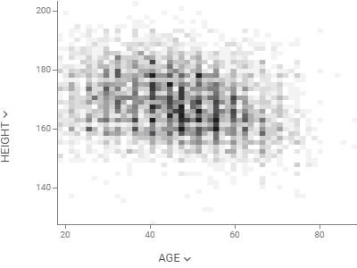    | [Matrix plot](viewers/word-cloud.md) shows density of points for the chosen X and Y columns, unlike [scatter plot](viewers/scatter-plot.mdx) that shows all of them.                                                                                                                                                                                                                                                  |
| 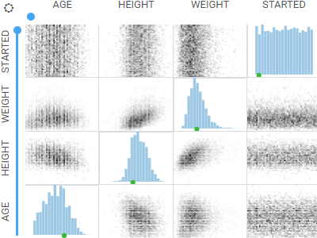     | [Matrix plot](viewers/word-cloud.md) shows relationships between selected columns by utilizing [density plots](viewers/density-plot.md) and [histograms](viewers/histogram.md).                                                                                                                                                                                                                                       |
| 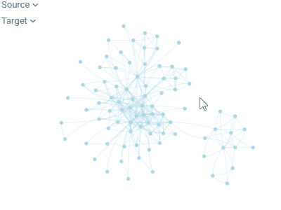 | [Network diagram](viewers/network-diagram.md) visualizes graphs, with values of the specified two columns as nodes, and rows as edges.     In this picture, you see relationships between the _Game of Thrones_ characters. Can you guess what the two clusters are?                                                                                                                                          |
|          | [Heatmap](viewers/heat-map.md) is a condensed representation of the grid, where it shows all dataset at once with the color-coded cells                                                                                                                                                                                                                                                                               |
| 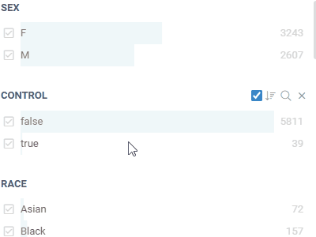         | [Filters](viewers/filters.md) let you quickly filter and select rows based on the column values.     Filters automatically adjust to the data type and semantics. Built-in filters: numerical, categorical, molecular, sequences, calendar, free text, lists, etc.                                                                                                                                            |
|        | [Correlation plot](viewers/correlation-plot.md) lets you see correlations between all columns at once. Cells are color-coded by the [Pearsson correlation coefficient](https://en.wikipedia.org/wiki/Pearson_product-moment_correlation_coefficient).     Histograms along the diagonal show the corresponding distribution. Hover over the cell to see the corresponding scatter plot. The grid is sortable. |
|                                        |                                                                                                                                                                                                                                                                                                                                                                                                                       |
|                                        |                                                                                                                                                                                                                                                                                                                                                                                                                       |

