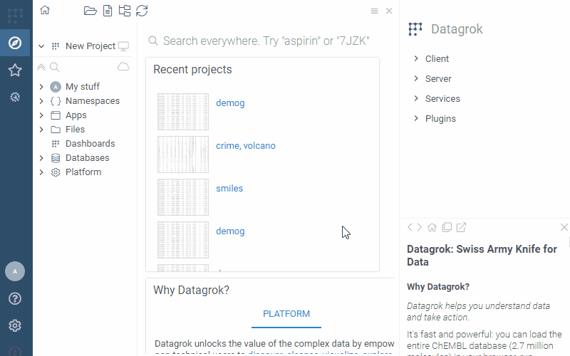

Bring more interactivity to your dashboards by defining custom event handlers. For instance,
you can make a REST call, and show additional information when a user double-clicks a point
on a scatter plot. The event handler is defined as a JavaScript code that gets invoked when
a particular event occurs. The code is saved in the viewer settings, so it gets saved along
with the projects or [view layouts](view-layout.md).

:::note This is a beta feature

To turn it on, check `Settings | Beta | Allow Event Scripts`

:::

To define an event handler:
1. Open viewer settings by clicking on the "gear" icon
2. Under the "Events" pane, find the event of interest
3. Edit the script, using the `args` and `viewer` variable to get event context. See examples below.

The following picture demonstrates how a few custom events are automatically activated
when the project is opened:



## Examples

Scatter plot: `On Rendered`: rendering custom text
```js
args.sender.canvas.getContext('2d').fillText('foo', 100, 100);
```

Scatter plot: `On Point Clicked`: show custom information when a point is clicked
```js
grok.shell.o = ui.divText('Clicked on ' + args.args.rowId);
```

Grid: `On Cell Clicked`
```js
grok.shell.info('Clicked on ' + args.data.cell.column.name + ' : ' + args.data.cell.rowIndex)
```

Bar chart: `On Category Clicked`: clicking on a category
```js
grok.shell.info(args.args.matchConditionStr);
```

