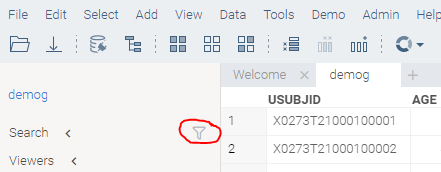
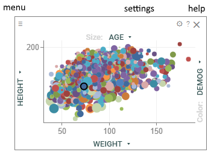
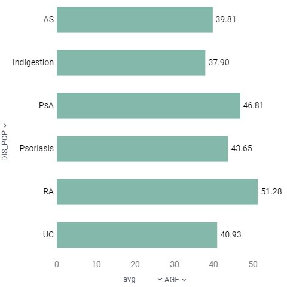
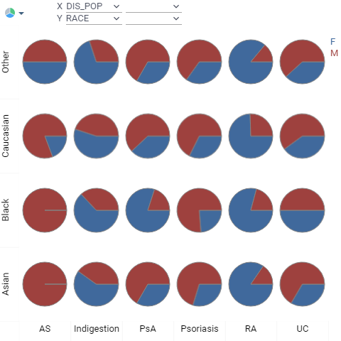
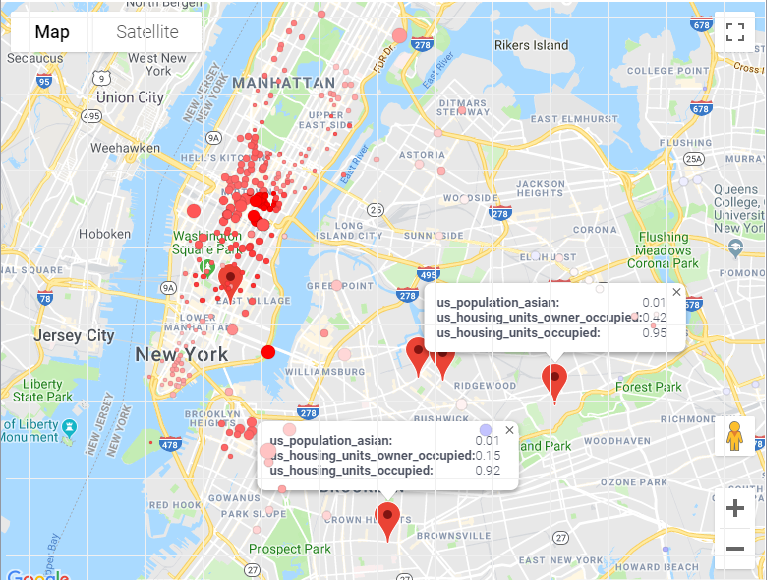
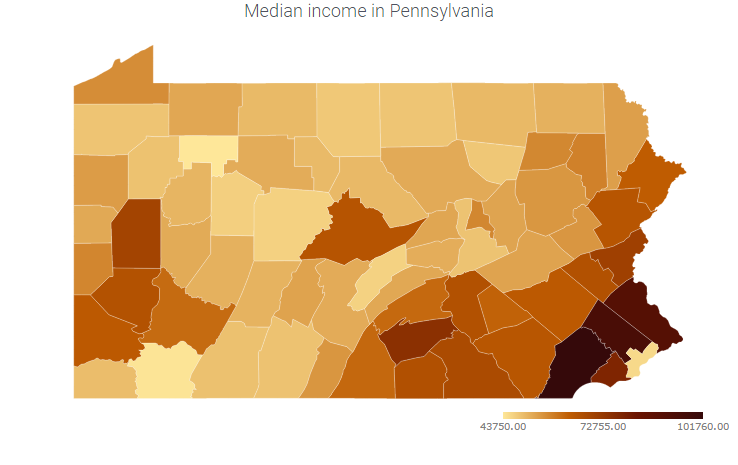
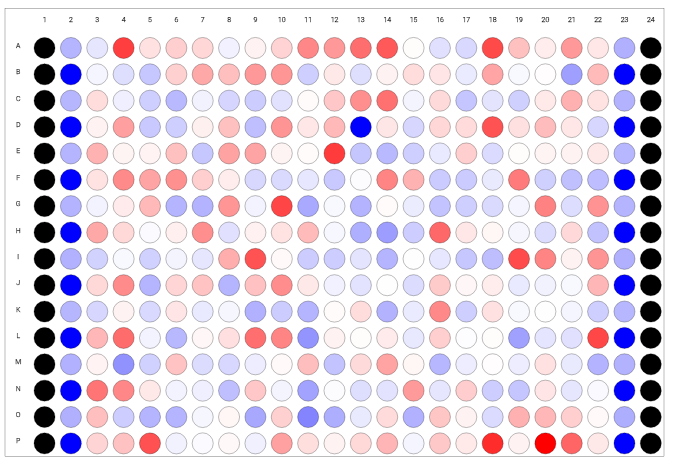
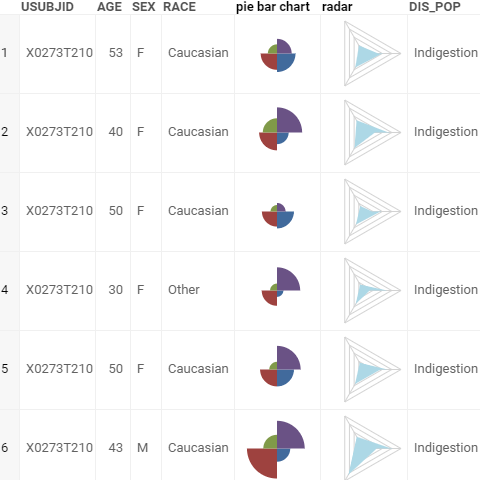
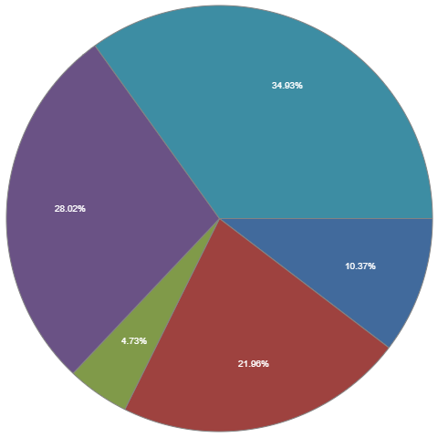

<!-- TITLE: Viewers -->
<!-- SUBTITLE: -->

# Viewers

A viewer is a visual component associated with a [table](../overview/table.md). Unlike 
other products, our viewers are [super fast](../develop/performance.md#viewers), 
completely interactive, and are capable of handling tens of millions of rows (or millions of columns).

Viewers belonging to the same [view](../overview/table-view.md) all share the same 
row selection and filter. Viewers are saved as part of the [project](../overview/project.md).
Also, it is possible to save viewers and views individually, and reuse them (or 
share with teammates) later on.

## Docking

Viewers are docked within a view. To rearrange it, start dragging viewer's header. Drop zone
indicators will appear; move the mouse cursor to one of them and release the mouse button to 
dock the viewer at that spot. To resize the viewer, drag the viewer's border.

## Selection

All viewers share the same row selection and filtered state, which can be manipulated
in a consistent way across all viewers:

|                  |                 |
|------------------|-----------------|
| ESC              | Deselect all rows and reset filter |
| Ctrl+A           | Select all rows |
| Ctrl+Shift+A     | Deselect all rows |
| Ctrl+Click       | Toggle selected state |
| Shift+Click      | Select point or group |
| Ctrl+Shift+Click | Deselect point or group |

To select rows in the [grid](viewers/grid.md):  

|                                 |                    |
|---------------------------------|--------------------|
| Shift+Mouse Drag                | Select rows        |
| Ctrl+Shift+Mouse Drag           | Deselect rows      |
| Mouse Drag row headers          | Select rows        |
| Shift+drag column headers       | Select columns     |
| Ctrl+click column headers       | Select columns     |
| Ctrl+Shift+click column headers | Deselect columns   |
| (Ctrl+) Shift + ↑↓               | (Un)select rows    |
| (Ctrl+) Shift + ←→              | (Un)select columns |
| (Ctrl+) Shift + mouse-drag       | (Un)select rows    |
| (Ctrl+) Shift + ENTER            | (Un)Select rows with the current value  | 

## Filter

To open filter group, click on the funnel icon in the toolbox:
 

Alternatively, click on the column's "hamburger icon" to filter by individual column:

## Select or filter

Use "row source" [property](#properties) to specify which rows should be visualized on the viewer.
To define what happens when user click on a group of rows, use "on click" property and choose
between "filter" and "select".

By setting up these properties, it is possible to create dashboards where one
viewer would serve as a filter to another.   

## Properties

Each viewer has a set of properties associated with it that define either the appearance
(such as "Back Color" or "Font"), or data (such as "Value" or "Split"). The most important
data properties (usually columns to visualize) are exposed as combo boxes on top of the viewer.
To edit the rest of the properties, either click on the "gear" icon on top of the viewer,
or press F4 when the viewer has focus, or right-click and select `Viewer | Propeties`.

## Common actions

Many viewers support the following:

|                 |                 |
|-----------------|-----------------|
| Double-click    | Reset View |
| Alt+drag        | Zoom   |
| Mouse drag      | Pan   |

All of the common actions are available from the context menu. To bring it up, either
right-click, or click on the "hamburger" menu in the top left corner. The icons in the 
viewer header are only visible when the mouse is hovering over the viewer.
 
The following ones are available under the **Viewer** submenu:

|                 |                 |
|-----------------|-----------------|
| Properties      | Show viewer properties in the [property panel](../overview/property-panel.md) |
| Clone           | Create a copy of the viewer |
| Full Screen     | Show in full screen. **Alt+F** |
| Close           | Close the viewer |
| Use in Trellis  | Add a [trellis plot](viewers/trellis-plot.md), using this viewer as a renderer |
| Save to Gallery | Saves this viewer to a [gallery](view-layout.md#layout-suggestions) |
| Copy Markup     | Copy viewer settings to the clipboard. It can be pasted as a [Markup](../overview/markup.md) |
| Embed           | Create HTML code that can be embedded in an external website |

Style-related commands reside under the **Style** submenu:

|                      |                 |
|----------------------|-----------------|
| Pick up              | Remember the style of the current viewer |
| Apply                | Applies previously remembered style. This option, as well as the "Apply data settings" and "apply style settings", is only enabled when the settings of the corresponding viewer type were picked up previously. |
| Apply Data Settings  | Apply only "Data" section of the settings |
| Apply Style Settings | Apply only "Appearance" section of the settings |
| Set as Default       | Use these settings for new viewers of that type |
| Reset Default        | Clear default settings |

Tooltip-related settings reside under the **Tooltip** submenu:

|                      |                 |
|----------------------|-----------------|
| Use as Group Tooltip | Use this viewer in for [tooltips that correspond to groups of rows](#group-tooltips) |
| Reset                | Stop using this viewer as a group tooltip |

## Group tooltips

One of the unique features of the Grok platform is the ability to quickly visualize multiple rows
in a tooltip, using the settings of another viewer.  

Once the "Use as Group Tooltip" command is executed, the original viewer is no longer required, 
and it is safe to close it if you choose so.

The following picture illustrates the concept:

## Viewer controls

## Scatter plot

|                           |                        |
|---------------------------|------------------------|
|              | A scatter plot (also called a scatter graph, scatter chart, scattergram, or scatter diagram) is a type of plot or mathematical diagram using Cartesian coordinates to display values for typically two variables for a set of data. If the points are color-coded you can increase the number of displayed variables to three. The data is displayed as a collection of points, each having the value of one variable determining the position on the horizontal axis and the value of the other variable determining the position on the vertical axis.   [Scatter Plot](viewers/scatter-plot.md) |

## 3D Scatter Plot

|                           |                        |
|---------------------------|------------------------|
|        | Use 3D scatter plot to plot data points on three axes to show the relationship between three variables. Each row in the data table is represented by a marker whose position depends on its values in the columns set on the X, Y, and Z axes. Additionally, you can color-code and size-code points, as well as display labels next to markers. [3D Scatter Plot](viewers/3d-scatter-plot.md) |

## Histogram

|                           |                        |
|---------------------------|------------------------|
|            | A histogram is a graphical representation of the distribution of numerical data.   [Histogram](viewers/histogram.md) |

## Line Chart

|                           |                        |
|---------------------------|------------------------|
|       | A line chart or line graph is a type of chart which displays information as a series of data points called 'markers' connected by straight line segments. It is a basic type of chart common in many fields. It is similar to a scatter plot except that the measurement points are ordered (typically by their x-axis value) and joined with straight line segments. [Line Chart](viewers/line-chart.md) |

## Bar Chart

|                           |                        |
|---------------------------|------------------------|
|         | A bar chart presents grouped data with rectangular bars with lengths proportional to the values that they represent. The bars can be plotted vertically or horizontally. [Bar Chart](viewers/bar-chart.md) |
 
## Box Plot

|                           |                        |
|---------------------------|------------------------|
|          | The box plot (a.k.a. box and whisker diagram) is a standardized way of displaying the distribution of data based on the five number summary: minimum, first quartile, median, third quartile, and maximum. [Box Plot](viewers/box-plot.md) | 

## Filters

|                           |                        |
|---------------------------|------------------------|
|     | A set of controls for quick filtering, selection, and visual assessment of column values. [Filters](viewers/filters.md) |

## Trellis Plot

|                           |                        |
|---------------------------|------------------------|
|     | A Trellis Chart is a layout of smaller charts in a grid with consistent scales. Each smaller chart represents rows that belong to a corresponding category. Trellis Charts are useful for finding the structure and patterns in complex data. The grid layout looks similar to a garden trellis, hence the name Trellis Chart. [Trellis Plot](viewers/trellis-plot.md) |

## Tree map

|                           |                        |
|---------------------------|------------------------|
|    | Tree maps display hierarchical (tree-structured) data as a set of nested rectangles. Each branch of the tree is given a rectangle, which is then tiled with smaller rectangles representing sub-branches. A leaf node's rectangle has an area proportional to a specified dimension of the data. [Tree Map](viewers/tree-map.md) |

## Form

|                           |                        |
|---------------------------|------------------------|
|     | Form allows you to customize the appearance of the row by manually positioning the fields, and adding other visual elements, such as pictures or panels. A form can be used either as a stand-alone viewer, or as a row template of the Tile Viewer. [Form](viewers/form.md) |

## Calendar

|                           |                        |
|---------------------------|------------------------|
|   | Calendar lets you analyze longitudinal data. It needs at least one column of type DateTime. [Calendar](viewers/calendar.md) | 

## Google Map

|                           |                        |
|---------------------------|------------------------|
|   | Google Map Viewer overlays latitude/longitude data from the corresponding table on top of the Google Map. [Google Map](viewers/google-map.md) | 

## Shape Map

|                           |                        |
|---------------------------|------------------------|
|     | Shows a map that is applicable for the specified dataset. Typically, it would represent a geographical area (countries, states, counties, etc), but also it can show an arbitrary shapes (such as a store floor plan, brain regions, or EEG electrodes). [Shape Map](viewers/shape-map.md) | 
 
## Grid

|                           |                        |
|---------------------------|------------------------|
|           | A default view for the interactive exploration of tables that might contain multiple different viewers all sharing the same row filter and row selection. [Grid](viewers/grid.md) | 

## Matrix Plot

|                           |                        |
|---------------------------|------------------------|
|          | Use Matrix Plot to assess the relationship among many pairs of columns at the same time. [Matrix Plot](viewers/matrix-plot.md) | 

## Network Diagram

|                           |                        |
|---------------------------|------------------------|
|   | Network diagram is used to visualize graphs, where values of the specified two columns become nodes, and rows become edges. It is possible to color-code and size-code nodes and columns by choosing the aggregate function that would apply to the values that represent an edge or a node. [Network Diagram](viewers/network-diagram.md) | 

## Parallel Coordinates Plot

|                           |                        |
|---------------------------|------------------------|
|         | Parallel coordinates is a common way of visualizing high-dimensional geometry and analyzing multivariate data. [Parallel Coordinates Plot](viewers/pc-plot.md) | 

## Pie Chart

|                           |                        |
|---------------------------|------------------------|
|         | Pie chart is useful for reflecting numerical proportions. [Pie Chart](viewers/pie-chart.md) | 

## Word cloud

|                           |                        |
|---------------------------|------------------------|
|   | A word cloud is a graphical representation of word frequency. Any other aggregation function can be used as well for representing size or color of the particular word. [Word Cloud](viewers/word-cloud.md)  | 

## Correlation Plot

|                           |                        |
|---------------------------|------------------------|
|   | A quick way to assess correlations between all columns at once. Cells are color-coded by the [Pearsson correlation coefficient](https://en.wikipedia.org/wiki/Pearson_product-moment_correlation_coefficient). Histograms along the diagonal show the corresponding distribution. Hover over the cell to see the corresponding scatter plot. The grid is sortable. Select columns in the view by selecting corresponding rows. [Correlation Plot](viewers/correlation-plot.md)  | 

## Density Plot

|                           |                        |
|---------------------------|------------------------|
|   | Unlike [scatter plot](viewers/scatter-plot.md) that visualizes each individual data point, density plot splits 2D area by bins, and color-codes it depending on the number of points that fall within this bin. The darker the color, the more points it contains. [Density Plot](viewers/density-plot.md)  | 

## Heat Map

|                           |                        |
|---------------------------|------------------------|
|   | A Heat Map is a graphical representation of table where each cell value is represented as color. It is based on grid, so all of the grid's features are applicable to the heat map as well. [Heat Map](viewers/heat-map.md)  | 

## Markup Viewer

|                           |                        |
|---------------------------|------------------------|
|   | Use [Markup Viewer](viewers/markup.md) to host any text, arbitrary HTML content, or [markdown-formatted text](../features/markdown.md). In most casees, the viewer will auto-detect content type. Use the "Content Type" property to explicitly specify it.  | 

## Tile Viewer

|                           |                        |
|---------------------------|------------------------|
|   | Visualizes rows as a collection of forms that are positioned as tiles. [Tile Viewer](viewers/tile-viewer.md)
  | 

## Statistics
Provides specified descriptive [Statistics](viewers/statistics.md) for the chosen columns.

## Globe
Visualises magnitude and color for data on 3D globe using: latitude, longitude. Details: [Globe](viewers/globe.md) 

## Viewers interaction

All visualizations are tightly coupled. Hover, selection, filtering on one viewer is displayed on the rest:

       

Filtering data, for example, on a [histogram](viewers/histogram.md) will affect the [Scatter Plot](viewers/scatter-plot.md):    

    

### Videos

<iframe width="560" height="315" src="https://www.youtube.com/embed/67LzPsdNrEc" frameborder="0" allow="accelerometer; autoplay; encrypted-media; gyroscope; picture-in-picture" allowfullscreen></iframe>

See also: 
  
* [Table View](../overview/table-view.md)
* [Column Selectors](viewers/column-selectors.md)
* [Chemically-Aware Viewers](../domains/chem/chemically-aware-viewers.md)
