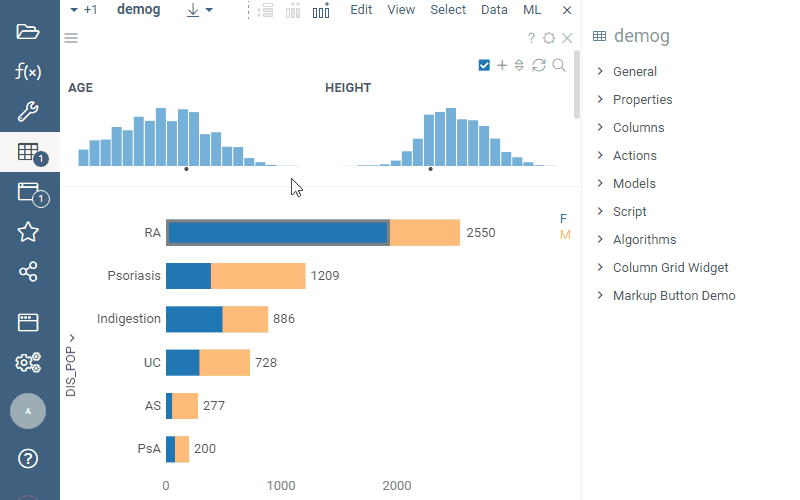
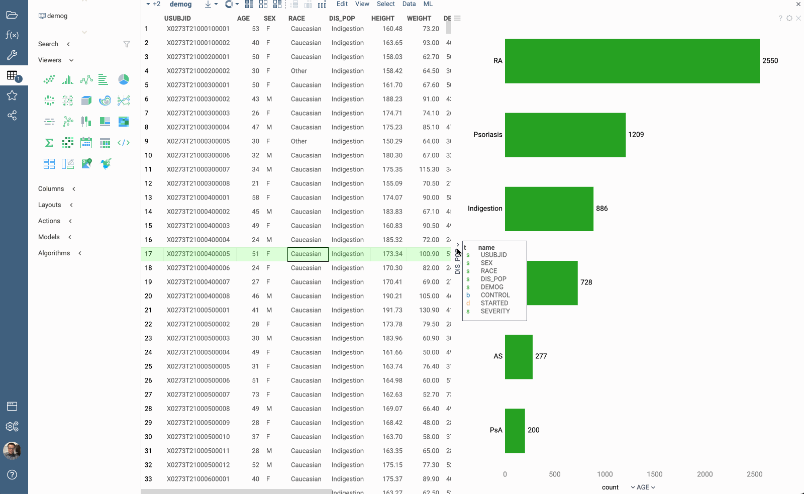

A bar chart presents grouped data as rectangular bars with lengths proportional to the values that they represent.
Unlike histograms which you can apply to display the distribution of numerical data, bar charts are primarily designed
for categorical values.

> Developers: To add the viewer from the console, use:
 `grok.shell.tv.addViewer('Bar chart');`

|                |                                   |
|----------------|-----------------------------------|
| Click on a bar | [Select or filter](../viewers/viewers.md) |
| Right click    | Context menu                      |
| Double-click   | Reset View                        |
| Alt+drag       | Zoom                              |
| Alt+F          | Show in full screen               |

## Features

### Stacked bars and relative values

Use the 'Relative Values' property in combination with the 'Stack' property to analyze the distribution of the stacked
values:

### Dates and years, quarters, months

You can categorize DateTime columns using special functions, such as 'Year', 'Month', 'Quarter', '
Year - Month' and 'Year - Quarter':

## Videos

## Properties

| Property | Type | Description |
|----------|------|-------------|
| **Data** | | |
| Row Source | string | Determines the rows shown on the scatter plot. |
| Filter | string | Formula that filters out rows to show. Example: `${AGE} > 20` or `${WEIGHT} / 2) > 100` |
| On Click | string | Determines what happens when you click on a bar. |
| Table | string |  |
| **Value** | | |
| Value Column Name | string | Value column. See *Value Aggr Type* for aggregation options. |
| Value Aggr Type | string | Value aggregation. |
| Relative Values | boolean | When true, each outermost bar is of the same width. This mode is useful for comparing relative value frequency when the *Stack* column is specified. |
| Include Nulls | boolean | Indicates whether the no data bar should appear when the *Split* value is not present. |
| Bar Sort Type | string | Whether to sort bars *by category* or *by value*. See also *Bar Sort Order* |
| Bar Sort Order | string | Whether the bars should be sorted in ascending or descending order. See also *Bar Sort Type*. |
| Axis Type | string |  |
| Show Value Axis | boolean |  |
| Show Value Selector | boolean |  |
| **General** | | |
| Orientation | string |  |
| Show Mouse Over Rect | boolean |  |
| Show Filtered Rows | boolean | Show which part is filtered Only works with RowSource = All |
| Show Mouse Over Rows | boolean |  |
| Back Color | number |  |
| Axis Color | number |  |
| Bar Color | number |  |
| Category Color | number |  |
| Value Text Color | number |  |
| Bar Border Line Mouse Over Color | number |  |
| Bar Border Line Filtered Color | number |  |
| Bar Border Line Color | number |  |
| Outer Margin Left | number |  |
| Outer Margin Right | number |  |
| Outer Margin Top | number |  |
| Outer Margin Bottom | number |  |
| Show Empty Bars | boolean |  |
| Show Labels | string |  |
| Legend Visibility | visibilitymode |  |
| Legend Position | flexautoposition |  |
| Allow Dynamic Menus | boolean |  |
| Show Context Menu | boolean | Properties common for all viewers todo: use code generation |
| Title | string |  |
| Description | string | Viewer description that gets shown at the *Descriptor Position*. Markup is supported. |
| Help | string | Help to be shown when user clicks on the ''?'' icon on top. Could either be in markdown, or a URL (starting with ''/'' or ''http''). |
| Description Position | flexposition |  |
| Description Visibility Mode | visibilitymode |  |
| **Category** | | |
| Split Column Name | string | A categorical column to split data on (each bar represents a category) |
| Split Map | string | Time unit map function for *Split* (applicable to dates only). |
| Show Category Values | boolean |  |
| Show Values Instead Of Categories | boolean |  |
| Show Category Selector | boolean |  |
| **Stack** | | |
| Stack Column Name | string | A categorical column to further split data on. Each category would become a part of the bar resulting from *Split*. |
| Stack Map | string | Time unit map function for *Stack* (applicable to dates only). |
| Show Stack Selector | boolean |  |
| **Color** | | |
| Color Column Name | string | Numerical column to be used for color-coding. The values in the bin get aggregated using the *Color Aggr Type* property. |
| Color Aggr Type | string | Color aggregation type. |
| Invert Color Scheme | boolean |  |
| Linear Color Scheme | list |  |
| **Selection** | | |
| Show Selected Rows | boolean | Whether the selected rows are indicated. Only works for cumulative aggregations such as count. |
| **Style** | | |
| Auto Layout | boolean |  |
| Max Category Width | number |  |
| Category Value Width | number |  |
| Show Value Axis Line | boolean |  |
| Bar Border Line Mouse Over Width | number |  |
| Bar Border Line Width | number |  |
| Max Bar Height | number |  |
| Bar Corner Radius | number |  |
| Vertical Align | verticalaligntype |  |
| Font | string |  |
| Axis Font | string |  |
| Min Text Height | number |  |
| Controls Font | string | Viewer controls elements font. |
| **Description** | | |
| Show Title | boolean |  |

See also:

* [Column selectors](column-selectors.md)
* [Table View](../table-view-1.md)
* [Viewers](../viewers/viewers.md)
* [JS API: Bar Chart](https://public.datagrok.ai/js/samples/ui/viewers/types/bar-chart)
* [Community: Visualization-related updates](https://community.datagrok.ai/t/visualization-related-updates/521)

