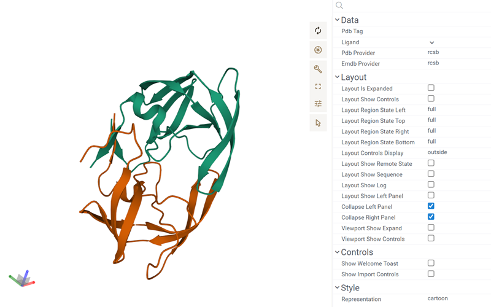

Biostructure Viewer is used for visualizing and analyzing macromolecules.

It allows you to view 3D structures, explore docking results, and offers multiple rendering modes for different visual
representations. The viewer is based on [RCSB Molstar viewer](https://github.com/molstar/rcsb-molstar).

## Creating an Biostructure viewer

1. Navigate to the **Menu Ribbon**
2. Select **Add > Javascript Viewer > Biostructure**
3. Load the macromolecule file by using the "**Open...**" link in the empty viewer.

> Note:
> The user interface for loading macromolecules from a file share is not implemented.
> You have to save the macromolecule to your local device before opening it in the NGL Viewer.

## Configuring a NGL viewer

The Biostructure viewer is configurable like other Datagrok viewers with the **Context Panel**.
To do that, click the **Gear** icon on top of the viewer.
Molstar component built-in control knobs are also available.

## See also

* [Viewers](../viewers/viewers.md)
* [MolStar](https://molstar.org/)
* [NGL Viewer](./ngl.md)
