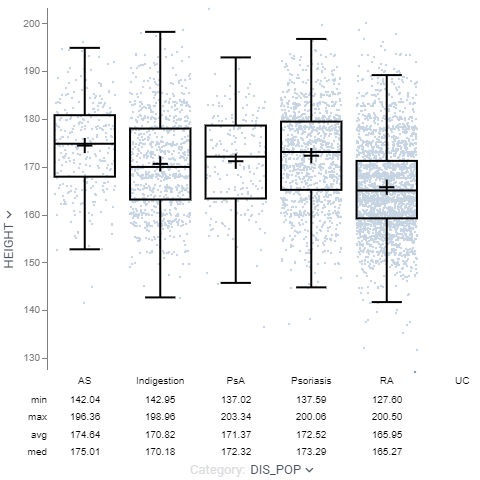

<!-- TITLE: Box plot-->
<!-- SUBTITLE: -->

# Box plot

The box plot (a.k.a. box and whisker diagram) is a standardized way of displaying the distribution of data based on the
five number summary: minimum, first quartile, median, third quartile, and maximum.

General:

|             |              |
|-------------|--------------|
| Right click | Context menu |

## T-test

When the "category" column contains exactly two categories, press "T" to perform
[Welch's t-test](https://en.wikipedia.org/wiki/Welch%27s_t-test). The resulting p-value will then be shown on top of the
box plot.

## Inverted whiskers

On certain datasets, you would see whiskers extending inside the box plot. This is not a rendering bug. The bottom of
the box is at the 1st quartile (Q1), and the top is at the 3rd quartile (Q3)
value. The whiskers are the lines that extend from the top and bottom of the box to the adjacent values. The adjacent
values are the lowest and highest observations that are still inside the region defined by the following limits:

Lower Limit: Q1 - 1.5 (Q3 - Q1)
Upper Limit: Q3 + 1.5 (Q3 - Q1)

However, the upper adjacent value can be less than Q3, which forces the whisker to be drawn from Q3 into the box. The
lower adjacent value can also be greater than Q1, which forces the whisker to be drawn from Q1 into the box.

For instance, you would get the upper whisker inverted on the following data: [0, 41, 42, 70]

## Videos

See also:

* [Viewers](../viewers.md)
* [Table View](../../overview/table-view.md)
* [JS API: Box plot](https://public.datagrok.ai/js/samples/ui/viewers/types/box-plot)
* [Wikipedia: Welch's t-test](https://en.wikipedia.org/wiki/Welch%27s_t-test)
