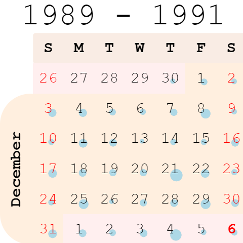

<!-- TITLE: Calendar -->
<!-- SUBTITLE: -->

# Calendar

Calendar lets you analyze longitudinal data. It needs at least one column of type DateTime.

General:

|                      |                       |
|----------------------|-----------------------|
| Right click          | Context menu          |
| Click on date        | Filter by date        |
| Click on year        | Filter by year        |
| Click on day of week | Filter by day of week |
| Click on month       | Filter by month       |
| Click on week        | Filter by week        |

## Videos

See also:

* [Viewers](../viewers.md)
* [Table View](../../overview/table-view.md)
* [JS API: Calendar](https://public.datagrok.ai/js/samples/ui/viewers/types/calendar)
