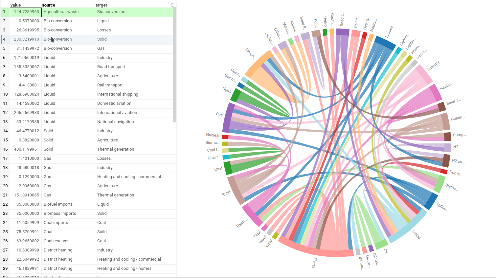

A chord diagram is a graphical method of displaying the inter-relationships
between data.
You can use it to visualize complex networks or flows between
different entities.
Chrod diagram arranges data radially around a circle and draws the flows
between the data points as arcs connecting the data.
The chord width represents the strength of the flow
between the entities.

## Create a Chord viewer

To create a **Chord** viewer, open the main menu and select
the option "Add -> JavaScript Viewers -> Chord"

When you add a chord viewer in Datagrok, the platform selects three columns:

* A categorical "From" column
* A categorical "To" column
* A numeric "Chord length" column representing the flow strength between source
and target categories

## Configuring a Chord viewer

You can set the source, target and "Chord length" columns
and customize a visualization options.
To do that, click the **Gear** icon on top of the viewer and use the **Data**
and **Misc** info panels
on the **Context Pane** to manage the viewer’s settings.

For example, you can:

* Change the aggregation type of connections via **Agg type**: just count of
connections or sum of the "Chord length" values.
* Set the connection color mode by source or by target via **Color by** control.
* Change the sorting order of the categories via **Sort by** control.
* Set the direction of categories via **Direction** option.
* Show or hide categories without connections by switching **Include nulls** checkbox.

## Interaction with other viewers

A **Chord** viewer responds to data filters but has limited interaction in rows
selection.
Clicking by connection or category on the viewer selects the corresponding row(s)
in the table. However, selecting the rows in table or on the other viewers
has no effect on the **Chord** viewer representation

## Viewer controls

| Action                                                  | Control                            |
|---------------------------------------------------------|------------------------------------|
| Select all rows containing the category                 | Click the category                 |
| Select row containing connection between two categories | Click on the connection            |
| Add connection/category to selection                    | Shift+click the connection/category|
| Toggle connection/category selection                    | Ctrl+click the connection/category |

## See also

* [Viewers](../viewers/viewers.md)
* [Network viewer](network-diagram.md)
* Sankey viewer
