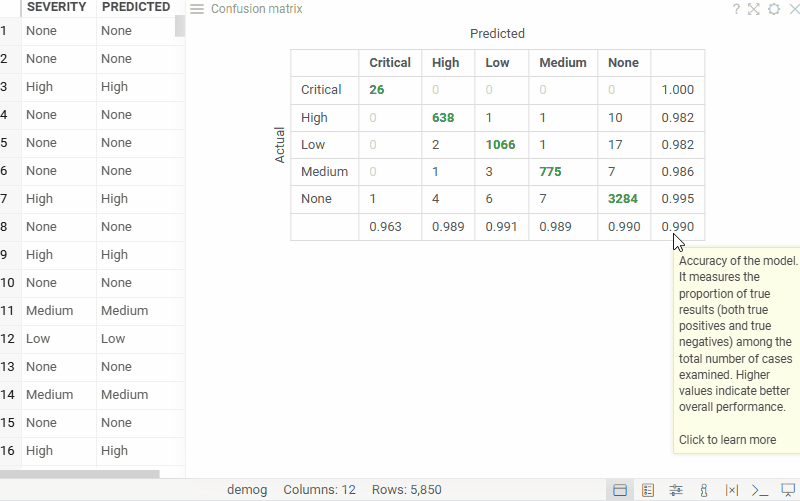

Confusion matrix evaluates a model by comparing its predictions with actual results in a tabular format. 
It displays a table where each cell counts rows for a specific combination of predicted and actual values, 
while also showing prediction errors and overall model accuracy.

To add a confusion matrix, click the **Add Viewer** icon on the menu ribbon and select **Confusion Matrix**.

:::note developers

To add the viewer programmatically from the console, use:   
`grok.shell.tv.addViewer('Confusion Matrix');`
:::

