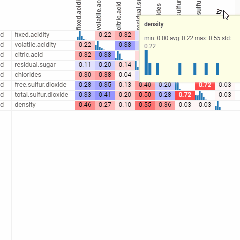

<!-- TITLE: Correlation plot -->
<!-- SUBTITLE: -->

# Correlation plot

A quick way to assess correlations between all columns at once. Cells are color-coded by the
[Pearson correlation coefficient](https://en.wikipedia.org/wiki/Pearson_product-moment_correlation_coefficient)
or [Spearman's rank correlation coefficient](https://en.wikipedia.org/wiki/Spearman%27s_rank_correlation_coefficient)
. Histograms along the diagonal show the corresponding distribution. Hover over the cell to see the corresponding
scatter plot. The grid is sortable. Select columns in the view by selecting corresponding rows.

General:

|                     |              |
|---------------------|--------------|
| Right click         | Context menu |
| Header double-click | Sort column  |

See also:

* [Viewers](../viewers.md)
* [Table View](../../overview/table-view.md)
* [JS API: Correlation plot](https://public.datagrok.ai/js/samples/ui/viewers/types/corr-plot)
