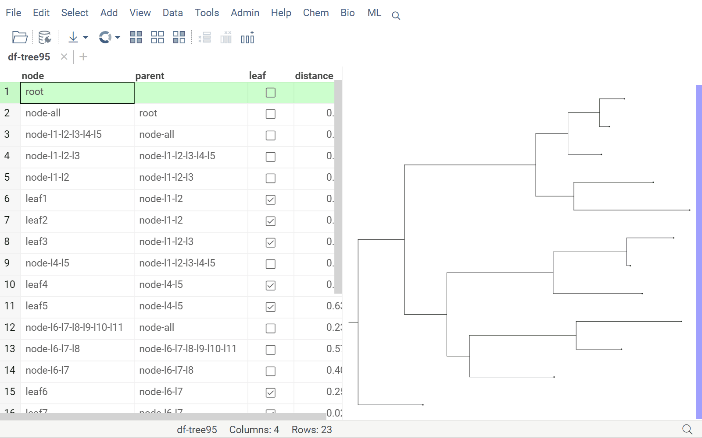
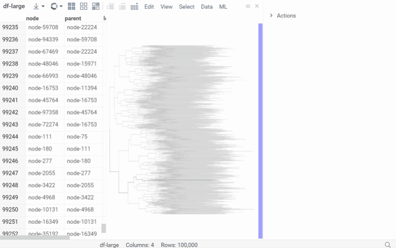
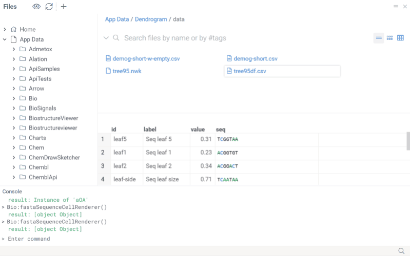

# Dendrogram

_Dendrogram_ is a [package](../../develop/develop.md#packages) for phylogenetic trees visualization.

## Notations

Currently, only the _Newick_ tree format is supported.

## Viewers

Dendrogram viewer is a pure typescript component derived from
[DG.JsViewer](https://datagrok.ai/api/js/api/dg/classes/JsViewer) to be used as
[a Datagrok viewer](../../visualize/viewers/viewers.md).
Exposed properties allow customizing the viewer appearance for the line width and color, the node size and fill color.



The viewer expects a data frame with the tag '.newick' (you can customize the tag name with the
property 'newickTag') containing tree data. You can also set the 'newick' property for data directly (the 'newick'
property value takes priority over the data frame tag).

```ts
//name: Dendrogram
//language: javascript
const csv = await grok.dapi.files.readAsText("System:AppData/Dendrogram/data/tree95df.csv");
const newick = await grok.dapi.files.readAsText("System:AppData/Dendrogram/data/tree95.nwk");
const df = DG.DataFrame.fromCsv(csv);
df.setTag('.newick', newick);
const tv = grok.shell.addTableView(df);
const viewer = await df.plot.fromType('Dendrogram', {});
tv.dockManager.dock(viewer, DG.DOCK_TYPE.RIGHT); // TypeError: Cannot read properties of undefined (reading 'H')
```

## Optimized for large trees

The Dendrogram viewer is highly optimized to render trees with hundreds of thousands of nodes.



## File handlers

Opening a file with .nwk or .newick extension transforms it into a DataFrame of nodes (node, parent, leaf, distance
columns) with a DendrogramViewer docked on the right side of the grid. The dendrogram viewer interacts with the data
frame through the column with node names specified in the Node[ColumnName] property. Current state,
hover, and selection are supported and displayed with specific styles in the dendrogram and data frame grid.



## Dendrogram injected to grid, hierarchical clustering

An application developer can inject a Dendrogram viewer into a grid linked by row number or leaf column name.
For example, the Top menu function **ML | Hierarchical Clustering** calculates the tree on selected features/columns with
a specified pairwise distance metric and aggregation method. Mouse over, current, selected, and filtered states, as well as row height,
are synchronized between the grid and injected tree in both directions.


