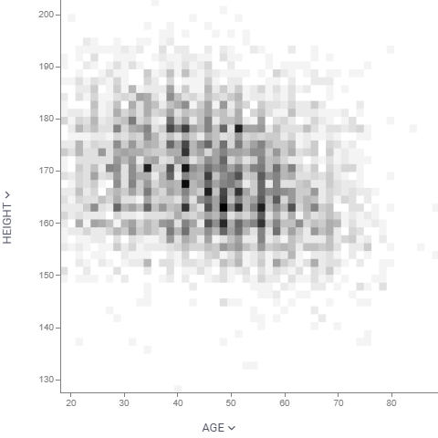

Unlike [scatter plot](scatter-plot.md) that visualizes each individual data point, density plot splits 2D area by bins,
and color-codes it depending on the number of points that fall within this bin. The darker the color, the more points it
contains.

> Developers: To add the viewer from the console, use:
`grok.shell.tv.addViewer('Density plot');`

General:

|             |              |
|-------------|--------------|
| Right click | Context menu |

## Properties

| Property | Type | Description |
|----------|------|-------------|
| **General** | | |
| Bin Shape | string |  |
| X Column Name | string | Columns to be put on the X axis |
| Y Column Name | string | Columns to be put on the Y axis |
| Allow Zoom | boolean |  |
| Bin To Range | boolean |  |
| Show Bin Selector | boolean |  |
| Back Color | number |  |
| Row Source | string | Determines the rows shown on the plot. |
| Allow Dynamic Menus | boolean |  |
| Show Context Menu | boolean | Properties common for all viewers todo: use code generation |
| Title | string |  |
| Description | string | Viewer description that gets shown at the *Descriptor Position*. Markup is supported. |
| Help | string | Help to be shown when user clicks on the ''?'' icon on top. Could either be in markdown, or a URL (starting with ''/'' or ''http''). |
| Description Position | flexposition |  |
| Description Visibility Mode | visibilitymode |  |
| **Style** | | |
| Auto Layout | boolean |  |
| Axis Font | string |  |
| Show Color Scale | boolean |  |
| Invert Color Scheme | boolean |  |
| Color Transform Type | string |  |
| Linear Color Scheme | list |  |
| Controls Font | string | Viewer controls elements font. |
| **X** | | |
| Show X Axis | boolean |  |
| X Axis Type | string |  |
| Invert X Axis | boolean |  |
| Show X Selector | boolean |  |
| X Min | number |  |
| X Max | number |  |
| **Y** | | |
| Show Y Axis | boolean |  |
| Y Axis Type | string |  |
| Invert Y Axis | boolean |  |
| Show Y Selector | boolean |  |
| Y Min | number |  |
| Y Max | number |  |
| **Misc** | | |
| Bins | number |  |
| **Data** | | |
| Filter | string | Formula that filters out rows to show. Examples: `${AGE}` > 20 or `${WEIGHT / 2)}` > 100, `${SEVERITY}` == ''Medium'', `${RACE}`.endsWith(''sian'') |
| Table | string |  |
| **Description** | | |
| Show Title | boolean |  |

See also:

* [Viewers](../viewers/viewers.md)
* [Scatter Plot](scatter-plot.md)
* [Table View](../table-view-1.md)
* [JS API: Density plot](https://public.datagrok.ai/js/samples/ui/viewers/types/density-plot)
* [Community: Visualization-related updates](https://community.datagrok.ai/t/visualization-related-updates/521)

