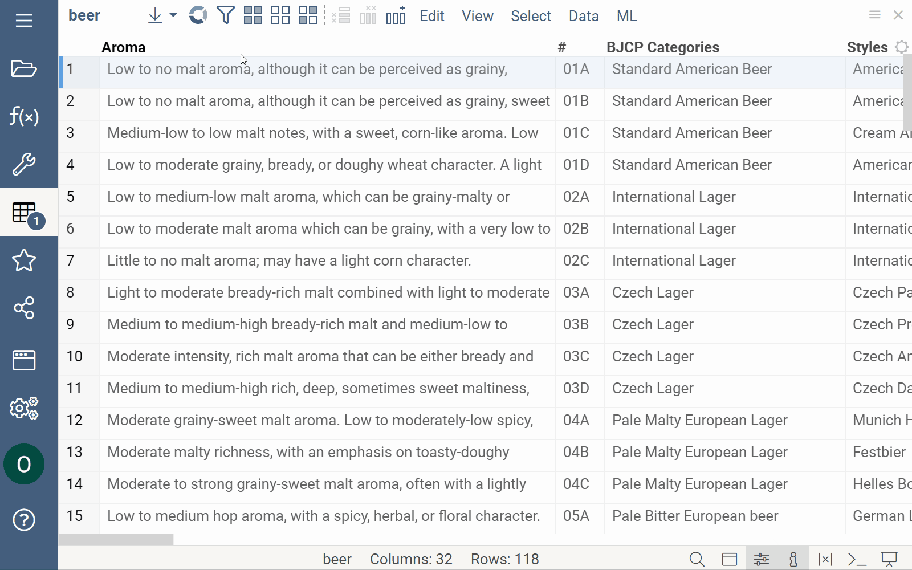
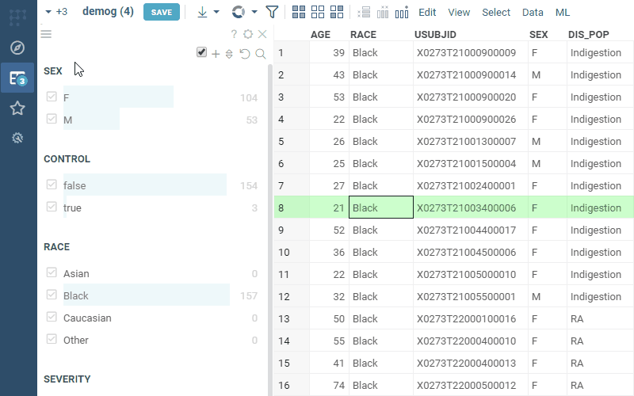

A set of controls for quick filtering, selection, and visual assessment of column values.

General:

|                   |                         |
|-------------------|-------------------------|
| 1st column click  | Toggle filter           |
| 2nd column click  | Toggle selection        |
| Name column click | Filter by that category |
| Up / down         | Filter by that category |
| Esc               | Reset filter            |


## Search

Each categorical filter group has a search field for filtered values. Click the Search icon to the right of the filter
caption to open it. This icon appears when you hover the mouse over the filter.

If you start typing text in the field, the filter will show all values that partially contain this text. But if you are
typing words, separating them with a comma, then the filter will show only those values that exactly match each other.

It is also allowed to paste multi-line text from the clipboard into the search field. In this case, the filter will also
display those values that exactly match each word. To select or deselect only the found values of the category - click
the checkbox to the left of the search field. Note that other (not displayed) values of the categories do not change
their choice.


## Text filter

This filter is used for fuzzy searching for the specified search terms, and applies to string columns that 
have the "Text" semantic type.

To add a search term, enter it in the search box, and press Enter. Use the checkboxes and the "and/or"
switch to control search results.



## Free-text filter

Free-text filter lets you enter custom search terms. Typically, search terms
have a form of `column name` `operation` `value`. The following operations are supported:

* numerical columns: `none`, `=`, `!=`, `>`, `<`, `>=`, `<=`, `in`, `not in`, `-`, `is null`, `is not null`
  * `age > 40`
  * `height is null`
* string columns: `none`, `contains`, `starts with`, `ends with`, `equals`, `!=`, `regex`, `in`, `not in`, `is null`, `is not null`
  * `race contains sian`  // Asian, Caucasian
  * `race starts with B`
  * `race in (Black, Asian)`
  * `race regex ck$`
* datetime columns: `none`, `equals`, `before`, `after`, `range`, `is null`, `is not null`
  * `started after 7/1/1991`
  * `started `
* bool columns: `true`, `false`

### Logical conditions

Free-text filter also understands (very basic) logical conditions. Here are some examples:
* `age > 30 and height > 190`
* `age > 30 and sex = F`

Unfortunately, at the moment free-text filter does not work with columns that have space in the name. 
We are working on developing another filter that would let you specify column/operation/value in a more structured form.



## Column tags

* For **molecular columns**, use the **.structure-filter-type** column tag to
  define filter type:
  * Set **.structure-filter-type** to `Sketch` to use Sketcher for filtering
    molecular columns.
  * Set **.structure-filter-type** to `Categorical` to use molecular column
    values as categories in the filter group.

* For [**multi-value columns**](https://community.datagrok.ai/t/visualization-related-updates/521/12?u=skalkin),
 use the **.multi-value-separator** column tag to
  parse multiple values as separate filter categories. The most common
  separators are `\n`, `,`, `;`.

* To work with custom filters, use such column tags as `.custom-filter-type` and
  `.ignore-custom-filter`. The `.custom-filter-type` tag contains a custom
  filter name to be used by default for a column. Its value consists of two
  parts: the namespace and the function name (`<PackageName>:<FilterType>`,
  e.g., `Chem:substructureFilter`). Use the `.ignore-custom-filter` tag to
  control custom filters visibility. If both tags are used,
  `DG.TAGS.CUSTOM_FILTER_TYPE` takes precedence over
  `DG.TAGS.IGNORE_CUSTOM_FILTER`.

To set the column tag value via the UI:

1. Right-click the column's header and select **Column Properties** from the
   context menu. A dialog with column metadata opens.
1. In the dialog, use the **Plus** icon to add a new tag.
1. Enter the tag name and value.
1. Click **OK** to save changes.

To set the column tag value programmatically:

```javascript
column.tags[DG.TAGS.STRUCTURE_FILTER_TYPE] = 'Categorical';
```

## Drag-and-drop

Drag-and-drop columns right from the grid to add the corresponding filters:


See also:

* [Viewers](../viewers/viewers.md)
* [Table View](../../datagrok/navigation/table-view.md)
* [JS API: Filters](https://public.datagrok.ai/js/samples/ui/viewers/types/filters)
