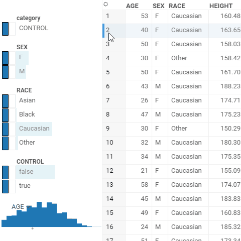
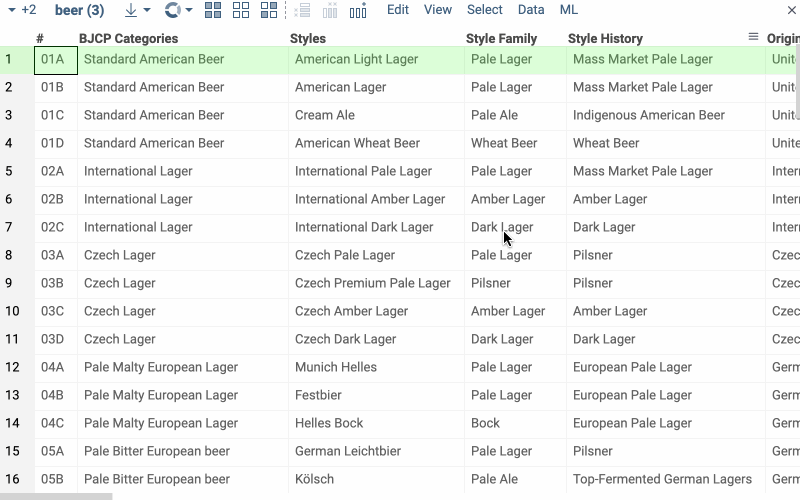

<!-- TITLE: Filters -->
<!-- SUBTITLE: -->

# Filters

A set of controls for quick filtering, selection, and visual assessment of column values.

General:

|                   |                         |
|-------------------|-------------------------|
| 1st column click  | Toggle filter           |
| 2nd column click  | Toggle selection        |
| Name column click | Filter by that category |
| Up / down         | Filter by that category |
| Esc               | Reset filter            |



## Search

Each categorical filter group has a search field for filtered values. Click the Search icon to the right of the filter
caption to open it. This icon appears when you hover the mouse over the filter.

If you start typing text in the field, the filter will show all values that partially contain this text. But if you are
typing words, separating them with a comma, then the filter will show only those values that exactly match each other.

It is also allowed to paste multi-line text from the clipboard into the search field. In this case, the filter will also
display those values that exactly match each word. To select or deselect only the found values of the category - click
the checkbox to the left of the search field. Note that other (not displayed) values of the categories do not change
their choice.



## Column tags

* For **molecular columns**, use the **.structure-filter-type** column tag to
  define filter type:
  * Set **.structure-filter-type** to `Sketch` to use Sketcher for filtering
    molecular columns.
  * Set **.structure-filter-type** to `Categorical` to use molecular column
    values as categories in the filter group.

* For [**multi-value columns**](https://community.datagrok.ai/t/visualization-related-updates/521/12?u=skalkin),
 use the **.multi-value-separator** column tag to
  parse multiple values as separate filter categories. The most common
  separators are `\n`, `,`, `;`.

To set the column tag value via the UI:

1. Right-click the column’s header and select **Column Properties** from the
   context menu. A **Structure** dialog opens.
1. In the dialog, use the **Plus** icon to add a new tag.
1. Enter the tag name and value.
1. Click **OK** to save changes.

To set the column tag value programmatically:

```javascript
column.tags[DG.TAGS.STRUCTURE_FILTER_TYPE] = 'Categorical';
```

## Drag-and-drop

Drag-and-drop columns right from the grid to add the corresponding filters:


See also:

* [Viewers](../viewers.md)
* [Table View](../../datagrok/table-view.md)
* [JS API: Filters](https://public.datagrok.ai/js/samples/ui/viewers/types/filters)
