```mdx-code-block
import Tabs from '@theme/Tabs';
import TabItem from '@theme/TabItem';
```

A set of controls for quick filtering, selection, and visual assessment of column values.

General:

|                   |                         |
|-------------------|-------------------------|
| 1st column click  | Toggle filter           |
| 2nd column click  | Toggle selection        |
| Name column click | Filter by that category |
| Up / down         | Filter by that category |
| Esc               | Reset filter            |

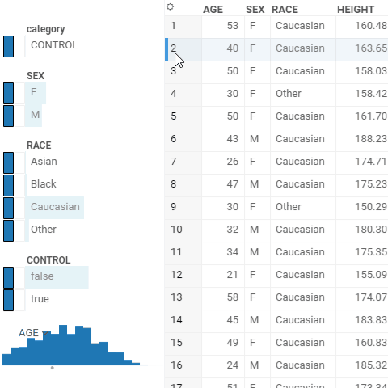

## Categorical filter

Categorical filter displays a list of unique column values with checkboxes, allowing you to include or exclude specific categories.

### Search

Each categorical filter group has a search field for filtered values. Click the Search icon to the right of the filter
caption to open it. This icon appears when you hover the mouse over the filter.

If you start typing text in the field, the filter shows all values that partially contain this text. If you
type words separated by commas, the filter shows only values that exactly match each word.

You can also paste multi-line text from the clipboard into the search field. The filter then
displays only values that exactly match each line. The checkbox on the left of the search field controls whether to select
filtered values only. When enabled, the filter automatically selects
only values that match the search criteria. When disabled, the search filters values
without selecting them.

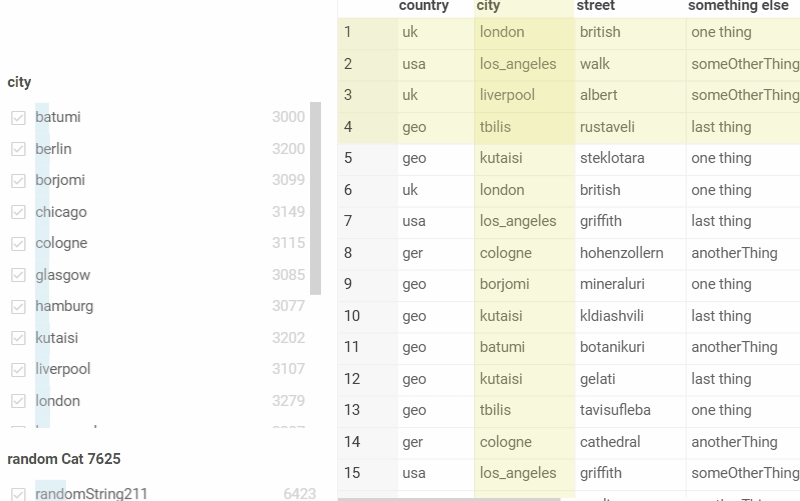

### Radio mode

By default, categorical filter uses **Multi-Select** mode — multiple categories can be checked simultaneously. To filter by a single category without switching modes, click its label directly (rather than the checkbox).
To restrict selection to one category at a time, switch to **Radio** mode: click the filter menu icon and select **Mode** > **Radio**. To return to multi-select behavior, select **Mode** > **Multi-Select**.

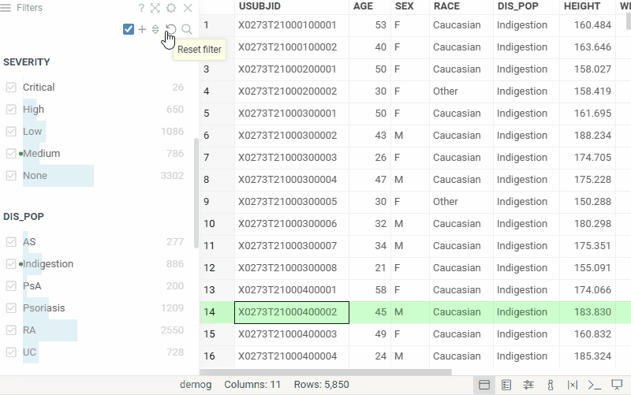

## Numerical filter

Numerical filter displays a histogram of value distribution with a range slider underneath. Use the range slider to filter rows by value range.

The filter menu provides the following options:
  * **Reset**: Restores the range to its full extent.
  * **Histogram**: shows or hides the histogram.
  * **Slider**: shows or hides the range slider handles.
  * **Min / max**: shows or hides the min and max value input fields for precise
    range entry.
  * **Missing values**: controls how missing values are handled 
  (keep, exclude, or show only missing values).

### Switch to categorical filter

To select specific numeric values instead of a range, switch the filter to categorical type: click the **Switch to categorical filter** icon in the filter header. The histogram is replaced by a list of individual values with checkboxes. To switch back, click the **Switch to histogram filter** icon.

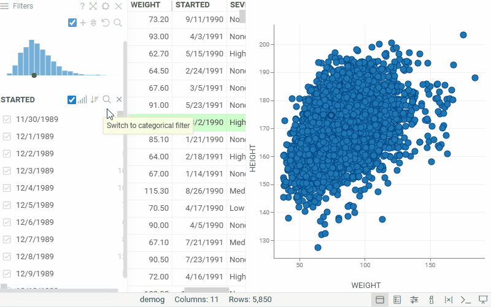

## Structure filter

Structure filter lets you filter molecules by structural patterns or similarity. 
It works on molecular columns and supports the following search types:

* **Contains**: filters molecules that contain the sketched structure.  
* **Included in**: filters molecules where the sketched structure is a superstructure.  
* **Not contains**: filters out molecules that contain the sketched structure.  
* **Not included in**: filters out molecules where the sketched structure is a superstructure.  
* **Exact match**: filters molecules that exactly match the sketched structure.  
* **Similar**: filters molecules similar to the sketched structure; supports a similarity threshold.
 
:::note Use current molecule as filter

To quickly filter the dataset by the selected molecule, right-click the molecule cell in the grid and select **Current value > Use as filter**.

:::

### Categorical mode

You can switch the structure filter to categorical mode, which treats each unique molecule as a separate, selectable category in the **Filter Panel**. To do that, click the column header, go to the **Context Panel** > **Chemistry** > **Rendering**, and set **Filter type** to `Categorical`. Alternatively, use [column tags](#column-tags) to set the categorical structure filter mode.

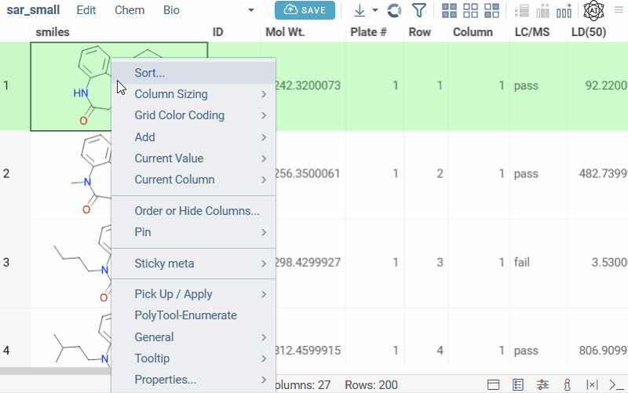

## Scaffold tree filter

Scaffold tree filter lets you filter molecules based on their scaffolds.  
The scaffold hierarchy is displayed as a tree, where you can:

* Select one or more scaffolds to filter the dataset.  
* Switch the **AND/OR** control to define filter logic.  
* Exclude selected scaffolds using the **≠** icon.  
* Color scaffolds to highlight relationships; colors are shown in both the dataset column and the scaffold tree.

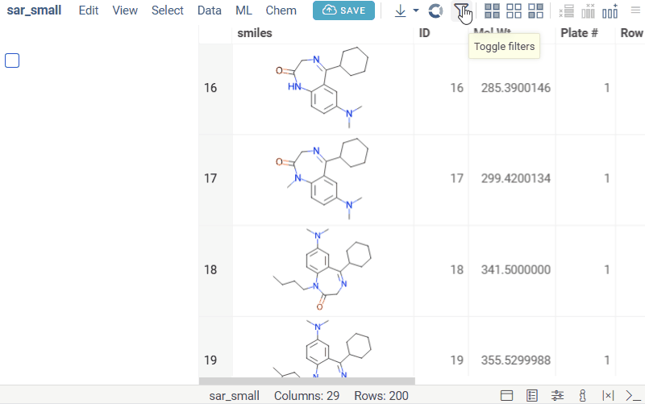

## Bio substructure filter

Bio substructure filter lets you filter macromolecules based on their subsequences:

* **FASTA sequences**: enter a subsequence.
* **Separator-based sequences**: enter a subsequence and specify the separator for exact matching.
* **HELM sequences**: use the visual editor to design complex structures for monomer-level filtering.

```mdx-code-block
<Tabs>
<TabItem value="fasta-filtering" label="FASTA" default>
```
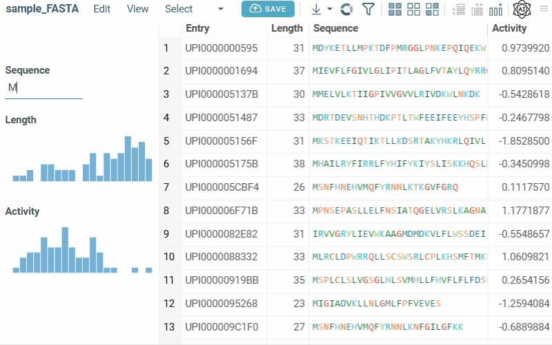

```mdx-code-block
</TabItem>
<TabItem value="separator-filtering" label="Separator">
```
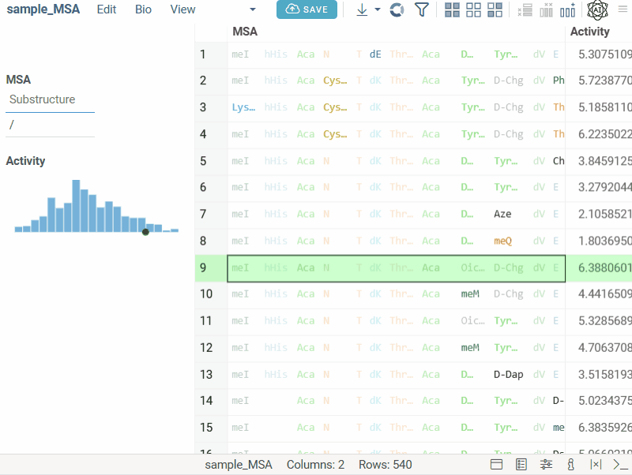

```mdx-code-block
</TabItem>
<TabItem value="helm-filtering" label="HELM">
```

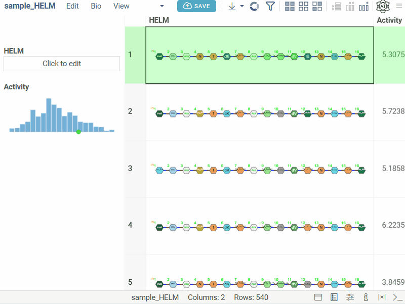

```mdx-code-block
</TabItem>
</Tabs>
```

## Text filter

This filter performs fuzzy searching for specified search terms and applies to string columns that 
have the "Text" semantic type.

To add a search term, enter it in the search box, and press Enter. Use the checkboxes and the "and/or"
switch to control search results. And/Or switch is used to control the logical operation between the search terms.
To control the fuzziness of the search, use the slider at the bottom of the search box. By default, the fuzziness value is set to 0, which corresponds to an exact match. The higher the fuzziness value, the more fuzzy the search becomes. All exact matches from the filter are highlighted in the column values.

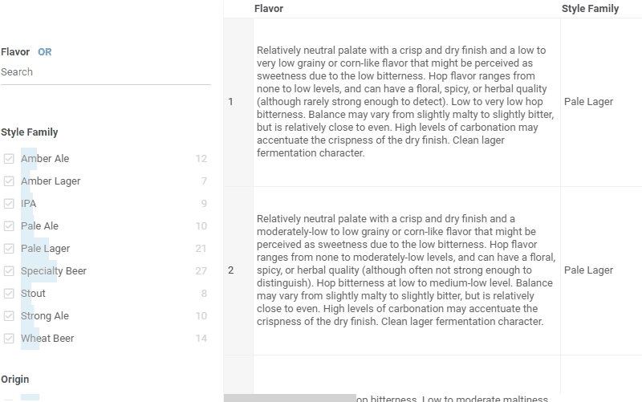

## Expression filter

Expression filter lets you create custom search terms for any column. These terms are in the form of `column name` `operation` `value`. The following operations are supported:

* numerical columns: `none`, `=`, `!=`, `>`, `<`, `>=`, `\<=`, `in`, `not in`, `-`, `is null`, `is not null`
  * `age > 40`
  * `height is null`
* string columns: `none`, `contains`, `starts with`, `ends with`, `equals`, `!=`, `regex`, `in`, `not in`, `is null`, `is not null`
  * `race contains sian`  // Asian, Caucasian
  * `race starts with B`
  * `race in (Black, Asian)`
  * `race regex ck$`
* datetime columns: `none`, `equals`, `before`, `after`, `range`, `is null`, `is not null`
  * `started after 7/1/1991`
  * `started `
* bool columns: `true`, `false`

In the filter, you can choose the column, choose available operation and value. To add expressions you can click the `+` button, or press enter.
Similarly to the text filter, you can control the logical operation between the expressions by using the `and/or` switch. In case of string columns, exact matches to the query will be highlighted in the column values.

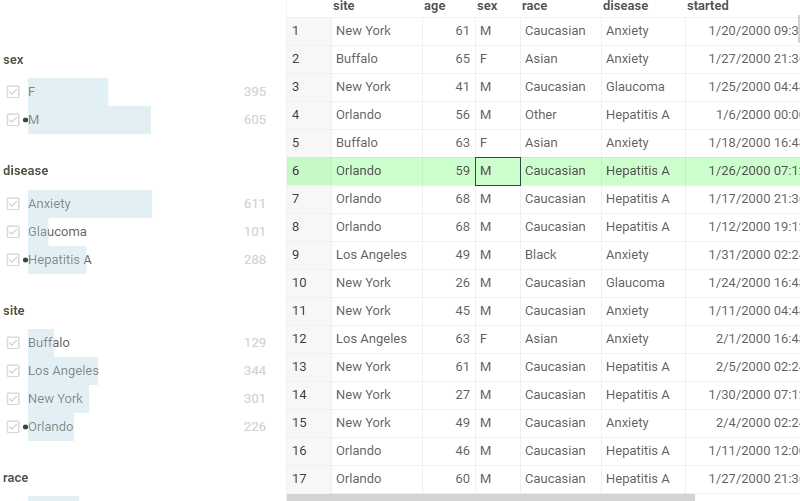

### Free-text filter mode

To switch the expression filter to free-text mode, click the `Free text` icon on the filter. In this mode, you can enter custom search terms in a text form. The filter will parse the text and create expressions based on the entered search terms. It is also possible to use logical conditions to combine simple expressions, for example:

* `age > 30 and height > 190`
* `age > 30 and sex = F`

If a column name contains spaces, wrap the column name in an escape sequence:

* `${column name with spaces} contains someString`


## Hierarchical filter

Hierarchical filter organizes column values in a tree-like structure. Use this filter for columns that have categories. For example, if the dataset contains two columns, _Sex_ and _Name_, the hierarchical filter shows the values of the _Name_ column grouped by sex categories, and each category or sub-category can be expanded, collapsed, turned on or off.

The hierarchical filter can be added from the filters hamburger menu. After the filter is added, it detects existing hierarchies based on the values (for example `Country`, `City`, `Street`). 

* To rearrange, add or remove columns, click on the 'tree' icon in the filter, enable needed columns and arrange them in the desired order.
* To navigate around the categories/subcategories, you can use your mouse or up/down arrows.
* To expand/collapse the categories, click on the `>` icon on the left of the category name or use the right/left arrow buttons.
* To toggle the category, click on the checkbox on the left of the category name or use the space bar.
* To enable only one subcategory, double-click or press enter.
* To select the corresponding category/subcategory, click the corresponding count number (same as in categorical filter).
* The green and gray indicator circles to the left of category name show the current and mouse over row of the dataframe respectively. 

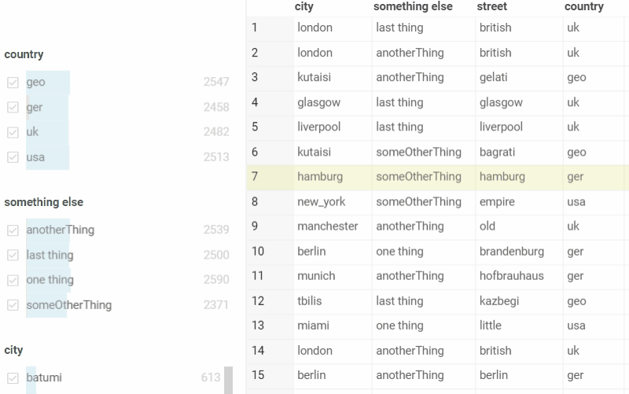

## Combined boolean filter

Combined boolean filter (or Flags filter) combines multiple boolean filters into one. It is useful when many boolean columns would overcrowd the filter panel. When you first open the filters panel, if the dataframe contains multiple boolean columns, Datagrok automatically creates a combined boolean filter instead of separate filters for each column. Each row of the filter corresponds to a column, and contains two checkboxes, corresponding to the true and false values respectively. Applied filters can be combined using logical 'and' or 'or' operations. Like categorical filter, Flags filter includes all interactivity features, such as mouse over highlighting, selection, current row indicator, etc.

* If both checkboxes are checked in a row, the filter for that row is considered inactive. In this case, the value indicator shows the amount of true values in the column.
* To toggle the filter for particular row, click on the corresponding checkbox.
* To toggle the logical operation between the filters, click on the 'and/or' switch.
* To select the filtered values (true or false) for corresponding column, click the corresponding count number (same as in categorical filter).
* To navigate around the filter columns, you can use your mouse or up/down/left/right arrows.
* The green and gray indicator circles to the left of the row show the current and mouse over row of the dataframe respectively.
* If you add multiple boolean columns to the dataframe (for example by using [Categorize](../../transform/categorize-data.md)), Datagrok automatically creates a combined boolean filter.

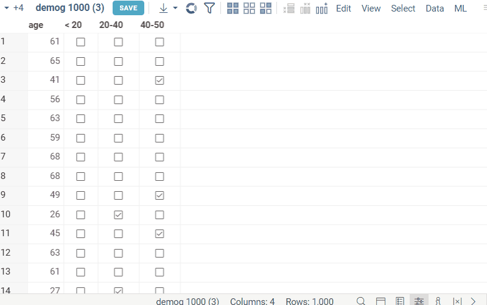

## Multi-value filter

Multi-value filter lets you filter columns containing cells with multiple values,
treating each value as an individual filter option. Each value in the filter has two checkboxes, allowing you to include or exclude rows that contain it.
The AND/OR toggle controls how selected values are combined within the filter. 

Add the filter from the **Filter Panel** hamburger menu: **Add Filter > Multi Value...**.
Once added, the multi-value filter uses the `.multiValueSeparator` [column tag](#column-tags)
to split values in the selected column.

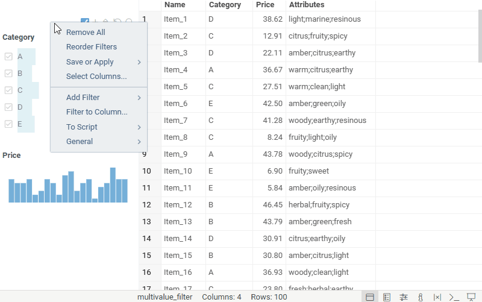

## Saving a filter configuration

You can save a filter configuration for later use:

1. In the **Filter Panel** context menu, select **Save or Apply > Save…**
2. Enter a name for the saved configuration.

Restore this configuration through **Save or apply** in the context menu.

## Column tags

* For **molecular columns**, use the **.structure-filter-type** column tag to
  define filter type:
  * Set **.structure-filter-type** to `Sketch` to use Sketcher for filtering
    molecular columns.
  * Set **.structure-filter-type** to `Categorical` to use molecular column
    values as categories in the filter group.

* For [**multi-value columns**](https://community.datagrok.ai/t/visualization-related-updates/521/12?u=skalkin),
 use the **column.meta.multiValueSeparator** to
  parse multiple values as separate filter categories. The most common
  separators are `\n`, `,`, `;`.
  <details>
  <summary>Example</summary>
  <pre> t.col('languages')meta.multiValueSeparator = '\n'; </pre>
  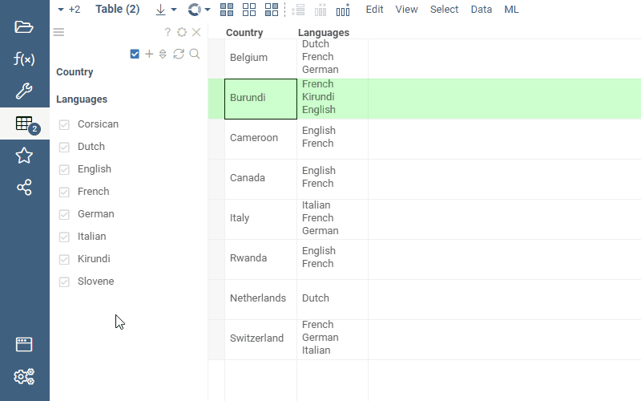
  </details>

* To work with custom filters, use such column tags as `.custom-filter-type` and
  `.ignore-custom-filter`. The `.custom-filter-type` tag contains a custom
  filter name to be used by default for a column. Its value consists of two
  parts: the namespace and the function name (`<PackageName>:<FilterType>`,
  e.g., `Chem:substructureFilter`). Use the `.ignore-custom-filter` tag to
  control custom filters visibility. If both tags are used,
  `DG.TAGS.CUSTOM_FILTER_TYPE` takes precedence over
  `DG.TAGS.IGNORE_CUSTOM_FILTER`.

To set the column tag value via the UI:

1. Right-click the column's header and select **Column Properties** from the
   context menu. A dialog with column metadata opens.
1. In the dialog, use the **Plus** icon to add a new tag.
1. Enter the tag name and value.
1. Click **OK** to save changes.

To set the column tag value programmatically:

```javascript
column.tags[DG.TAGS.STRUCTURE_FILTER_TYPE] = 'Categorical';
```

## Drag-and-drop

Drag-and-drop columns right from the grid to add the corresponding filters:

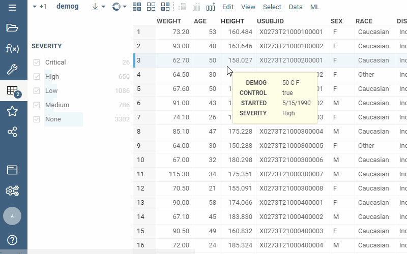

## Properties

| Property | Type | Description |
|----------|------|-------------|
| **General** | | |
| Histogram Look | histogramlook |  |
| Show Filter Counts Indication | boolean |  |
| Show Filter Indication | boolean |  |
| Show Selection Indication | boolean | Indicate the proportion of the selected rows inside each category. |
| Show Header | boolean |  |
| Show Histogram | boolean |  |
| Show Min Max | boolean |  |
| Show Search Box | boolean |  |
| Show Mouse Over Row | boolean | shows the current mouse over row in the table using grey vertical bar in corresponding row |
| Show Current Row | boolean | shows the current row in the table using green vertical bar in corresponding row |
| Show Mouse Over Group Row | boolean | shouws the mouse over group porportion in the filter (similar to how selection proportion is shown). |
| Show Bool Combined Filter | boolean | Show a filter that represents all boolean columns in the table. |
| Column Names | list |  |
| Filters | list |  |
| Allow Dynamic Menus | boolean |  |
| Show Context Menu | boolean | Properties common for all viewers todo: use code generation |
| Title | string |  |
| Description | string | Viewer description that gets shown at the *Descriptor Position*. Markup is supported. |
| Help | string | Help to be shown when user clicks on the ''?'' icon on top. Could either be in markdown, or a URL (starting with ''/'' or ''http''). |
| Description Position | flexposition |  |
| Description Visibility Mode | visibilitymode |  |
| **Description** | | |
| Show Title | boolean |  |
| **Data** | | |
| Table | string |  |

See also:

* [Viewers](../viewers/viewers.md)
* [Table View](../table-view-1.md)
* [JS API: Filters](https://public.datagrok.ai/js/samples/ui/viewers/types/filters)
* Community:
    * [Visualization-related updates](https://community.datagrok.ai/t/visualization-related-updates/521)
    * [Filters updates](https://community.datagrok.ai/t/filters-updates/603)

