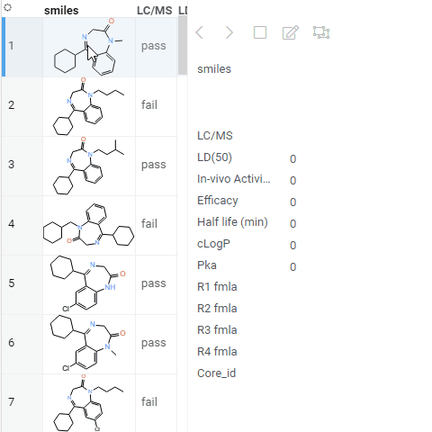

Form allows you to customize the appearance of the row by manually positioning the fields, and adding other visual
elements, such as pictures or panels. A form can be used either as a stand-alone viewer, or as a row template of
the [Tile Viewer](tile-viewer.md).

> Developers: To add the viewer from the console, use:
`grok.shell.tv.addViewer('Form');`

## Editable forms

To edit values via the form, click on the 'edit' icon on top.

## Built-in form designer

To reposition the fields, click on the 'presentation' icon, and then drag-and-drop fields to the new locations. To
change visual properties of an element, click on it while in the designer mode; properties will appear in
the [Context Panel](../../datagrok/navigation/panels/panels.md#context-panel)
on the right.

Field color-coding and format are picked up from the corresponding grid, if possible.

The following keyboard shortcuts work only when the form is in both read-only and presentation modes:

|                   |                        |
|-------------------|------------------------|
| \<, left or up    | Previous row           |
| > , right or down | Next row               |
| Space             | Toggle selected state  |

## Videos

## Properties

| Property | Type | Description |
|----------|------|-------------|
| **General** | | |
| Sync Mode | string | Determines what gets shown on the form. |
| Show Navigation | boolean |  |
| Show Prev Row Arrow | boolean |  |
| Show Next Row Arrow | boolean |  |
| Show Row Selector | boolean |  |
| Show Field Editor | boolean |  |
| Show Design Editor | boolean |  |
| Show Column Selector | boolean |  |
| Show Save File | boolean |  |
| Show Open File | boolean |  |
| Sketch State | map |  |
| Allow Dynamic Menus | boolean |  |
| Show Context Menu | boolean | Properties common for all viewers todo: use code generation |
| Title | string |  |
| Description | string | Viewer description that gets shown at the *Descriptor Position*. Markup is supported. |
| Help | string | Help to be shown when user clicks on the ''?'' icon on top. Could either be in markdown, or a URL (starting with ''/'' or ''http''). |
| Description Position | flexposition |  |
| Description Visibility Mode | visibilitymode |  |
| **Description** | | |
| Show Title | boolean |  |
| **Data** | | |
| Table | string |  |

See also:

* [Tile viewer](tile-viewer.md)
* [JS API: Form](https://public.datagrok.ai/js/samples/ui/viewers/types/form)
* [Community: Visualization-related updates](https://community.datagrok.ai/t/visualization-related-updates/521)

