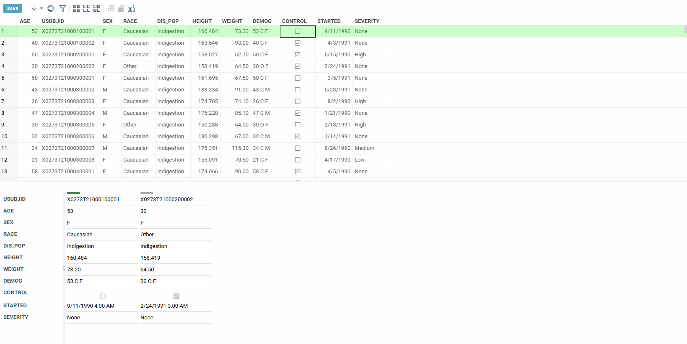

**Forms viewer** shows rows in forms positioned side-by-side.
It is useful for quick exploration of the selection, as well as for comparison between current, 
mouse-over, and selected rows.

* To add **Forms**, click the "Add viewer" icon on top, and then select "Forms".
* To select columns on a form, use the **Fields** property in the options. Drag-and-drop columns to reorder. 
* To choose a subset of rows to show, use these properties: `Show Current Row`, `Show Mouse Over Row`, and 
  `Show Selected Rows`. You can mix and match these options. 

Green color stripe on top of the form indicates current row, grey one indicates mouse-over row. 
The viewer also works together with the grid:

* To select or deselect rows, Ctrl+click the form.
* To go to a particular cell in a grid, click on a field
* To make a column current, click on the column name.

To reorder the fields in Forms viewer, go to Froms viewer settings, open Fileds option and just drag-n-drop corresponding fields in the ‘Select columns…’ dialog.

The viewer is a part of the [PowerGrid](https://github.com/datagrok-ai/public/tree/master/packages/PowerGrid) package.