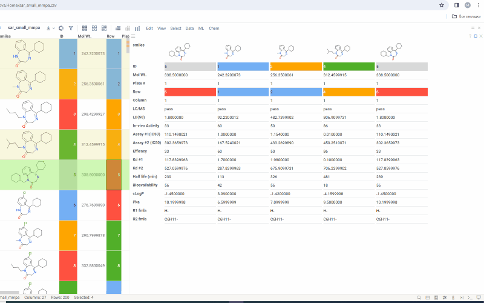

Forms viewer provides a convenient way to visualize a set of selected rows. The viewer is a part of PowerGrid package.

Forms viewer allows to simulataneously visualize:

- current row
- mouse over row
- selected rows

These options are adjustable and you can choose any of them.
The data for each row appears in a convenient vertical column form. Color coding changes are also reflected in Forms viewer.

By default data first 20 columns are shown. To add/remove/change columns use viewer options.

