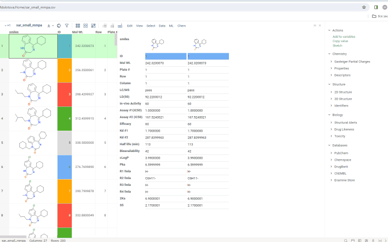

Forms viewer visualizes a set of specific rows in a pivoted form. The data for each row appears as a column with the list of column headers on the left. By default first 20 columns are shown. To change which fields are shown, use the **Fields** property in the option. Drag-and-drop columns in the dialog to order them.

You can choose to show:

- current row
- mouse over row
- selected rows

To go to particular grid cell, click any field. To go to respective grid column, click column label.
To select/deselect row, Ctrl+click corresponding form.
To remove column hover over its name in a columns list and click X icon.

Current and mouse over rows have colored indicators on top of each form:

- green for current
- grey for mouse over

Grid color coding is saved in Forms viewer.

The viewer is a part of PowerGrid package.

