```mdx-code-block
import Tabs from '@theme/Tabs';
import TabItem from '@theme/TabItem';
```

Grid lets you efficiently work with tabular data. Think Excel on steroids, very extensible
and built to support interactive exploration of vast amounts of scientific data.

## Controls

|                                       |                                 |
|---------------------------------------|---------------------------------|
|<h4>**Select**</h4>   ||
|Select all rows                        | Ctrl+A                          |
|Select rows                            | Shift+Mouse Drag                |
|Deselect rows                          | Ctrl+Shift+Mouse Drag           |
|Select columns and rows                | Mouse Drag rows                 |
|Select columns                         | Shift+drag column headers       |
|Select columns                         | Ctrl+click column headers       |
|Deselect columns                       | Ctrl+Shift+click column headers |
|Invert column selection                | Ctrl+click                      |
|(De)select rows                        | (Ctrl+) Shift + ↑↓              |
|(De)select columns                     | (Ctrl+) Shift + ←→              |
|(De)select rows                        | (Ctrl+) Shift + mouse-drag      |
|(De)Select rows with the current value | (Ctrl+) Shift + ENTER           |
|Select rows above current              | Ctrl + Shift + Home             |
|Select rows below current              | Ctrl + Shift + End              |
|<h4>**Navigate**</h4>        ||
| Navigate                              | Up, Down, Left, Right           |
| Navigate                              | Page Up, Page Down              |
| Jump to first row                     | Ctrl+Home                       |
| Jump to last row                      | Ctrl+End                        |
| Jump to first column                  | Home                            |
| Jump to last column                   | End                             |
| Prev / next selected row              | Ctrl + ↑↓                       |
| Show in full screen                   | Alt+F                           |
|<h4>**Sort**</h4>||
| Sort a column                          | Double-click column header      |
|<h4>**Edit**</h4>||
| Edit cell                              | Double-click                    |
| Copy cell value                        | Ctrl+C                          |
| Paste into cell                        | Ctrl+V                          |
| Add a row (requires `Allow Edit` set to `true`) | Enter or click the **plus** **(+)** icon in the bottom row |
| Undo                                   | Ctrl+Z                          |
| Redo                                   | Ctrl+Shift+Z                    |
| Delete selected rows and/or columns    | Shift+Del                       |
|<h4>**Resize and reorder**</h4>||
| Reorder columns   | Drag the column header.<br/>Selected columns are repositioned simultaneously next to each other   |
| Resize columns                 | Drag the right border of the column header.<br/>Selected columns are resized simultaneously      |
| Resize row height              | Drag the border of the row header     |
|<h4>**Column properties**</h4>||
| Open                           | <kbd>F2</kbd>                   |

## Interacting with the grid

You can access available options for rows, columns, and cells in a number of ways:

* From an object's context menu (right-click to open)
* From the **Top Menu** options and icons
* For the current object, from the [Context Panel](../../datagrok/navigation/panels/panels.md#context-panel)
* For columns, by clicking the **Hamburger** **(≡)** icon (hover over the column's header to display)

From there, you can [change the cell format](#format-cells), [color code a column](#color-code-columns), [pin rows](#pin-rows-and-columns), and do more. For shortcuts, see [Controls](#controls).

## Rows

Grid rows have different states: 

* Selected (highlighted in orange)
* MouseOver (on hover, highlighted in light blue)
* Current (click or navigate using the up **(↑)** and down **(↓)** keys, highlighted in green). 
* Filtered

These states are synchronized with other viewers, making it easy to explore your
data. For example, moving between rows in the grid updates both the current
molecule on a scatterplot and similar molecules in the 
[similarity viewer](../../datagrok/solutions/domains/chem/chem.md#similarity-and-diversity-search).
The same works in reverse. Clicking a molecule on a scatterplot or a similarity
viewer updates the current row in all other viewers, including grid. 

To further aid with data exploration, the **Context Panel** dynamically updates
to show [info panes](../../datagrok/navigation/panels/info-panels.md) specific to
the current object, e.g., a molecule.


## Columns

Unlike Excel, cells within a grid column are assigned one of the
predefined data types: `string`, `int`, `bigint`, `qnum`, `double`, `datetime`,
or `bool`. Additionally, a column may have [tags](../../govern/catalog/tags.md), a 
[semantic type](../../govern/catalog/semantic-types.md) (e.g., `Molecule`), and an 
[entity type](../../govern/catalog/sticky-meta.md#metadata-objects), which lets you
annotate specific data points with custom metadata.

To edit column settings, either right-click the column's header to access
its context menu or click the column's header to display available options
in the **Context Panel**.

Subject to permissions, you can:

* Change the column's properties (e.g., it's data type or [cell renderer](#cell-renderers))
* Customize the column's appearance or behavior (e.g., change the cell's format, color-code values, pin rows, etc.) 
* Specify who can edit a column. Users without edit permissions will receive a notification when attempting to edit a restricted column.

<details>
<summary>Column properties</summary>

| Property         | Description                                        |
|------------------|----------------------------------------------------|
| New name         | New column name                                    |
| Visible          | Allows to hide column                              |
| Is Color Coded   | Enable/Disable column color coding                 |
| Show Value       | Allows to do not show values on color coded column |
| Width            | Column width, in pixels                            |
| Background Color | Background Color, 32 bit integer                   |
| Decimal Places   | Decimal Places                                     |
| Custom Name      | Custom name, original will be saved                |
| Column Name      | Column Name                                        |
| Custom Format    | Custom Format                                      |
| Cell Type        | Cell Type                                          |

  </details>

:::tip tips

<Tabs>
<TabItem value="navigation" label="Navigation">

For quick navigation, preview, or batch actions, use the 
[Column Manager](../../datagrok/navigation/panels/column-manager.md).
To open, on the **Status Bar**, click **Columns:**

<br/>


</TabItem>
<TabItem value="repositioning" label="Repositioning">

To quickly move a column to the beginning or end of your dataset, click the column's header and start dragging. The arrows appear. Drop the column onto an arrow to adjust its position in the spreadsheet.

<br/>


</TabItem>

<TabItem value="profiling" label="Profiling">

For quick profiling, use the **Plots** info pane. Simply select columns, and
their content is automatically visualized in the **Context Panel**.

<br/>


</TabItem>
</Tabs>

:::

### Sorting

To sort the table by a particular column, double-click the column header. The "↓" symbol
next the column name would appear, indicating that the column is sorted in descending order
(from high to low). Double-click again to sort in ascending order. Next double-click resets the
sorting order.

To sort by multiple columns at once, right-click the grid, choose "Sort...", and 
pick the desired columns, along with the sort direction for each of the columns. 

### Selecting columns

There are multiple ways to select a column:
* Shift+click on a header to select
* Ctrl+shift+click on a header to deselect
* Ctrl+click on a header to invert selected state
* Shift+drag on a header to select multiple columns at once
* From the "Columns" pane, Shift+drag on the row headers
* Press Shift+LEFT or Shift+RIGHT

Once columns get selected, they appear in the context panel. Expand different panes
to see column details, invoke commands, color-code, change style, explore statistics,
and visualize the content.

You can also [resize selected columns](#resizing-columns) by mouse-dragging column border in the header.

:::tip

Select multiple colors and apply colors and styles at once for quick formatting. Assign groups for quick filtering, selection, and navigation 


:::

### Hiding and unhiding columns

There are many ways to hide a column:
* [Resize](#resizing-columns) it, bringing its width to 0
* Right-click, select "Order or hide columns...", and uncheck corresponding checkboxes
* Select a number of columns and click "Hide" on the context panel

You can tell whether there are hidden columns by looking at the column header separators -
it gets bolder and darker if there are hidden columns. To unhide a column, double-click
on the corresponding column separator, like shown on the picture below:

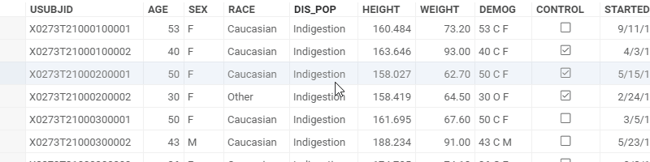

### Resizing columns

There are multiple ways to resize a column:
* Mouse-drag column border in the header
* Right-click on the grid, and choose one of the options under "Column sizing" 

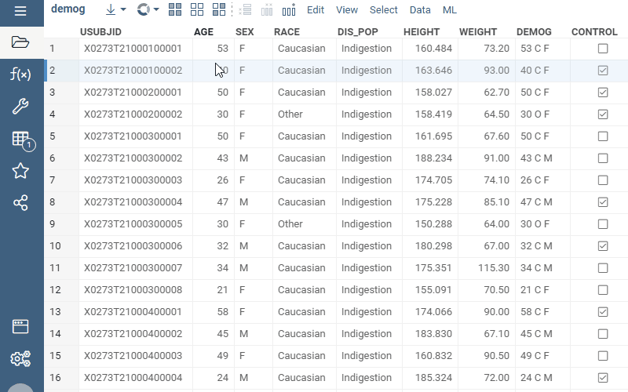

### Resizing rows and columns

When you resize row heights, columns widths automatically adjust in order to provide
the best experience. This lets you "zoom out" to see the bigger picture, or the opposite -
zoom in to see additional details in the cell (especially useful for dynamic cells that
render differently depending on your zoom level, such as proteins, users, forms, or 
JIRA tickets).


You can do mouse-panning (with the right mouse button) just like in a Google map! It is 
particularly useful if you are exploring a big and wide dataset in the zoomed-out mode.


### Adding new columns

To add a new column, on the **Top Menu**, click the **Add new column** ()
icon. This opens a dialog where you can specify a column name, type, and
formula, as applicable.  

For more details, including formula syntax, read [Add new column](../../transform/add-new-column.md) or watch [this video](https://youtu.be/4_NS3q7uvjs?si=yGXl0Y4PCD0S-MBG&t=1655).

### Column groups

Group columns together by selecting them and then choosing the "Group columns..." action
in the context panel. You can also specify group color. Once columns are grouped, group name will appear above
columns names. You can use it for selecting and moving all columns at once.

You can quickly show or hide groups of columns from [filters](filters.md).

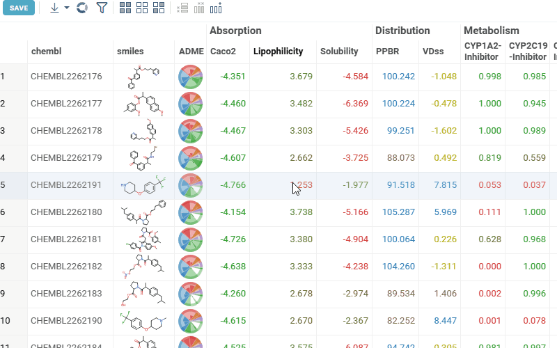

### Blur content

The blur content feature obscures column values, which is useful for protecting
sensitive data during screen sharing or presentations. When enabled, the column's
cell values are blurred, making them unreadable while still showing that data exists.

To enable blur content for a column:

1. Click the column header to select it.
2. In the **Context Panel**, expand the **Settings** section.
3. Enable the **Blur content** checkbox.

To disable blurring, uncheck the **Blur content** option.

## Cells

You can customize the display of cell data using [cell renderers](#cell-renderers). Grid cells can also contain values from [multiple columns](#summary-columns) or [linked tables](#data-from-linked-tables), and display embedded [images](#images).


### Cell renderers

Cell renderers customize how cell data is shown. For instance, molecules in
SMILES notation may be rendered in 2D. For specific semantic types,
such as molecules or URL images, cell renderers are applied automatically. 

Use the "Renderer" combobox under the "Settings" pane in the column context panel.


Examples of built-in renderers include molecules, URL based images, fit lines, comboboxes, and more. <!--For the full list, see [Supported cell renderers].  //TODO: New doc: supported-cell-renderers.md-->

:::note developers

[Create custom cell renderers](../../develop/how-to/grid/custom-cell-renderers.md)

:::

#### Choice renderer

The `Choice` renderer provides a drop-down list for a single selection from a predefined set of options. When you
double-click the cell, it allows you to pick one value from the list.

To configure it, set the column tag, `.choices`, to a JSON string array of the options (e.g., `["Option 1", "Option 2", "Option 3"]`).
After that, double-clicking the cell will show a drop-down list with those options.

#### MultiChoice renderer

The `MultiChoice` renderer displays a list of predefined options as checkboxes within a cell. To configure it:

1. Set the column tag `cell.renderer` to `MultiChoice`.
2. Set another column tag, `.choices`, to a JSON string array of the options you want to display (e.g., ["Option 1", "Option 2", "Option 3"]).

#### Tags renderer

The `Tags` renderer is used to display comma-separated values from a string column as individual "tags". To use it:

1. Set the column tag `cell.renderer` to `Tags`.
2. Ensure the cell values are formatted as a comma-separated string (e.g., "Opt1,Opt2,Opt3").

#### Stars

The `Stars` cell type applies to the integer column, and lets you "rate" something with stars.

### Summary columns

Summary columns show data from multiple columns within a row. To simply display
data from multiple columns, use _smart forms_. To visualize
numerical data, use _sparklines_. To design a custom form, use _forms_.

<Tabs>
<TabItem value="smart-forms" label="Smart forms" default>

Smart forms show values from multiple columns within a single cell. They inherit
color-coding and [cell renderers](#cell-renderers) from the source columns, and their content
dynamically adjusts to fit the cell size.

To add a smart form, right-click a cell and select **Add** > **Summary Columns** > **Smart Form**. To change selected columns for the summary column, click its header and choose the columns you want in the **Context Panel** under **Renderer**.

<br/>


</TabItem>
<TabItem value="sparklines" label="Sparklines">

Sparklines use charts to visualize numerical values within a row,
offering a quick way to compare rows visually.
Supported summary column types:

* Sparklines
* Bar Chart
* Radar
* Pie Chart
<!--* Markup-->

To add sparklines, right-click a cell and select **Add** > **Summary Columns**, then choose your preferred option from the menu. To change selected columns for the summary column, click its header and choose the columns you want in the **Context Panel** under **Renderer**.

<br/>

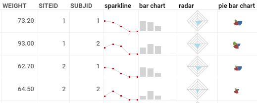

</TabItem>
<TabItem value="forms" label="Forms">

To show data from multiple columns, you can design a form:

1. Right-click a cell, select **Add** > **Forms** > **Design a Form...**. This
   opens a [form viewer](forms.md).  
1. In the form viewer, column names and values are shown as individual components
   that you can edit. Design your form with clicks and drags.
1. Once done, click the **CLOSE AND APPLY** button to add the form as a column to your dataset.

<br/>

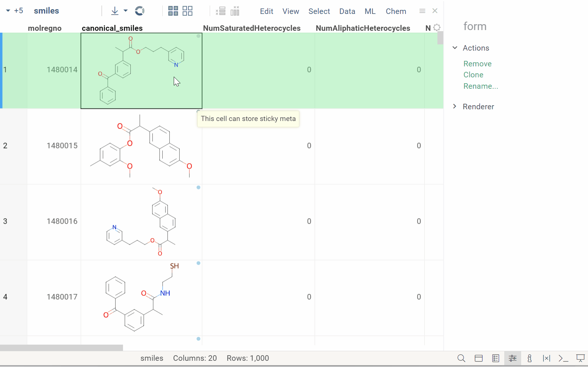

</TabItem>
<TabItem value="confidence-interval" label="Confidence interval">

Confidence interval columns visualize point estimates with their uncertainty ranges. Each cell
shows a center mark (dot, diamond, or vertical line) for the estimate, connected by a horizontal
whisker line to the lower and upper bounds. Optional end caps (serifs) and a semi-transparent
fill band between the bounds make the intervals easy to read at a glance.

Two input modes are supported: **three-column** binding (estimate, lower bound, upper bound) and
**two-column** binding (estimate + margin of error for symmetric intervals). Scale options include
global (shared min/max across all rows), per-row, custom fixed range, and symmetric around zero.
A reference line (e.g., zero or a target value) can be added for comparison. Log scale is
available for data spanning orders of magnitude. When bounds extend beyond the visible range,
arrow indicators show truncation. Hovering over a cell displays exact values in a tooltip.

</TabItem>
</Tabs>

### Data from linked tables

You can display data from one linked table within another. For example, you may
want to show order details alongside customer orders.

Here's how:

1. [Link the tables](../../transform/link-tables.md).
1. Right click any cell, select **Add** > **Linked Tables**, and choose the table you want. A column with data from the linked table is added to your dataset.

 

### Images

Datagrok supports two types of images in cells: embedded and linked. Supported formats are .jpg, .png, and .jpeg.

To embed an image, double click a cell and select the source file.

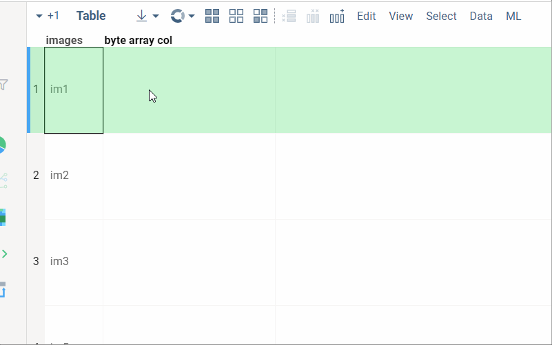

For linked images, Datagrok automatically detects and visualizes images from URLs (starting with "http://" or "https://"
and ending with a supported image extension) as well as images stored as Datagrok paths (beginning with "System:" and
ending with a supported image extension) using a [cell renderer](#cell-renderers).

<details>
<summary>Troubleshooting</summary>

If images are not detected automatically, right-click the column header and select **Column Properties**. This opens a dialog. In the dialog, under **Tags**, set the following parameters:

* `quality` to `ImageUrl`
* `cell.renderer` to `ImageUrl`.

</details>


### Charts in cells

You can embed actual charts directly inside grid cells.
1. [Link the tables](../../transform/link-tables.md).
2. Right click any cell, select **Add** > **Linked Tables**, and choose the table you want. A column with data from the linked table will be added to your dataset.
3. Click the header of the new column. In the **Context Panel** under **Renderer**, select the desired chart type (e.g., Bar Chart, Line Chart, Pie Chart, etc.).


### Designed forms in cells

You can design a [custom form](form.md) that would represent a row in the table, and 
use this form within a cell. 

To design a form and add it to the grid:
1. Right-click on the grid
2. Select **Add | Summary Columns | Design a Form...**
3. Design a form, then click **CLOSE AND APPLY** on top. 

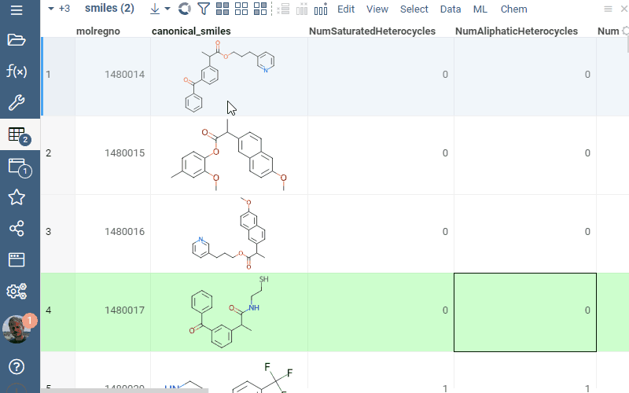

:::tip tips

You can also design a [stand-alone form](form.md), or use forms as [tiles](tile-viewer.md).

:::

### HTML forms in cells

You can create forms in cells based on the arbitrary HTML, with the row values injected
using [markup](../../develop/under-the-hood/markup.md). This allows for potentially complex
visualizations, including SVG:


:::note fun fact

The EEG recording in the video above was recorded from Andrew Skalkin's head while he was helping build 
[JAKE](https://pubmed.ncbi.nlm.nih.gov/30872988/#&gid=article-figures&pid=figure-3-uid-2) 
sometime around 2016, back at Johnson & Johnson. Fun times! :)

Datagrok is one of the very few web application capable of interactively working with sensor data - you can open
datasets with up to a billion data points OR a million columns (not at the same time, of course).

:::

### Adaptive number formatting

Initially, the format of the numerical and datetime values is chosen in a way that lets you
differentiate between values in a column. For instance, if all datetime values in a column have the
time component set to "0:0", only the date is shown. When you import a CSV file, the number of
significant digits is just enough to represent all digits after comma.  

If you [resize a column](#resizing-columns) so that the content doesn't fit anymore, at first
the precision will be degraded - time will be stripped out of dates, floating point numbers will
lose precision and eventually will be rendered as integers. If you make the width even smaller,
eventually the value will be rendered as a circle with the color indicating the cell value.
For numbers, darker colors correspond to higher values. For strings, each value gets assigned 
its own color.


## Working with data

Subject to permissions, you can [add, delete, or modify records in your dataset](#controls). 
In addition, the **Top Menu** provides multiple options for data
cleaning and transformation. For example, you can
 [add calculated columns](../../transform/add-new-column.md),
[impute missing values](../../explore/missing-values-imputation.md), 
[delete duplicates](../../transform/aggregate-rows.md), and more.

To learn more about data transformation, visit the 
[Transform](../../transform/transform.md) section of our documentation.

In addition to actions directly on your table's data, you can augment your
dataset with additional information. You have these options:

* Use built in tools from the **Top Menu**. For example, for molecules, you can add
  a column with descriptors via **Top Menu** > **Chem** > **Calculate** >
  **Descriptors...**
* Add columns using info panes

  <details>
  <summary>How to add</summary>

  You can add the content of most info panes as a column. 

  To add the entire info pane, click the **Add new column** **(...)** icon next to
  the info pane's name. To add a specific calculation or object within an info
  pane, click the **plus (+)** icon next to the object or calculation you want to
  add. 

  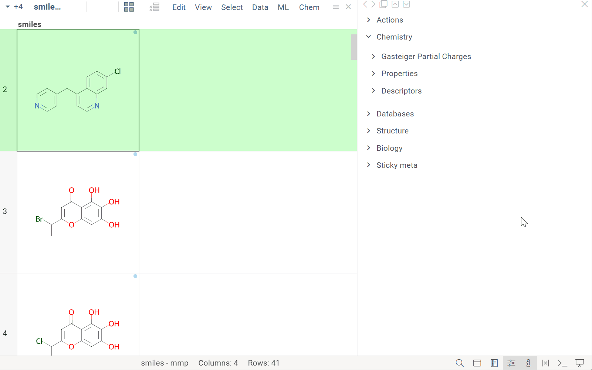

  </details>

### Filtering

To toggle filters, in the **Top Menu**, click the filter icon.

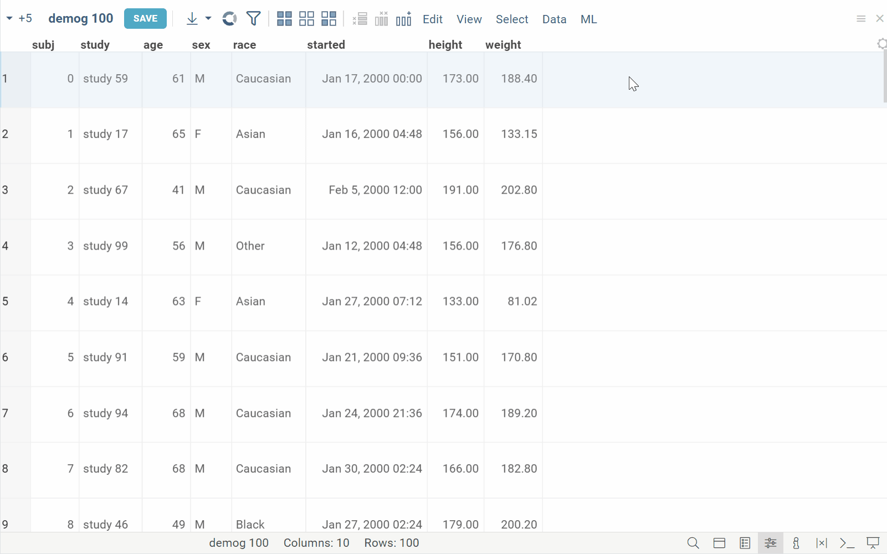

Text filters highlight the occurrences of the search term right in the grid:  

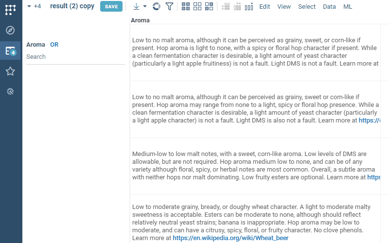

The **Filters Panel** is a [viewer](viewers.md). [Learn more about filters](filters.md).

### Searching

Press Ctrl+F to open a search box. You can search for substrings, or enter expressions
in the form of `[column] [operator] [value]`, such as "age > 30". Matching values
get highlighted as you type. Press UP or DOWN to go to the previous or next match.

Click the hamburger menu on the right of the input field to access these options:
* **Select matching**: Select all matching rows
* **Filter matching**: Filter all matching rows
* **Auto-select**: Select all matching rows as you type
* **Auto-filter**: Filter all matching rows as you type


## How To

:::note developers

<!--To edit column permissions, use:
`table.col('myColumn').tags['editableBy'] = "username"`. <br/>-->
[Customize the grid programmatically](../../develop/how-to/grid/customize-grid.md)

:::

### Format cells

To change a cell's format:

1. Right-click the column's header and select
**Format**. Alternatively, right-click a cell and select **Current column** >
**Format**. 
2. Select the format you want from the options provided or set a custom format
   by choosing the **Custom...** option.

<Tabs>
<TabItem value="navigation" label="Numbers">

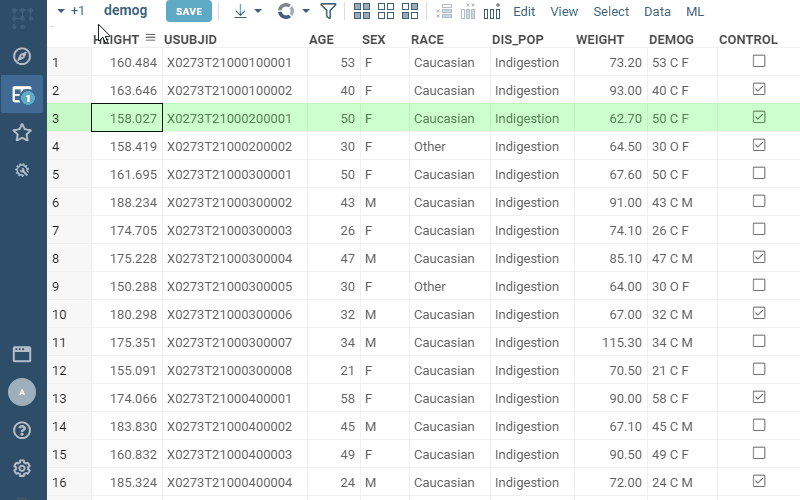

</TabItem>
<TabItem value="repositioning" label="Dates">

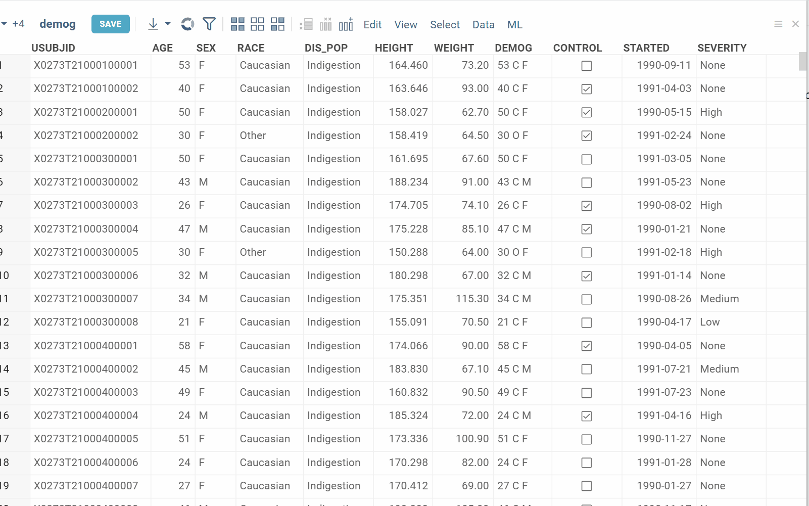

</TabItem>
</Tabs>

:::note developers

See:

* [Formatting notation](../../govern/catalog/tags.md#format) for dates and numbers
* [Formatting via JS API](../../develop/how-to/grid/customize-grid.md#formatting)

:::

### Add rows and columns

To add a new row, either click the **plus (+)** icon after the bottom row in your dataset. Alternatively, go to the **Top Menu** and select **Edit** > **Add rows..**. This opens a dialog where you can specify the number of rows to add, as well as their position relative to your current row.

To add a new column:

1. In the **Top Menu**, click the **Add New Column...** icon. This opens a dialog.
1. In the dialog, specify the column's name and data type and click **OK**. 
1. An empty column is added to the dataset.
1. Optional. To specify a column's [semantic type](../../govern/catalog/semantic-types.md), [tags](../../govern/catalog/tags.md), or [cell renderer](#cell-renderers), use the [column's properties](#columns).

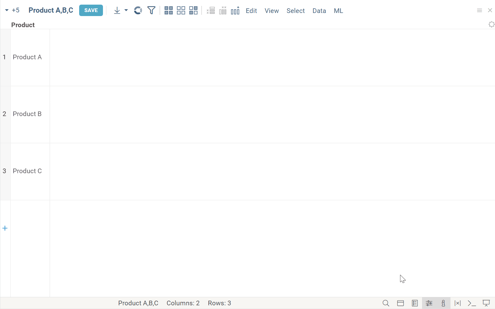

[Learn how to add calculated columns](../../transform/add-new-column.md).

### Pin rows and columns

You can pin rows and columns from the context menu. Pinned rows can be saved in
projects and as layouts, using the column's name and cell
value (for unique rows only).

To pin:

1. Select rows or columns you want to pin. 
1. Right-click your selection and choose the relevant option from the **Pin**
   menu. Your selection is now pinned.

To unpin rows, select the **Unpin** option from the **Pin** context menu.

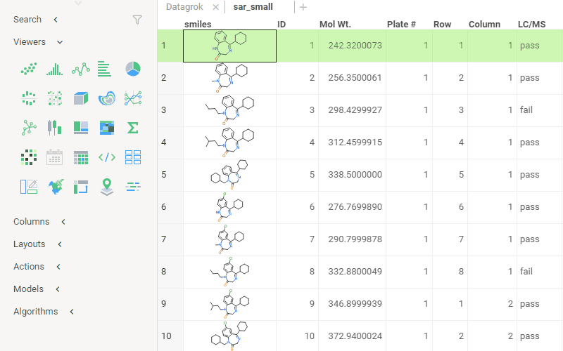

### Color code columns  

You can color code columns with these schemes: 
   
* For categorical columns (`string` and `bool` data types), "categorical"
* For numeric columns, "conditional" or "linear"
* For `datetime` columns, "linear"

To color-code a column, right click its header and select the desired scheme
from the **Color Coding** submenu. This applies color to the
column's background. To customize color-coding settings, click the column's
header and adjust them in the **Context Panel** under **Colors**.

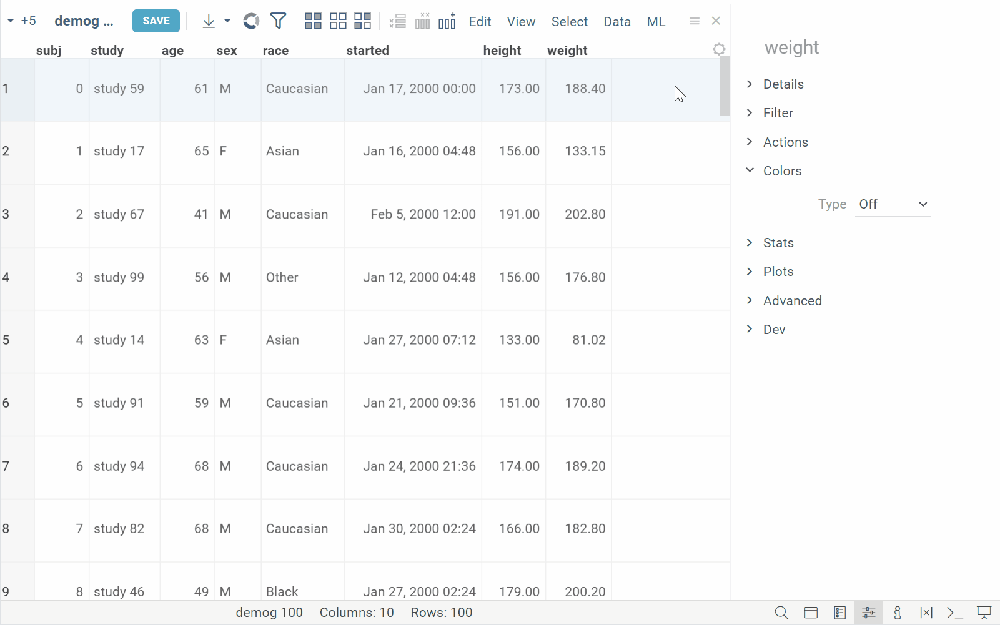

To copy color coding from one column to others, use the **Pick Up Coloring** and
**Apply Coloring** commands from the column's **Color Coding** menu. These
commands copy both standard and custom color-coding, including the **Off** setting
which removes color coding. Note that you can't transfer settings
between numeric and categorical columns. The **Apply Coloring** command remains
inactive if no color coding has been picked up. These settings are retained for
a viewer instance but are not saved through layout serialization. <!-- //TODO rewrite the last sentence for clarity-->

### Show, hide, or reorder columns

To show, hide, or reorder columns:

1. Right-click any cell and select **Order or Hide Columns...**. A dialog opens
2. In the dialog:
   * To hide a column, clear a checkbox next to the column's name. To show a
     column, select the corresponding checkbox. 
   * To reorder columns, drag column names or use the arrow controls

<br/>

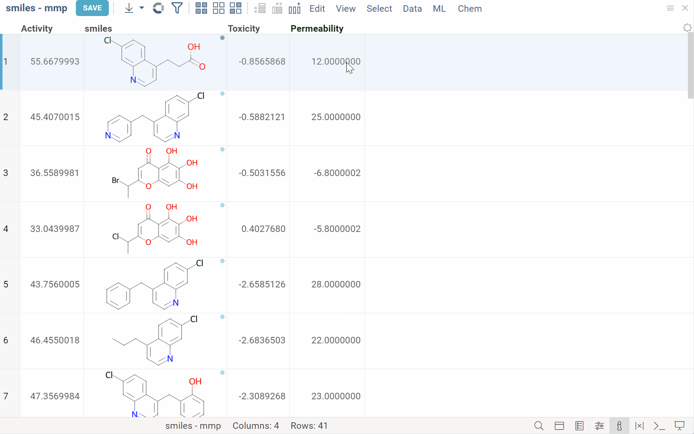

### Inspect multiple columns

**Columns** pane allows you to easily search, select, and navigate columns 
in the table. To toggle pane visibility, click **Columns** on the status bar in the bottom,
or press Alt+C.

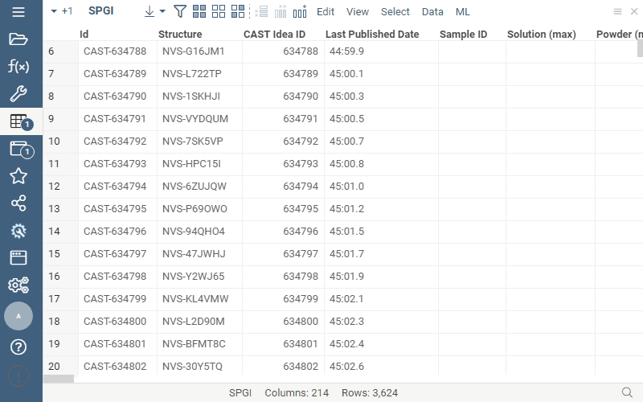


## Properties

| Property | Type | Description |
|----------|------|-------------|
| **Data** | | |
| Allow Edit | boolean | Indicates whether the grid is editable. See also *Show Add New Row Icon* |
| Show Add New Row Icon | boolean | When [allowEditable] is true, shows the last virtual row that the user can edit. This row gets appended to the underlying table as soon as any value is entered. The grid should also be in the editable mode |
| Add New Row On Last Row Edit | boolean | Automatically adds a new row in the end of the dataframe when the last row is edited The grid should also be in the editable mode |
| Show Remove Row Icon | boolean | When [allowEditable] is true, allows user to remove the mouse over row. The grid should also be in the editable mode |
| Filter | string | Formula that filters out rows to show. Examples: `${AGE}` > 20 or `${WEIGHT / 2)}` > 100, `${SEVERITY}` == ''Medium'', `${RACE}`.endsWith(''sian'') |
| Table | string |  |
| **Columns** | | |
| Show Column Labels | boolean |  |
| Col Header Height | number | Column header height. If not specified, it is calculated automatically. See also *Col Labels Orientation*, *Horz Col Labels Height* |
| Vert Col Labels Height | number | Height of the column labels when the orientation is vertical, and *Col Header Height* is not specified. |
| Horz Col Labels Height | number | Height of the column labels when the orientation is horizontal, and *Col Header Height* is not specified. |
| Max Heatmap Columns | number |  |
| **General** | | |
| Show Friendly Name | boolean | When checked, friendly name gets shown underneath the column name. |
| Top Level Default Menu | boolean | When set to false, default menu appears under the ''Grid'' submenu. |
| Show Default Popup Menu | boolean | Whether items applicable to all viewers (such as Pickup Style) should be shown in a popup menu. Also requires *Show Context Menu*. |
| Allow Block Selection | boolean | Mouse drag on the data cells selects both rows and columns |
| Allow Col Selection | boolean | Shift+click on a header to select a column Shift+mouse drag on the headers to select multiple columns Ctrl+click to invert selection Ctrl+Shift+click to deselect |
| Allow Row Reordering | boolean | Mouse drag on the rows header selects rows Reorder rows by dragging them |
| Allow Sorting | boolean | Whether to sort when user double-clicks on the column header |
| Allow Row Selection | boolean | Mouse drag on the rows headers selects rows Ctrl+click to invert selection Shift+mouse drag to select multiple rows Ctrl+Shift+mouse drag to unselect |
| Allow Content Panning | boolean | Right-click and drag to pan content |
| Show Column Groups | boolean |  |
| Show Row Header | boolean |  |
| Show Row Gridlines | boolean |  |
| Allow Column Menu | boolean | Whether the hamburger menu should be shown for a column when the mouse is over its header |
| Auto Scroll Column Into View | boolean | Automatically scroll column into view when this column becomes current |
| Auto Scroll Row Into View | boolean | Automatically scroll current row into view when it is set from outside (for instance, as a result of clicking on a point in a scatter plot) |
| Auto Resize Column Widths | boolean | Automatically resize column widths when row height is resized |
| Show Column Gridlines | boolean |  |
| Allow Col Reordering | boolean | Reordering columns by dragging the header |
| Allow Change Current Object | boolean | Whether the current object (shown in the context panel) is changed when you click on a column header. |
| Allow Row Dragging | boolean | Whether row (rows) can be dragged out of the grid. |
| Allow Row Resizing | boolean | Resize rows by dragging the border between rows on a row header. Applicable only to grid. |
| Draw Every Row | boolean | Indicates the way colors are sampled in the heatmap mode when there is not enough pixels on the screen for each row: True: each row is draws (but the result is blended and the resulting color might not represent any row) False: a row is sampled and then drawn as one pixel (but non-sampled rows do not get drawn at all) Applicable only to heatmap. |
| Show Context Menu | boolean | Whether the context menu is shown |
| Show Read Only Notifications | boolean | Whether to show notifications when the user tries to edit a read-only table |
| Show Heatmap Scrollbars | boolean | Whether to show scrollbars in the heatmap mode Note that scrollbars will still be visible if they are not expanded |
| Missing Value Color | number |  |
| Selected Rows Color | number |  |
| Selected Cols Color | number |  |
| Current Row Color | number |  |
| Mouse Over Row Color | number |  |
| Mouse Over Row Stripe Color | number |  |
| Back Color | number |  |
| Col Header Text Color | number |  |
| Col Header Back Color | number |  |
| Col Header Mouse Over Text Color | number |  |
| Cell Text Color | number |  |
| Current Cell Text Color | number |  |
| Row Header Back Color | number |  |
| Global Color Scaling | boolean | true: colors are scaled based on the global min/max in all numerical columns false: colors are scaled based on the column min/max. Applicable only to heatmap. |
| Heatmap Colors | boolean | Whether the heatmap should be color-coded (you might want to do it programmatically) See also [globalColorScaling] |
| Margin Left | number |  |
| Margin Top | number |  |
| Margin Right | number |  |
| Margin Bottom | number |  |
| Allow Sticky Meta | allowstickymetatype |  |
| Sync New Columns | boolean | Determines whether newly added columns are added to the grid |
| Column Header Types | list |  |
| Cell Style | gridcellstyle |  |
| Current Row Cell Style | gridcellstyle |  |
| Columns | list |  |
| Is Heatmap | boolean |  |
| Row Source | string | Determines the rows shown on the plot. |
| Allow Dynamic Menus | boolean |  |
| Title | string |  |
| Description | string | Viewer description that gets shown at the *Descriptor Position*. Markup is supported. |
| Help | string | Help to be shown when user clicks on the ''?'' icon on top. Could either be in markdown, or a URL (starting with ''/'' or ''http''). |
| Description Position | flexposition |  |
| Description Visibility Mode | visibilitymode |  |
| Horz Align | string |  |
| Vert Align | string |  |
| Tooltip | string | When defined, overrides the default cell tooltip |
| Cursor | string |  |
| Text Wrap | string |  |
| Text Color | number |  |
| Back Color | number |  |
| Text Vertical | boolean |  |
| Image Scale | number | Applies to image columns only |
| Opacity | number | Applies to image columns only |
| Element | element | For ''html'' cell types only |
| Choices | list | When defined, the cell editor becomes a combo box with the specified values |
| **Rows** | | |
| Row Height | number | Applicable only to grid |
| **Selection** | | |
| Show Mouse Over Row Indicator | boolean | Indicates mouse-over row by drawing a vertical stripe on the row header |
| Show Current Row Indicator | boolean | Indicates current row with the *Current Row Color*. |
| **Style** | | |
| Show Current Cell Outline | boolean |  |
| Color Coding | gridcolorcodingtype | Color-coding that applies to all columns. Additionally, each column can be individually color-coded. |
| Default Cell Font | string |  |
| Max Font Size | number |  |
| Col Header Font | string |  |
| Col Labels Orientation | textorientation | Orientation of the column header text. In spreadsheet mode, it defaults to horizontal no matter how small the columns are. In heat map mode, it depends on whether the text can fit in the area. |
| Allow Col Header Resizing | boolean | Resizing column header by dragging the border between the header and the first row |
| Allow Col Resizing | boolean | Resizing columns by dragging the border between column headers |
| Linear Color Scheme | list |  |
| Categorical Color Scheme | list |  |
| **Tooltip** | | |
| Show Tooltip | string | Controls grid tooltip visibility |
| Show Labels | visibilitymode |  |
| Show Cell Tooltip | boolean |  |
| Show Visible Columns In Tooltip | boolean | Include currently visible columns in a tooltip |
| Show Column Tooltip | boolean |  |
| Row Tooltip | string | Newline-separated list of column names to be used in a tooltip. Requires *showTooltip* to be enabled. |
| **Description** | | |
| Show Title | boolean |  |
| **Margin** | | |
| Margin Left | number |  |
| Margin Right | number |  |
| Margin Top | number |  |
| Margin Bottom | number |  |

## Resources

* Tutorials:
    * [Grid](https://dev.datagrok.ai/apps/tutorials/Tutorials/ExploratoryDataAnalysis/GridCustomization)
    * [Viewers](https://dev.datagrok.ai/apps/tutorials/Tutorials/ExploratoryDataAnalysis/Viewers)

* YouTube:

  [](https://www.youtube.com/watch?v=7MBXWzdC0-I&t=2971s)

See also:

* [Viewers](../viewers/viewers.md)
* [Table View](../table-view-1.md)
* [JS API: Grid](https://public.datagrok.ai/js/samples/ui/viewers/types/grid)
* [PowerGrid package](https://github.com/datagrok-ai/public/blob/master/packages/PowerGrid/README.md) 
* Community: 
  * [Grid updates](https://community.datagrok.ai/t/grid-updates/616)
  * [Power Grid: Smart form](https://community.datagrok.ai/t/power-grid-smart-form/774)
  * [Visualization-related updates](https://community.datagrok.ai/t/visualization-related-updates/521)

