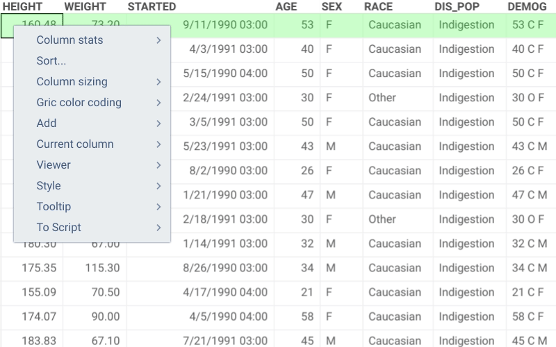
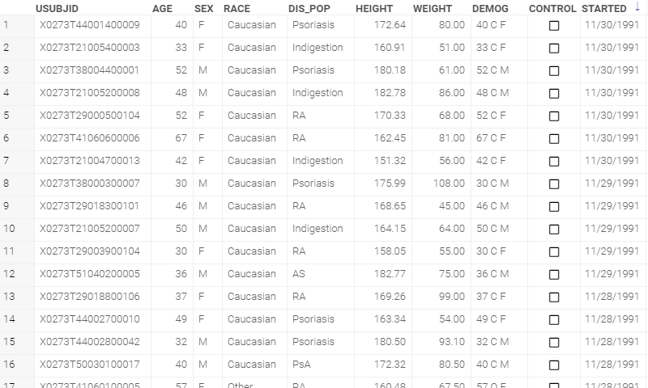
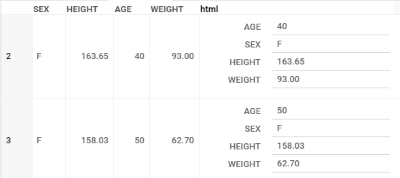
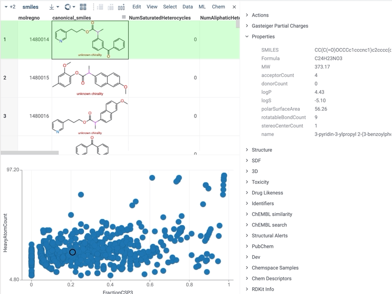

<!-- TITLE: Grid -->
<!-- SUBTITLE: -->

# Grid

### Selection

|                                 |                    |
|---------------------------------|--------------------|
| Shift+Mouse Drag                | Select rows        |
| Ctrl+Shift+Mouse Drag           | Deselect rows      |
| Mouse Drag row headers          | Select rows        |
| Shift+drag column headers       | Select columns     |
| Ctrl+click column headers       | Select columns     |
| Ctrl+Shift+click column headers | Deselect columns   |
| (Ctrl+) Shift + ↑↓               | (Un)select rows    |
| (Ctrl+) Shift + ←→              | (Un)select columns |
| (Ctrl+) Shift + mouse-drag       | (Un)select rows    |
| (Ctrl+) Shift + ENTER            | (Un)Select rows with the current value  |
| Ctrl + Shift + Home             | Select rows above current |
| Ctrl + Shift + End              | Select rows below current |

### Navigation

|                   |                      |
|-----------------------|----------------------|
| Up, Down, Left, Right | Navigate             |
| Page Up, Page Down    | Navigate             |
| Ctrl+Home             | Jump to first row    |
| Ctrl+End              | Jump to last row     |
| Home                  | Jump to first column |
| End                   | Jump to last column  |

### Sorting

|                                 |      |
|-------------------------------------|------|
| Double-click column header          | Sort |
| Menu \| Current Column \| Sort      | Sort |

### Editing

|          |                         |
|--------------|-------------------------|
| Double-click | Edit cell               |
| Ctrl+C       | Copy cell               |
| Ctrl+V       | Paste into cell         |
| Ctrl+click   | Invert column selection |
| ≡            | Open column filter      |

### Resizing and Reordering

|          |                         |
|--------------|-------------------------|
| Drag column header        | Reorder columns         |
| Drag column header border | Resize columns          |
| Drag row header border    | Copy cell               |
| Menu -> Column sizing     | Batch sizing options    |

### Formatting

|                                                |                         |
|------------------------------------------------|-------------------------|
| Right-click column header \|  Format           |  Change datetime format |
| Right-click cell \|  Current column \|  Format |  Change datetime format |
| Column Properties (F2) \|  Tags \|  format     |  Change datetime format |

### Color-Coding

|              |                         |
|--------------|-------------------------|
| Menu \|  Color coding \|  On/Off  | Turn color-coding on/off for all columns  |
| Menu \|  Color coding \|  Color scheme  | Select a palette  |

### Row Summary Columns

Summary columns is a way to visualize multiple values numerical across
the row. This feature is useful for quick visual profiling of values.
In the following picture, each inline viewer visualizes the values of five
numerical columns, which allows for quick visual comparison between rows.

The following summary column types are available:
* Sparkline
* Bar Chart
* Radar
* Pie Bar Chart
* Markup

To add a summary column: **Menu | Add | Summary Columns**

### Forms

An HTML (or Markdown) template that renders row values can be embedded
in each row.

To add a default form: **Menu | Add | Forms | Default**
To add a custom form: **Menu | Add | Forms | Custom...**

### Custom Cell Renderers

## Current rows

Rows in a grid can not only be selected or filtered, in addition to that, the grid keeps track of a current row and highlights it in green. This indication is a neat and lightweight way to update information related to the current value and lets users explore and compare rows with ease. To bring a row into focus, you can simply click on it or navigate up and down the grid using the cursor up and down keys. Info panels in the property panel get synchronized with the current cell. It is also integrated into Datagrok's visualizations and cheminformatics functionality, e.g., similarity search, so as you move from one row to another you immediately see where the row values belong on the chart or which molecules have the most similar structure to the reference. This also works the other way around: by first clicking on a visual element, you will see the row it represents in the grid.

## Videos

<iframe width="560" height="315" src="https://www.youtube.com/embed/7MBXWzdC0-I?start=2971" frameborder="0" allow="accelerometer; autoplay; clipboard-write; encrypted-media; gyroscope; picture-in-picture" allowfullscreen></iframe>

See also:

  * [Viewers](../viewers.md)
  * [Table View](../../overview/table-view.md)
  * [JS API: Grid](https://public.datagrok.ai/js/samples/ui/viewers/types/grid)
