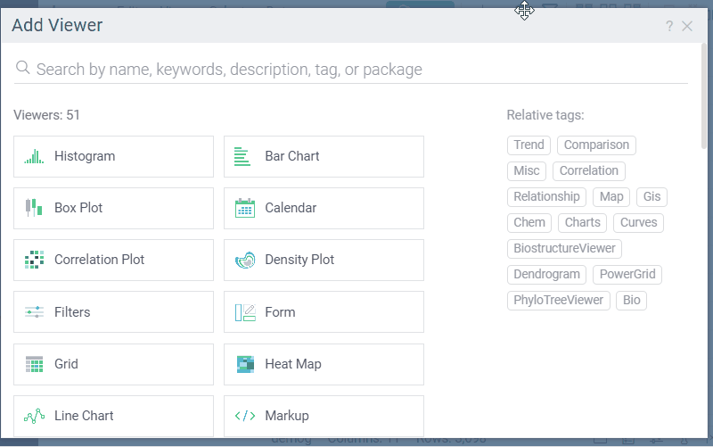

Group analysis viewer groups data by one or more columns and analyzes them using aggregations, charts, and statistical tests. It helps compare groups and understand their characteristics.

>Note: To use a group analysis viewer, install the package
[Charts](https://github.com/datagrok-ai/public/tree/master/packages/Charts).

## Add a group analysis viewer

1. On the menu ribbon, click the **Add viewer** icon. A dialog opens.
1. In the dialog, select **Group Analysis**.

> Developers: To add the viewer from the console, use:
 `grok.shell.tv.addViewer('Group Analysis');` 

## Configuring a group analysis viewer

* **Select grouping columns**: choose one or more columns under **Group by**. A row is created for each unique combination of values.
* **Add analysis columns**: 
  1. Click the **+** icon to add columns for analysis. A dialog opens.
  1. In the dialog, select:
      * **Column**: The column to analyze
      * **Column type**: `Aggregate`, `Chart`, or `Statistics`
      * **Function/Chart/Statistic**: Specific analysis method
  1. Click OK
  
  The grid updates automatically to show analysis results. Charts appear as interactive visualizations within cells.

   

## When to use alternative viewers

While the group analysis viewer provides basic grouping and analysis capabilities, consider these alternatives depending on your use case:
* [Trellis plot](../../visualize/viewers/trellis-plot.md): Best choice for in-cell visualizations grouped by categorical variables
* [Pivot table](../../visualize/viewers/pivot-table.md): Recommended for multi-dimensional numeric aggregations with more flexible configuration options
* [Statistics viewer](../../visualize/viewers/statistics.md): Recommended for summary statistical analysis
* [Correlation plot](../../visualize/viewers/correlation-plot.md): Best choice for exploring relationships and correlations between variables
* [Additional statistical tools](../../datagrok/solutions/domains/data-science.md#statistical-hypothesis-testing): Designed for advanced statistical methods including ANOVA and other hypothesis tests. For multivariate analysis techniques like PLS, see [Multivariate analysis](../../explore/multivariate-analysis.md).

## See also
  
* [Charts](https://github.com/datagrok-ai/public/tree/master/packages/Charts)  
* [Viewers](viewers.md)
* [Community: Visualization-related updates](https://community.datagrok.ai/t/visualization-related-updates/521)