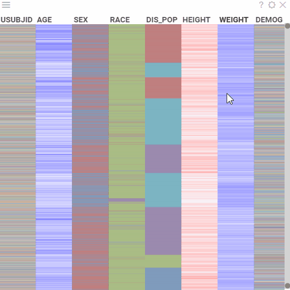
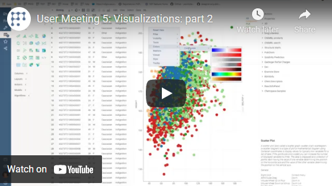

<!-- TITLE: Heatmap -->
<!-- SUBTITLE: -->

# Heatmap

Heatmap is a spreadsheet (grid) that contains colors instead of numbers and strings.
For numerical data, the higher values are colored red, and the
lower ones appear blue. The central value is assigned a light color so that
darker colors indicate a larger distance from the center. For categorical data,
each possible value is set to one color from a qualitative palette.

Heatmap displays more data in a smaller area. Use it to cross-examine
multivariate data and show the intensity and difference between variables.

>Note: Heatmap is based on [grid](grid.md), so you can apply all of the grid's
>features to it as well.

## Adding

1. Go to **Tables** and expand the **Viewers** panel.
1. Locate the **Heatmap** icon and click it.

Initially, the viewer displays a heatmap of the entire dataset on a screen. 
Pan or resize the range slider on the right to control how many rows are shown. 

## Settings

To configure a heatmap, click the **Gear** icon on top of the viewer and use the info panels on the **Context Pane**.
For example, you can:

* **Configure the data display detailing** using one of the following methods:
    * Set the desired row height under the **Row Height** setting.
    * On the viewer, configure vertical and horizontal range sliders.
* **Choose which rows to show** using the `Show Filtered Rows Only` property
* **Configure any other option** as you would for a [grid](grid.md)

## Interactivity

Heatmap responds to the row selection and data filtering.

## Videos

## See also

* [Grid](grid.md)
* [JS API: heatmap](https://public.datagrok.ai/js/samples/ui/viewers/types/heat-map)