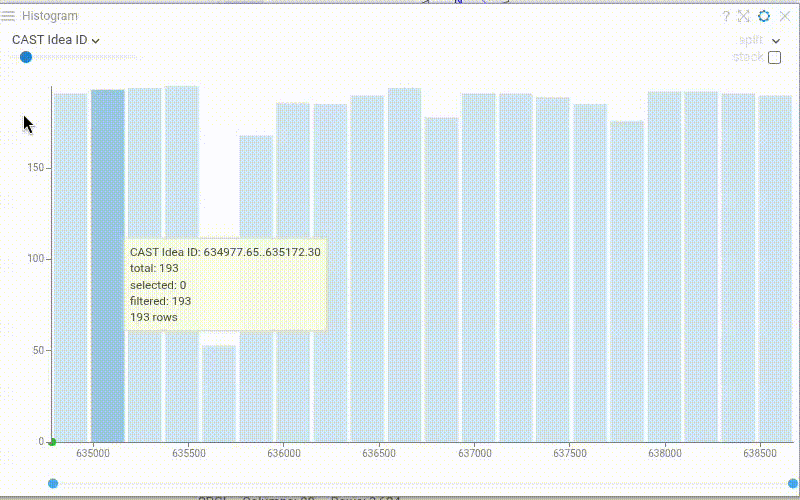
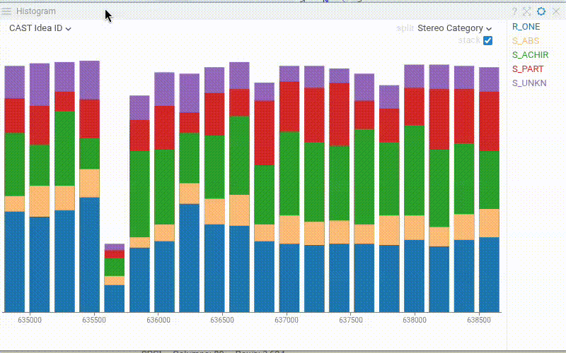

A histogram is a graphical representation of the distribution of numerical data.

> Developers: To add the viewer from the console, use:
`grok.shell.tv.addViewer('Histogram');`

General:

|                  |                        |
|------------------|------------------------|
| Right click      | Context menu           |
| Alt+F            | Show in full screen    |
| Bin: click       | Select bin exclusively |
| Bin: ctrl+click  | Invert bin selection   |
| Bin: shift+click | Select bin             |
| Shift+Mouse drag | Select bins            |

## Show bin values

Enable **Show Values** to display the bin count on top of each bar. The value shown reflects the current row source configuration (filtered, selected, or all rows), making it easy to see bin sizes at a glance.

## Distribution lines

When a **Split Column** is defined, enable **Show Distribution Lines** to overlay distribution curves over the histogram. This feature works with:
- Stacked bins (when **Split Stack** is enabled)
- Spline curves (when displaying multiple distributions)
- Filled splines (when both **Spline** and **Fill Spline** are enabled)

Distribution lines help visualize and compare the distribution patterns across different categories.

## Videos

## Properties

| Property | Type | Description |
|----------|------|-------------|
| **Data** | | |
| Show Filtered Out Rows | boolean | Whether the filtered out rows should be shown with the semi-transparent color See also *Filtered Out Color* |
| Filtering Enabled | boolean | Allows to filter table using the range slider on the bottom. |
| Filter | string | Formula that filters out rows to show. Examples: `${AGE}` > 20 or `${WEIGHT / 2)}` > 100, `${SEVERITY}` == ''Medium'', `${RACE}`.endsWith(''sian'') |
| Table | string |  |
| **Value** | | |
| Value Column Name | string | A numerical column used to calculate the distribution of values. |
| Show X Axis | boolean |  |
| Allow Column Selection | boolean |  |
| Show Bin Selector | boolean | Show bin selector in the left top panel when the mouse is over the histogram |
| Show Values | boolean | Show bin values on top of the bars |
| Bins | number | Number of bins on the histogram |
| Value Min | number |  |
| Value Max | number |  |
| **Category** | | |
| Split Column Name | string | A categorical column to split data on (each bar represents a category) |
| Normalize Values | boolean | Whether the values should be normalized when multiple histograms are shown. If true, you are comparing distributions; if false, you are comparing absolute values. Requires *Split Column Name* to be set. |
| Split Stack | boolean | If true, split are shown as stacked bins |
| Spline Tension | number | Spline tension in case multiple histograms are shown. Requires *Split Column Name* to be set. |
| Show Markers | boolean | Whether markers should be drown when multiple histograms are shown. Requires *Split Column Name* to be set. |
| **Misc** | | |
| Show Y Axis | boolean |  |
| Show Distribution Lines | boolean | Shows distribution lines for each stack or spline category in the histogram (see also **Split** and **Split Stack**). |
| **General** | | |
| Zoom To Range | boolean | Whether the horizontal axis should be zoomed to the range of the visible bins. |
| Normalize To Filter | boolean | Whether the values should be normalized to the filter or globally. |
| Bin To Range | boolean | Bin the values that are in the filter range. |
| Spline | boolean | Whether the distribution should be rendered as bars or as a spline. When *Split* is defined, histogram always shows splines. |
| Fill Spline | boolean | Whether the area below the spline should be filled with the corresponding color. Only applicable when *spline* is true and *split* is empty |
| Show Column Selector | boolean |  |
| Show Split Selector | boolean |  |
| Show Range Slider | boolean |  |
| Show Range Inputs | boolean | Visibility of the free-text inputs for the filter range |
| Bin Width Ratio | number | How much space does bin occupy (1 = no margins, 0 = no bin) |
| Show Histogram | boolean |  |
| Show Context Menu | boolean | Shows the context menu. |
| Margin Left | number |  |
| Margin Top | number |  |
| Margin Right | number |  |
| Margin Bottom | number |  |
| Filter Margin Top | number |  |
| Filter Margin Bottom | number |  |
| Legend Visibility | visibilitymode |  |
| Legend Position | flexautoposition |  |
| Row Source | string | Determines the rows shown on the plot. |
| Allow Dynamic Menus | boolean |  |
| Title | string |  |
| Description | string | Viewer description that gets shown at the *Descriptor Position*. Markup is supported. |
| Help | string | Help to be shown when user clicks on the ''?'' icon on top. Could either be in markdown, or a URL (starting with ''/'' or ''http''). |
| Description Position | flexposition |  |
| Description Visibility Mode | visibilitymode |  |
| **Color** | | |
| Color Column Name | string | Numerical column to be used for color-coding. The values in the bin get aggregated using the *Color Aggr Type* property. |
| Color Aggr Type | string |  |
| Invert Color Scheme | boolean |  |
| Linear Color Scheme | list |  |
| **Selection** | | |
| Show Current Row | boolean | Indicates current row as a dot on the horizontal axis |
| Show Mouse Over Row | boolean | Indicates current row as a dot on the horizontal axis |
| Show Mouse Over Row Group | boolean | Show the distribution of the values that the mouse is currently over in another viewer. |
| **Style** | | |
| Auto Layout | boolean | style |
| X Axis Height | number |  |
| Y Axis Width | number |  |
| Filter Height | number |  |
| Row Indicator Size | number |  |
| Back Color | number |  |
| Axis Font | string |  |
| Filtered Bins Color | number |  |
| Selected Bins Color | number |  |
| Values Color | number |  |
| Filtered Out Color | number |  |
| Controls Font | string | Viewer controls elements font. |
| **Description** | | |
| Show Title | boolean |  |

See also:

* [Viewers](../viewers/viewers.md)
* [Table View](../table-view-1.md)
* [JS API: Histogram](https://public.datagrok.ai/js/samples/ui/viewers/types/histogram)
* [Community: Visualization-related updates](https://community.datagrok.ai/t/visualization-related-updates/521)

