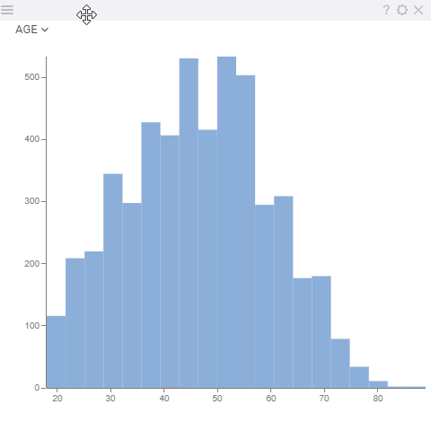

<!-- TITLE: Histogram -->
<!-- SUBTITLE: -->

# Histogram

A histogram is a graphical representation of the distribution of numerical data.

General:

|                  |                        |
|------------------|------------------------|
| Right click      | Context menu           |
| Bin: click       | Select bin exclusively |
| Bin: ctrl+click  | Invert bin selection   |
| Bin: shift+click | Select bin             |
| Shift+Mouse drag | Select bins            |

## Videos

See also:

* [Viewers](../viewers.md)
* [Table View](../../overview/table-view.md)
* [JS API: Histogram](https://public.datagrok.ai/js/samples/ui/viewers/types/histogram)
