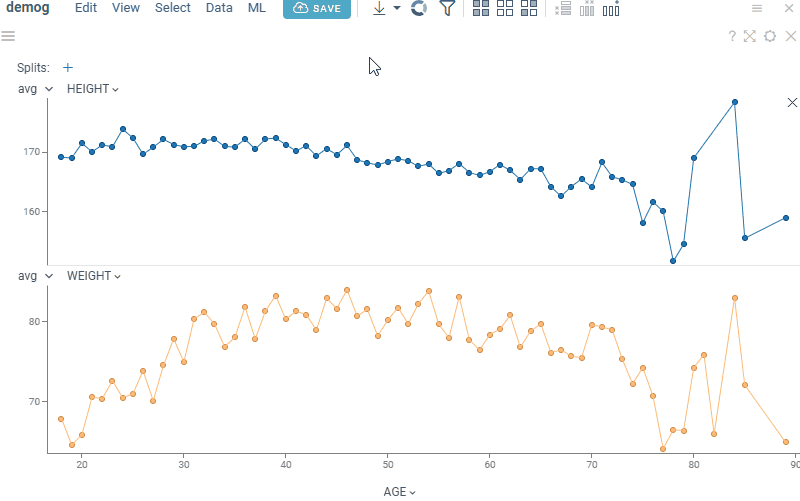
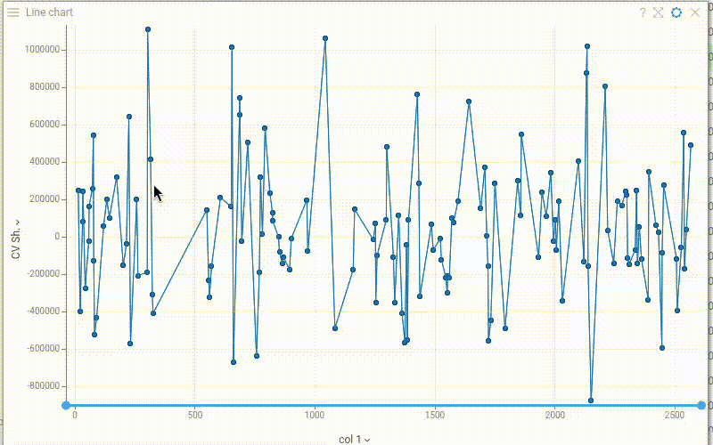

Line chart shows data points as connected line segments. It is commonly used to track trends, changes over time, and compare multiple data series. 

> Developers: To add the viewer from the console, use:
`grok.shell.tv.addViewer('Line chart');`

General:

|                       |                 |
|-----------------------|-----------------|
| Right click           | Context menu    |
| Alt+Mouse Drag        | Zoom            |
| Alt+F                 | Show in full screen |
| Shift+Mouse Drag      | Select          |
| Up, Down, Left, Right | Scroll          |
| Ctrl -                | Zoom out        |
| Ctrl +                | Zoom in         |
| Shift+drag axes       | Select segments |

## Custom aggregated tooltip

The line chart supports tooltips for both single and aggregated values. The default [single-value tooltip](../table-view-1.md#tooltips) is inherited from the grid. The default aggregated tooltip displays axis values and can be customized to show additional summary statistics.

To configure a custom aggregated tooltip, go to **Context menu > Tooltip > Edit**. This opens the aggregated tooltip dialog, where you can select the columns and corresponding aggregation functions. Available aggregation functions depend on the column type.

 
   
Supported aggregation functions

| Column type   | Aggregation functions                 |
|---------------|--------------------------------------|
| Numerical   | `min`, `max`, `sum`, `avg`, `med`, `geomean`,   `count`, `values`, `unique`, `nulls`,  `stdev`, `variance`, `skew`, `kurt`,  `q1`, `q2`, `q3`, `first`|
| Categorical     | `first`, `count`, `values`, `unique,nulls`, `values or unique count`,   `concat all`, `concat unique`,    l`ongest`, `shortest`,   `most frequent`, `concat counts`  |
| Date          | `first`, `count`, `values`, `unique`, `nulls`,  `min`, `max`, `avg`,    `range`                    |

 

## Statistical Process Control

Line chart includes comprehensive Statistical Process Control (SPC) capabilities for monitoring process behavior:

- Control limits (manually configurable) and process mean line
- Sigma bands (±1σ and ±2σ) to visualize process variation
- Western Electric rules for anomaly detection: outliers, bias, trends, oscillation, shifts, and suppressed variation

Toggle each component on/off independently in the **Context Panel** to focus on relevant process signals.

## Videos

## Properties

| Property | Type | Description |
|----------|------|-------------|
| **Data** | | |
| Split Column Names | list | A categorical column by which lines are split |
| Overview Column Name | string | Defines a Y column for the chart on the bottom used for zooming |
| Y Aggr Types | list | Aggregation types for all columns |
| Axes Follow Filter | boolean | When true, X axis is synchronized with the corresponding filter''s range values. Otherwise, when the filter is changed points are filtered out on a chart but the min-max stays. |
| Multi Axis | boolean | When true, multiple *Y Columns* charts get rendered on top of each other, otherwise they are stacked |
| Whiskers Type | string | Marker type for showing the distribution of the aggregated values when multiple values have the same X value |
| Aggr Type | string |  |
| Filter | string | Formula that filters out rows to show. Examples: `${AGE}` > 20 or `${WEIGHT / 2)}` > 100, `${SEVERITY}` == ''Medium'', `${RACE}`.endsWith(''sian'') |
| Table | string |  |
| **General** | | |
| Pack Categories | boolean |  |
| Overview Aggr Type | string |  |
| Overview Type | string |  |
| Left Panel | string | Show additional chart on the left |
| Chart Types | list |  |
| Line Color | number |  |
| Back Color | number |  |
| Axis Line Color | number |  |
| Axis Text Color | number |  |
| Marker Color | number |  |
| Mouse Over Line Color | number |  |
| Current Line Color | number |  |
| Show Top Panel | boolean | Shows top panel with the Split by selector |
| Show Close Link | boolean | Show the x close icon for each chart |
| X Axis Custom Tickmarks | list |  |
| Y Axis Custom Tickmarks | list |  |
| Inner Chart Margin Top | number |  |
| Inner Chart Margin Bottom | number |  |
| Outer Chart Margin Left | number |  |
| Outer Chart Margin Top | number |  |
| Outer Chart Margin Right | number |  |
| Outer Chart Margin Bottom | number |  |
| Show Dataframe Formula Lines | boolean | Control the visibility of dataframe-originated formula lines. Edit formula lines by right-clicking and selecting Tools \| Formula Lines from the popup menu. Requires the PowerPack plugin. |
| Show Viewer Formula Lines | boolean | Control the visibility of dataframe-originated formula lines. Edit formula lines by right-clicking and selecting Tools \| Formula Lines from the popup menu. Requires the PowerPack plugin. |
| Legend Visibility | visibilitymode |  |
| Legend Position | flexautoposition |  |
| Row Source | string | Determines the rows shown on the plot. |
| Allow Dynamic Menus | boolean |  |
| Show Context Menu | boolean | Properties common for all viewers todo: use code generation |
| Title | string |  |
| Description | string | Viewer description that gets shown at the *Descriptor Position*. Markup is supported. |
| Help | string | Help to be shown when user clicks on the ''?'' icon on top. Could either be in markdown, or a URL (starting with ''/'' or ''http''). |
| Description Position | flexposition |  |
| Description Visibility Mode | visibilitymode |  |
| **X** | | |
| X Column Name | string | Column to be used on the X axis |
| X Map | string | Time unit map function for x column (applicable to dates only). |
| X Axis Type | string |  |
| Segment Column Name | string | When defined, background is colored according to the segment column. Example: time series data with the stimuli column |
| Invert X Axis | boolean |  |
| Show X Axis | boolean |  |
| Show X Selector | boolean |  |
| Show Vertical Grid Lines | boolean |  |
| X Axis Label Orientation | string |  |
| X Axis Tickmarks Mode | axistickmarksmode |  |
| **Y** | | |
| Y Column Names | list | Numerical columns to be used on Y axes. Depending on the * |
| Y Axis Type | string |  |
| Show Y Axis | boolean |  |
| Y Global Scale | boolean |  |
| Show Horizontal Grid Lines | boolean |  |
| Y Axis Title | string | Axis title to be shown on the left axis in multi-axis mode |
| Y2 Axis Title | string | Axis title to be shown on the left axis in multi-axis mode |
| Y Axis Tickmarks Mode | axistickmarksmode |  |
| Show Y Selectors | boolean |  |
| Show Aggr Selectors | boolean |  |
| Show Split Selector | boolean |  |
| Interpolation | lineinterpolationmode |  |
| Spline Tension | number |  |
| **Marker** | | |
| Markers Column Name | string | A categorical column that determines the shape of the markers. |
| Markers Map | string | Marker category time unit map function (applicable to dates only). |
| Marker Type | string |  |
| Marker Size | number |  |
| Show Markers | visibilitymode | A boolean column that determines whether to show markers. |
| Markers Visibility Column Name | string |  |
| **Selection** | | |
| Show Current Row Line | boolean | Show vertical line reflecting the position of the current row See also *Current Line Color* |
| Show Mouse Over Category | boolean | Determines whether the line is highlighted when you hover over the corresponding category. Example: Split by = SEX and you hover over the Male category in the filter. |
| Show Mouse Over Row Line | boolean | Show vertical line reflecting the position of the mouse-over row See also *Mouse Over Line Color* |
| **Statistical process control** | | |
| Show Statical Process Control | boolean | Shows/hides upper and lower control limits, and [Western Electric rules](https:sentient.cloud/what-are-western-electric-rules-2/). |
| Show Control Limits | boolean | Shows/hides upper and lower control limits. |
| Show Sigma1 | boolean |  |
| Show Sigma2 | boolean |  |
| Show Average | boolean |  |
| Lower Control Limit | number |  |
| Upper Control Limit | number |  |
| Show Outlier | boolean | Rile 1: One point is more than 3 standard deviations from the mean. When sample(s) is grossly out of control. |
| Show Bias | boolean | Rule 2: Nine (or more) points in a row are on the same side of the mean. Some prolonged bias exists. |
| Show Consistent Trend | boolean | Rule 3: Six (or more) points in a row are continually increasing (or decreasing). When a trend exists. |
| Show Oscillation | boolean | Rule 4: Fourteen (or more) points in a row alternate in direction, increasing then decreasing. This much oscillation is beyond noise. Note that the rule is considered with directionality only. The position of the mean and the size of the standard deviation have no bearing. |
| Show Medium Shift | boolean | Rule 5:Two (or three) out of the three points in a row are more than 2 standard deviations from the mean in the same direction. There is a medium tendency for samples to be mediumly out of control. The side of the mean for the third point is unspecified. |
| Show Sustained Shift | boolean | Rule 6: Four (or five) out of five points in a row are more than 1 standard deviation from the mean in the same direction. There is strong tendency for samples to be slightly out of control. The side of the mean for the fifth point is unspecified. |
| Show Suppressed Variation | boolean | Rule 7: Fifteen points in a row are all within 1 standard deviation of the mean on either side of the mean. With 1 standard deviation, greater variation would be expected. |
| **Misc** | | |
| Axes Use Column Format | boolean | Use column format for axis labels, where possible |
| Show Aggr Type Selector | boolean |  |
| **Style** | | |
| Auto Layout | boolean |  |
| Segments Font | string |  |
| Line Width | number |  |
| Whisker Width | number |  |
| Line Transparency | number |  |
| Overview Height | number | Height of the overview chart |
| Histogram Width | number |  |
| Auto Axis Size | boolean | If true, *X Axis Height* is calculated automatically to fit the required precision. If false, the specified *X Axis Height* |
| Annotation Font | string |  |
| X Axis Height | number | Requires *Auto Axis Size* to be turned off. |
| Line Coloring Type | string |  |
| Axis Font | string |  |
| Grid Line Color | number |  |
| Selected Rows Color | number |  |
| Statistical Process Line Color | number |  |
| Statistical Process Area Color | number |  |
| Statistical Process Rule Color | number |  |
| Controls Font | string | Viewer controls elements font. |
| **Tooltip** | | |
| Show Tooltip | string | Controls scatter plot tooltip visibility |
| Show Labels | visibilitymode |  |
| Row Tooltip | string | Newline-separated list of column names to be used in a tooltip. Requires *showTooltip* to be enabled. |
| Row Group Tooltip | string |  |
| **Legend** | | |
| Add Y Columns To Legend | boolean | When selected, column names are added to the legend. Requires *Multi Axis* to be enabled. |
| **Annotation regions** | | |
| Show Viewer Annotation Regions | boolean |  |
| Show Dataframe Annotation Regions | boolean |  |
| Lasso Tool | boolean | Enables lasso region drawing mode (instead of polygon drawing default one). |
| **Description** | | |
| Show Title | boolean |  |

See also:

* [Viewers](../viewers/viewers.md)
* [Table View](../table-view-1.md)
* [JS API: Line chart](https://public.datagrok.ai/js/samples/ui/viewers/types/line-chart)
* [Community: Visualization-related updates](https://community.datagrok.ai/t/visualization-related-updates/521)
