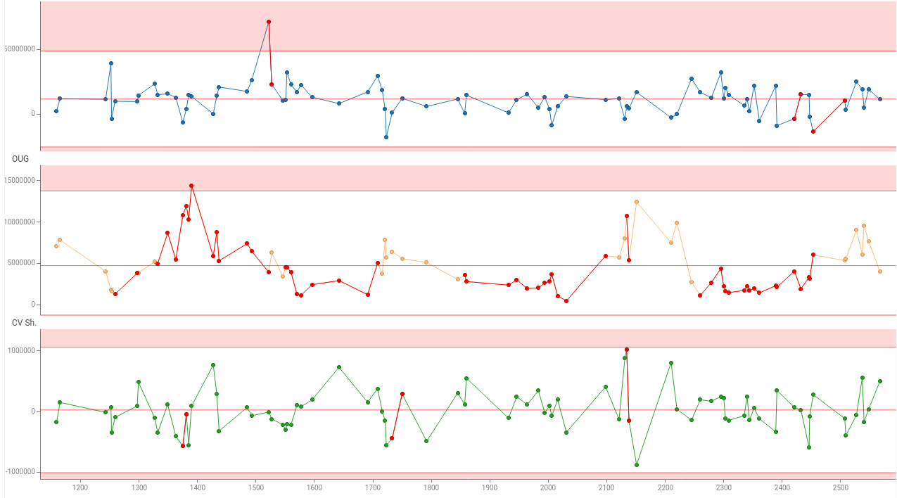

Line chart shows data points as connected line segments. It is commonly used to track trends, changes over time, and compare multiple data series. 

> Developers: To add the viewer from the console, use:
`grok.shell.tv.addViewer('Line chart');`

General:

|                       |                 |
|-----------------------|-----------------|
| Right click           | Context menu    |
| Alt+Mouse Drag        | Zoom            |
| Alt+F                 | Show in full screen |
| Shift+Mouse Drag      | Select          |
| Up, Down, Left, Right | Scroll          |
| Ctrl -                | Zoom out        |
| Ctrl +                | Zoom in         |
| Shift+drag axes       | Select segments |

## Tools

- **Formula lines**: Add reference lines or bands defined by mathematical formulas to analyze trends and thresholds. See [Scatterplot: Formula lines](scatter-plot.md#formula-lines) for details.
- **Annotation regions**: Highlight and annotate areas of interest on the chart using rectangular, lasso, or formula-based regions. See [Scatterplot: Annotation regions](scatter-plot.md#annotation-regions) for details.

## Statistical Process Control

Line chart supports Statistical Process Control (SPC) features out of the box, including contol limits and adjustable rules.

## Videos

See also:

* [Viewers](../viewers/viewers.md)
* [Table View](../../datagrok/navigation/views/table-view.md)
* [JS API: Line chart](https://public.datagrok.ai/js/samples/ui/viewers/types/line-chart)
