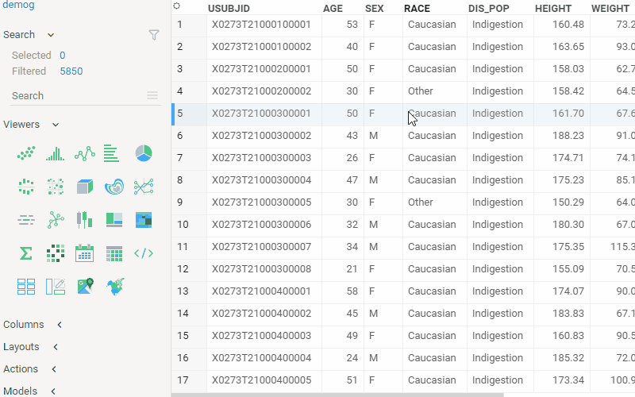

<!-- TITLE: Markup Viewer -->
<!-- SUBTITLE: -->

# Markup Viewer

Use this viewer to host any text, arbitrary HTML content, or [markdown-formatted text](../../overview/markdown.md). In most casees,
the viewer will auto-detect content type. Use the "mode" property to explicitly specify it.

Properties:

|                     |         |
|---------------------|---------|
| Content             |     |
| Mode                | Text, Html, Markdown, or Auto |
| Markup Enabled      | When true, the rendered HTML is processed by the [Markup](../../overview/markup.md) engine |

Context menu:

|                       |                 |
|-----------------------|-----------------|
| Edit content...       | Opens a dialog for editing viewer's content.   |

 

Here is how to embed iframes:

 

## Videos

<iframe width="560" height="315" src="https://www.youtube.com/embed/7MBXWzdC0-I?start=3052" frameborder="0" allow="accelerometer; autoplay; clipboard-write; encrypted-media; gyroscope; picture-in-picture" allowfullscreen></iframe>

See also: 
  
  * [Viewers](../viewers.md)
  * [Table View](../../overview/table-view.md)
  * [Flex View](../../overview/flex-view.md)
  * [JS API: Markup](https://public.datagrok.ai/js/samples/ui/viewers/markup)
