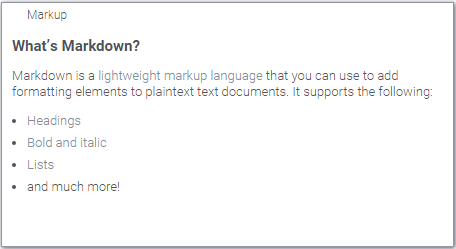

Use this viewer to host any text, arbitrary HTML content, or [Markdown-formatted text](https://en.wikipedia.org/wiki/Markdown). In
most casees, the viewer will auto-detect content type. Use the "mode" property to explicitly specify it.

Properties:

|                     |         |
|---------------------|---------|
| Content             |     |
| Mode                | Text, Html, Markdown, or Auto |
| Markup Enabled      | When true, the rendered HTML is processed by the [Markup](../../develop/under-the-hood/markup.md) engine |

Context menu:

|                       |                 |
|-----------------------|-----------------|
| Edit content...       | Opens a dialog for editing viewer's content.   |

Here is how to embed iframes:

## Videos

## Properties

| Property | Type | Description |
|----------|------|-------------|
| **General** | | |
| Stretch | boolean |  |
| Content | string |  |
| Mode | textinterpretationmode |  |
| Markup Enabled | boolean | Whether the rendered html is passed through Grok''s [Markup] engine (don''t confuse it with the Markup that might be used for html rendering) |
| Allow Dynamic Menus | boolean |  |
| Show Context Menu | boolean | Properties common for all viewers todo: use code generation |
| Title | string |  |
| Description | string | Viewer description that gets shown at the *Descriptor Position*. Markup is supported. |
| Help | string | Help to be shown when user clicks on the ''?'' icon on top. Could either be in markdown, or a URL (starting with ''/'' or ''http''). |
| Description Position | flexposition |  |
| Description Visibility Mode | visibilitymode |  |
| **Description** | | |
| Show Title | boolean |  |
| **Data** | | |
| Table | string |  |

See also:

* [Viewers](../viewers/viewers.md)
* [Table view](../table-view-1.md)
* [JS API: Markup](https://public.datagrok.ai/js/samples/ui/viewers/types/markup)
* [Community: Visualization-related updates](https://community.datagrok.ai/t/visualization-related-updates/521)