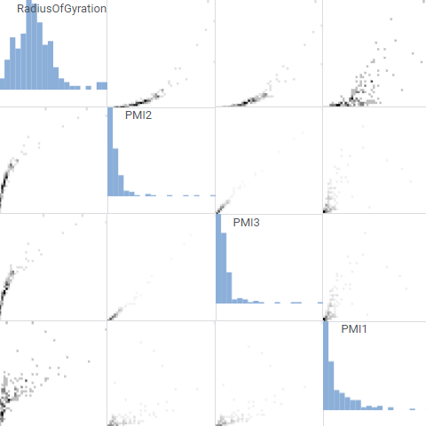

<!-- TITLE: Matrix plot -->
<!-- SUBTITLE: -->

# Matrix plot

Use Matrix Plot to assess the relationship among many pairs of columns at the same time.

General:

|             |              |
|-------------|--------------|
| Right click | Context menu |

## Videos

See also:

* [Viewers](../viewers.md)
* [Table view](../../overview/table-view.md)
* [JS API: Matrix plot](https://public.datagrok.ai/js/samples/ui/viewers/types/matrix-plot)
